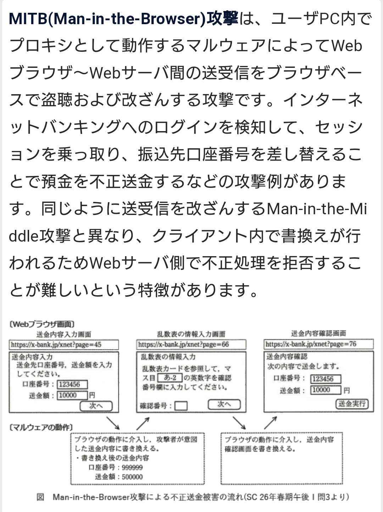
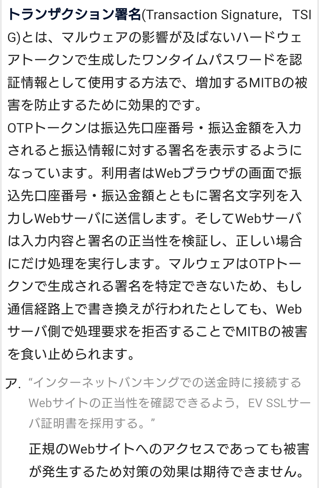
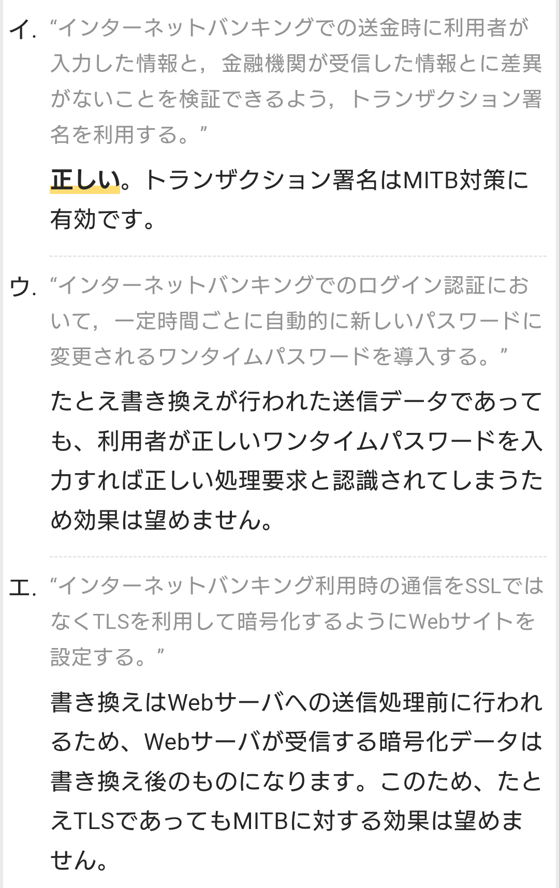

# ATTACK

- 一般的な攻撃の種類
    - マルウェア
    - SQLインジェクション攻撃
    - クロスサイトスクリプティング（XSS）
    - Denial Denial-of-Service（DoS）攻撃
    - セッションハイジャックと中間者攻撃
    - クレデンシャル再利用

# SQLインジェクション 【SQL injection】
- データベースと連動したWebアプリケーションなどに対する攻撃手法の一つ
- 検索文字列など外部から指定するパラメータの一部にSQL文の断片などを混入させ不正な操作を行うもの。また、そのような攻撃を可能にする脆弱性。 
- “injection” は「注入」の意。

    - SQLインジェクションの被害で最も多いのは個人情報などデータベースに保存された重要なデータや機密データの漏洩
    - 過去に名簿やアカウントリストなどの流出事件が様々なサイトで発生している。
    - また、Webサイトの改竄に悪用された場合、Webページ上にWebブラウザを攻撃するコードなどを埋め込まれる場合もあり、サイトを訪れた閲覧者に二次被害が広がってしまう。

- 対策としては、単純な文字列連結で動的にSQL文を生成するのをやめること
    - プレースホルダ（バインド機構）やプリペアードクエリ（プリペアードステートメント）のような仕組みを活用
    - 渡された入力値を入念にチェックして特定の文字を適切にエスケープ（無害な文字に置換）する
    - これら複数の手法を組みわせることも推奨されている。

## サニタイジング 【sanitizing】 サニタイズ / sanitize
- 利用者が入力した文字データを受け取る際に、プログラムにとって特別な意味を持つ可能性のある文字や文字列を検知して、一定の規則に従って別の表記に置き換えること。
- 「無害化」とも呼ばれ、攻撃者が入力データ中にコード断片などを混入させて誤作動を誘発する攻撃などを防ぐために行われる。
    - Webアプリケーションのセキュリティ対策としてよく用いられる手法で、HTMLタグやJavaScript、SQL文やそれらが使用する区切り記号などを検出して、同じ意味の別の表記に書き換えるエスケープ処理を行ったり、難しい場合は削除する。

## エスケープ処理 【escape processing】
- プログラミング言語やソフトウェアで文字列を扱う際に、特定の記号文字などに続けて記された文字（の並び）に、その文字本来の意味とは異なる特別な意味や機能を与えること。
- 先頭の特殊な文字を「エスケープ文字」という。
    - 例えば、HTMLはタグの記述に「<」「>」という記号を用いるため、この記号そのものを文字として表示することは本来できない。
    - このとき、「&lt;」「&gt;」という特殊な表記法に置き換えることで、それぞれ「<」「>」と表示することができる。

# クロスサイトスクリプティング 【XSS】 Cross Site Scripting
- 利用者が入力した内容を表示するような構成のWebサイトに存在する欠陥を悪用して、攻撃者が用意した悪意のあるスクリプトを利用者の元に送り込んで実行させる攻撃手法。
- 典型的な攻撃例は以下
    1. 標的サイトには入力フォームがあり、閲覧者の入力を受け付けてサイト内の別のページに表示する。
    1. 入力内容が「Hello World」の場合「http://標的サイト/message.cgi?text=Hello+World」というURLでアクセスするものとする。
    1. フォームの受け付けプログラムには入力内容のチェックに不備（XSS脆弱性）があり、「Hello+World」の部分が実行可能なJavaScriptのコード断片であってもそのままブラウザへ送り返し、内容を表示した閲覧者のコンピュータ上で実行されてしまう。
    1. 攻撃者はこのサイトの利用者に向けて攻撃用のサイトを用意し、標的サイトに向けてリンクを作成する。
    1. リンク先のURLには「http:// 標的サイト /message.cgi?text=%3C script%3Ealert%28%22Hello+World%22% 29%3B%3C%2Fscript%3E」のように、スクリプトとして解釈・実行される文字列を含ませておく。
    1. 閲覧者が攻撃用サイトのリンクを経由して標的サイトを訪れると、攻撃者によって仕込まれていたスクリプトが標的サイト上のものとして動作し、様々な攻撃が実行される。

- 閲覧者は標的サイトの発行したCookieデータなどを攻撃者に盗み取られたり、攻撃者の用意した偽サイトに誘導されて個人情報やアカウント情報などを攻撃者に送信してしまったり、標的サイト上で意図せず自動的に特定の操作を実行させられてしまうなどの被害を受ける。

- 現在では様々な攻撃のバリエーションが知られており、必ずしも攻撃者がサイトを用意する必要はなくなっている。
- 攻撃者が用意したスクリプトを標的サイトのものとして実行させられてしまう攻撃全般をクロスサイトスクリプティングと呼んでいる。

# OSコマンドインジェクション 【OS command injection】 コマンド注入攻撃
- コンピュータシステムに対する外部からの攻撃手法の一つ
- システムへの入力文字列中にオペレーティングシステム（OS）のコマンド（命令文）として解釈できる断片を紛れ込ませ、不正に実行させるもの。
    - 攻撃者はWebアプリケーションに送信するデータの中に、受信側が想定していない特殊な記号の組み合わせなどを含め、これに続けてOSのシェル呼び出しやコマンド実行を指示する文字列を連結しておく。

# セッションハイジャック 【session hijacking】
- ネットワーク上で一対の機器間で交わされる一連の通信（セッション）を途中で乗っ取り、片方になりすましてもう一方から不正にデータを詐取したり操作を行なう攻撃。
- 通信開始の手続きからのデータ受け渡し、通信終了までのやり取りに不正に介入する攻撃
- 偽造したデータを送りつけるなどの手法によりセッションを結んでいる片方になりすまし、もう一方と通信を行なう。
- これにより、本来の相手にしか開示されない秘密の情報を詐取したり、パスワードの変更などの重要な操作を不正に実行することができるようになる。

### Web上のセッションハイジャック
- Webのデータ転送に用いられるHTTP自体にはセッション管理のための仕様が存在しないため、アプリケーション側にセッション確立のための仕組みが組み込まれている。
- その設計に不備があるとセッションハイジャックを可能とする脆弱性が生じる。

# 中間者攻撃　Man in the middle Attack（MITM攻撃）
- 

# クレデンシャルスタッフィング攻撃(Credential Stuffing) / クレデンシャル再利用
- 漏洩したアカウント資格情報を悪用し、他のサービスへ不正アクセスを行う攻撃

# サイドチャネル攻撃 【side channel attack】
- IT機器に対する攻撃手法の一つで、装置の物理的な特性の変化を外部から観測・解析することにより、本来読み取ることができない情報を盗み取る手法。 
    - 機器が発する信号や正常時と異常時の動作の違いなどから情報を盗み取る。

- 暗号鍵の盗聴などに応用される。
- 機器を破壊せずそのままの状態で暗号を解読するため「非破壊攻撃」

1. タイミング攻撃
    - 器に様々な命令を出し、命令を処理する時間差を分析して情報を盗む攻撃

1. 電力解析攻撃
    - 「電力消費」の違いで暗号を解読する。
    - 消費電力の変化からカギや処理に内容の解析を試みる手法

1. 電磁波解析攻撃
    - コンピュータやIoT機器などの本体やケーブルから発せられる、微量の電磁波から情報を盗み取る攻撃

1. 故障利用攻撃
    - ICカードについているICチップなどに衝撃を加えて正常に動作しないようにし、ICチップの仕様や設定を変えてしまう攻撃
    - 限定的な障害によるデバイスの計算誤りから秘密情報を解析する

1. キャッシュ攻撃
    - データの取り出しや使用するまでの時間差を利用する

1. 音響解析攻撃
    - コンピュータが動くときに発するノイズを解析して、情報を推測し盗もうとする攻撃（音声解析攻撃）

# テンペスト攻撃
- テンペスト攻撃は盗聴を目的に行われる。
- ラジオのように電磁波や信号を受信することはできるが、暗号を解読することはできない。

# RAT 【Remote Administration Tool】 Remote Access Trojan / 遠隔操作ウイルス
- 不正アクセスに用いられる攻撃用ツールの一種で、標的のコンピュータに潜んで攻撃者からの遠隔操作を受け付けたりデータの盗み出しや改竄などを行うもの。
    - 標的のコンピュータに常駐し、攻撃者が任意のOSコマンドを実行できるようにしたり、保存されているファイルなどを盗み出して攻撃者へ送信したり、存在が露見しにくいようシステムの設定や記録の変更や改竄を行ったり、利用者の操作を監視（キーロガーによる文字入力記録やデスクトップのスクリーンショット撮影など）して攻撃者に報告したりする。

- あらかじめ決められた動作を行うだけのマルウェア感染に比べ、人間が攻撃手法を吟味して行うため被害が深刻化、長期化しやすい。
- 外部の攻撃への踏み台に使われた場合、乗っ取られた被害者が加害者と誤解され、そのまま検挙されて罰せられてしまう事件（2012年のパソコン遠隔操作事件など）も発生している。

# 水飲み場型攻撃 【watering hole attack】
- 特定の組織や個人を狙う標的型攻撃の手法の一つ
- 標的がよく利用すると思われるWebサイトを改竄し、コンピュータウイルスなどの感染を試みる手法。
- 肉食獣が水場の周囲で待ち伏せし、水を飲みに現れた草食獣を狙い撃ちにする様子になぞらえている。

# 標的型攻撃 【targeted threat】 スピア型攻撃 / spear attack
- 特定の個人や組織、情報を狙ったサイバー攻撃のこと。企業や国家の機密情報を盗み取る目的で行われることが多い。

## APT攻撃 【Advanced Persistent Threats】 高度標的型攻撃
- サイバー攻撃の一種で、特定の組織や個人を狙い、様々な手段を組み合わせて継続的に行われるもの。
- 攻撃が多角的で継続性があるものを指す。

# エクスプロイトキット 【exploit kit】
- 複数のエクスプロイトコードをまとめ、様々な方法でシステムを攻撃できるようにしたパッケージ。サイバー攻撃に利用される。
- 代表的な攻撃シナリオは以下
    1. 攻撃者はWebブラウザ向けのエクスプロイトキットを入手してマルウェアを組み込む。
    1. 脆弱なWebサーバを探して侵入・改竄し、Webページを閲覧するとキットが起動するよう仕掛けておく。
    1. 事情を知らない閲覧者が改竄されたWebページにアクセスするとキットが起動して脆弱性を探索し、Webブラウザに悪用可能な脆弱性があるとこれを攻撃する。
    1. 閲覧者のパソコンは攻撃者の用意したマルウェアに感染し、何らかの有害な動作が引き起こされる。

## エクスプロイトコード
- 機器やソフトウェア、システムなどに潜在的に存在するセキュリティ上の欠陥（脆弱性）を悪用し、外部から干渉して開発者や利用者が意図しない挙動を引き起こすプログラム

# デジタルフォレンジック 【digital forensics】/コンピュータフォレンジック / computer forensics
- 犯罪捜査や法的紛争などで、コンピュータなどの電子機器に残る記録を収集・分析し、その法的な証拠性を明らかにする手段や技術の総称。
- “forensics”には「法医学」「科学捜査」「鑑識」といった意味があり、分かりやすく意訳すれば「デジタル鑑識」。

# MITB攻撃 【Man-In-The-Browser】 マン・イン・ザ・ブラウザ攻撃
- ネットワークを通じた攻撃手法の一つ
- 攻撃対象の利用するコンピュータにトロイの木馬など悪意のあるソフトウェアを潜り込ませ、Webブラウザなどの通信を監視して通信内容を改ざんしたり操作を乗っ取る手法。
    - オンラインバンキングの操作を乗っ取って利用者の預金を詐取する手法がある。
    - 攻撃者は標的のコンピュータに何らかの方法でトロイの木馬を送り込み、Webブラウザの通信をすべて中継して監視するプロキシとして動作させる。

- 監視中に利用者が正規の認証情報を入力して金融機関のサービスにログインしたのを検知すると、通信に介入して送受信情報の改竄を行い、振込先などの情報を不正に書き換えて攻撃者の指定した口座に預金を振り込ませてしまう。

- 利用者から見ると不正な偽サイトに誘導されたわけではなく、正規のサービスを利用して正しく操作が完了したように見える（データの改竄は画面上ではなく送信のタイミングで行われる）ため対策が難しい。

- 銀行側から見ても、正規の利用者がいつものコンピュータから正規の手続きに則って認証を行い、正しく送金指示を行っているように見えるため、やはり対策を取りにくい。両者とも単独で改竄に気付くのは困難なため、送信時に送金情報に応じて変化するワンタイムパスワードを付加して受信側で検証するトランザクション署名などの仕組みが必要となる。

## トランザクション署名 【transaction signature】
- オンラインバンキングなどで用いられる認証方式の一つ
- 利用者の手元でハードウェアトークンなどに取引（transaction）の内容を入力し、生成された署名（番号など）を金融機関側に送信する方式。
- MITB攻撃などを阻止することができる。

- もし送信時にマルウェアが不正に取引指示を改竄したとしても、受信した金融機関側で署名を検証すると、改竄された指示内容からは生成されるはずのない番号が記載されているため、不正に書き換えられたものと判断して取引の実行を未然に防ぐことができる。
- 署名は利用者の持つ装置でしか生成できず、マルウェアが辻褄の合うように署名を正しく書き換えることもできない。

# バッファオーバーフロー攻撃 (バッファオーバーラン攻撃)
- ソフトウェアに存在するバッファオーバーフローを引き起こすコードを悪用し、外部からわざと想定より長いデータを与えることでプログラムを異常終了させたり、攻撃用のコードを送り込んで実行させたりする攻撃手法
- 攻撃者が任意の攻撃を実行できる手法もあり、コンピュータウイルス感染に悪用されたり、最悪の場合は管理者権限を乗っ取られて外部から遠隔操作され、重要なデータの漏洩、改竄、削除や、外部の別のシステムへの攻撃の踏み台にされることもある。

# IPスプーフィング 【IP address spoofing】 IP address forgery
- TCP/IPネットワークを通じた攻撃手法の一つで、IPパケットの送信元として虚偽のIPアドレスを書き入れてそのアドレスになりすます手法。不正侵入にもDoS攻撃にも悪用される。
- （自身の）IPアドレスを偽装して（他人になりすました状態で）悪いことをする
- 「spoofing（スプーフィング）」の意味は「なりすまし」 →　IPなりすまし

- 攻撃元の特定は困難になる

- 偽装の流れ
    1. 通信パケットのヘッダー部分にある送信元IPアドレスを書き換える
    1. 書き換えた偽装パケットで相手先に接続を試みる

- スプーフィング攻撃は、なりすましの対象によって以下の4つに大きく分類される。
    1. IPスプーフィング
        - 送信元のIPアドレスを偽装
        - 攻撃元を隠ぺいし、サーバーやネットワークなどのリソースに意図的に過剰な負荷をかけることでサービスを妨害するDoS攻撃（Denial of Service Attack サービス拒否攻撃）やDDoS攻撃（Distributed Denial of Service Attack 分散型サービス拒否攻撃）の際に手法として組み込まれることが多い

    1. メールスプーフィング
        - メールヘッダーを偽装
        - 実際とは異なる送信者によるメールであるかのようにみせかける。

    1. DNSスプーフィング
        - DNSへのURLリクエストに対し、偽サイトへ誘導する
        - ネットワーク上のプログラムとサーバーとの間に攻撃者が侵入・介在するMITM（Man in the middle attack）攻撃や、DNSサーバーのキャッシュ機能を悪用して偽のDNS情報を問い合わせたユーザーに返信させるDNSキャッシュポイズニングなどがある。

    1. ARPスプーフィング
        - ARPの応答を偽装して、LAN上でネットワーク機器のなりすましを行う
        - たとえば、ルーターになりすませば、LANからWANへの通信を盗聴することができるため、ユーザーは深刻･甚大にな被害を被る危険性がある。

## IPスプーフィングの対策
- IPスプーフィングは、攻撃の検知や防御が難しい
- 以下は対策の例
    - 通信の認証手段として、IPアドレスを使用しない
        - 認証キーを使用する、MACアドレスを併用するといったようにIPアドレスだけの認証を使用しない

    - 一段高い認証を実施する（ID/パスワードを要求するなど）
        - SSHを利用して暗号化された通信を行う
            - 通信内容が暗号化されないまま平文（テキスト）で、ネットワーク上を流れるとIPアドレスなどの情報が悪意のある第三者に盗み取られてしまう恐れがある。
    
    - ファイアウォールの設定を変更する
        - 外部からのアクセスにもかかわらず内部のIPアドレスであるなど挙動がおかしい場合には拒否する設定をする
