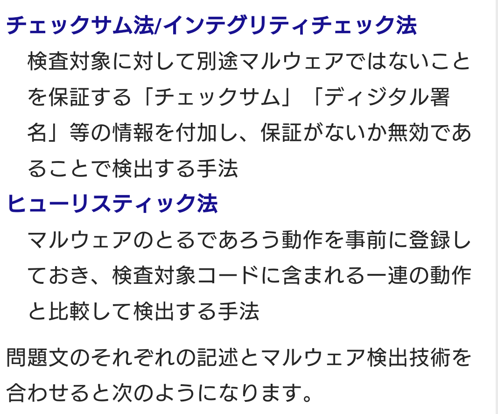
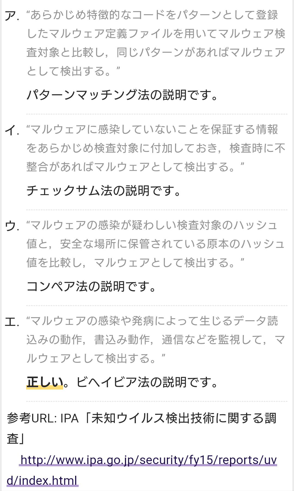

# ウイルススキャン 【virus scan】 ウイルスチェック / virus check
- コンピュータのストレージ（外部記憶装置）に保存されたファイルの一部としてコンピュータウイルスが潜んでいないか検査すること。
- トロイの木馬など他のマルウェアも対象とすることが多い。

## パターンマッチング法
- 既知のウイルスに含まれる特異的なコード断片などのパターンを大量に記録しておき、検査対象のファイルに一致するものがないかを調べる方式
- 過去に発見されたウイルスはほぼ完全に捕捉でき、誤検知が少ない一方、広まり始めたばかりの新種や、既存のウイルスの一部を改変してパターンに一致しなくなった亜種、感染時に毎回自らを書き換えるポリモーフィック型ウイルスには弱い。

## ヒューリスティック検知 【heuristic scan】 ヒューリスティックスキャン
- アンチウイルスソフトなどがコンピュータ内に潜むウイルスなどを探索する手法の一つ。
- ウイルスに特徴的な挙動がないか調べる方式。未知のウイルスや亜種にも対応できる。
- これまでに知られるウイルスなどの動作を解析し、感染や破壊などのために行われる、（ウイルス以外の）通常のプログラムがあまり行わない特徴的な処理のパターンを見出す。
- コンピュータ内の実行ファイルを分析して同じ動作パターンが含まれれば、高い確率でウイルスであることが疑われる。
    - これにより、ウイルス定義ファイルに登録されていない未知のウイルスや、パターンマッチングで検知されないよう一部を書き換えた既存ウイルスの亜種なども検知することができる。
    - ただし、システム設定を改変する動作を含むソフトウェアなどをウイルスであると誤判定してしまう場合もある。
- 動作の確認手法の違いにより、プログラムファイルを読み込んでコードの内容がパターンに一致するかどうかを調べる静的ヒューリスティック検知と、実際のコンピュータ環境に影響を及ぼさない仮想的な実行環境で起動し-てみて挙動を調べる動的ヒューリスティック検知（ビヘイビア法/振る舞い検知）の二種類がある。
    - 前者の方が高速に処理できるが、後者を用いると前者では検知が難しいミューテーション型（ポリモーフィック型）ウイルスにも対応することができる。

### ビヘイビア法 【behavior method】 振る舞い検知 / ダイナミックヒューリスティック法
- アンチウイルスソフトなどがウイルスの存在を検知する手法の一つ。
- 実行中のプログラムの振る舞い（behavior）を監視して、不審な処理が行われていないかを調べる方式。
- プログラムの挙動に着目する「ヒューリスティック検知」の一種で、実際にプログラムを実行してみるため「動的ヒューリスティック法」（ダイナミックヒューリスティック法）とも呼ばれる。
- 既知のウイルスに含まれる特徴的なコード断片が含まれていないかを調べる「パターンマッチング法」では検知できない新種のウイルスや既存ウイルスの一部が改変された亜種、静的ヒューリスティック法での検知が難しいミューテーション型（ポリモーフィック型）などにも対応することができる。

CVE(共通脆弱性識別子)は、一般に知られている個々の脆弱性ごとに採番された識別子です。世界各国の製品開発企業、セキュリティ関連企業、脆弱性検査ツールや脆弱性対策情報提供サービスにおいて、脆弱性を識別するために使用されています。採番の形式は CVE-[西暦年号]-[4桁以上の数字] です。
CCE(Common Configuration Enumeration)
CCE(共通セキュリティ設定)は、コンピュータのセキュリティ設定項目ごとに付けられた識別子です。
CVE(Common Vulnerabilities and Exposures)
正しい。CVEは、脆弱性ごとに付けられている識別子です。
CVSS(Common Vulnerability Scoring System)
CVSS(共通脆弱性評価システム)は、情報システムの脆弱性の深刻度を同一の基準のもとで定量的に評価する共通的な手法です。
CWE(Common Weakness Enumeration)
CWE(共通脆弱性タイプ)は、ソフトウェアの脆弱性の種類を識別するための共通基準です。

パリティチェックは、データ通信やメモリチェックなどにおいてデータのビット誤りを検出する最もシンプルな方法の一つです。一定長のビット列（通常は7～8ビット）ごとに1ビットの検査ビット（パリティビット）を付加し、検査側が受信データとパリティビットを照合することで誤りを検出します。

データのビット列とパリティビットを合わせて"1"のビット数が奇数になるようにパリティビットを付加する方式を奇数パリティ、偶数になるように付加する方式を偶数パリティといいます（設問の図は偶数パリティ）。

チェック方式にも2種類あり、送信データそれぞれに対してパリティを付加する方式を垂直パリティ、1番目のデータブロックの1ビット目、2番目のデータの1ビット目、…、n番目のデータの1ビット目というようにデータブロックの並びに対して付加する方式を水平パリティといいます。また、両者を併用して2方向にパリティを付加する方式を「垂直水平パリティ」と言います。

ブロードバンドルータは、家庭内の複数内の端末が同時にインターネットに接続できるように、IPマスカレード(NAPT)の機能を備えています。

ブロードバンドルータは、LAN内のPCがインターネットに接続する際に、①PCのプライベートIPアドレスとポート番号の組合せをグローバルIPアドレスとポート番号の組合せに変換し、その対応を変換テーブルに記録しておきます。その後、インターネットから応答パケットを受け取ると、②変換テーブルの中から応答パケットの宛先ポート番号を探し、適切なプライベートIPアドレスとポート番号の組合せに戻して送信元PCに応答パケットを届けます。この一連のアドレスとポート番号の変更がIPマスカレードの動作です。

②の動作において該当するポート番号が変換テーブル内に存在しないときは、適切な変換先が見つからないのでルータは応答パケットを破棄することになります。つまり、外部から適当なパケットを送り付けても内部LANには到達しないということです。この仕組みにより、外部からポートスキャンや不正侵入を試みる攻撃が来たとしても、PCが守られるセキュリティ効果が期待できます。
IPマスカレード機能による，インターネットからの不正侵入に対する防止効果
正しい。
PPPoE機能による，経路上の盗聴に対する防止効果
PPP over EthernetはPPPをイーサネット上で利用できるようにしたものです。ブロードバンドルータからプロバイダの認証と接続を行うときに使用されていますが、通信経路の暗号化機能は持っていません。
WPA機能による，不正なWebサイトへの接続に対する防止効果
WPA(Wi-Fi Protected Access)は、無線LANの暗号化規格です。コンテンツフィルタリング機能やURLフィルタリング機能はありません。
WPS機能による，インターネットからのマルウェア感染に対する防止効果
WPS(Wi-Fi Protected Setup)は、無線LANの親機と子機の接続設定やセキュリティ設定を容易に行うために策定された規格です。マルウェア感染を防止する機能はありません。