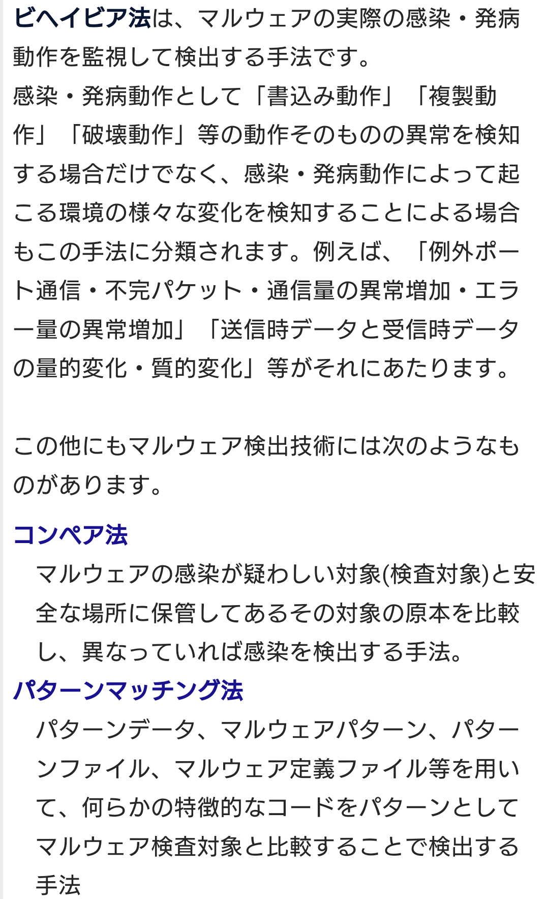

# ウイルススキャン 【virus scan】 ウイルスチェック / virus check
- コンピュータのストレージ（外部記憶装置）に保存されたファイルの一部としてコンピュータウイルスが潜んでいないか検査すること。
- トロイの木馬など他のマルウェアも対象とすることが多い。

## パターンマッチング法
- 既知のウイルスに含まれる特異的なコード断片などのパターンを大量に記録しておき、検査対象のファイルに一致するものがないかを調べる方式
- 過去に発見されたウイルスはほぼ完全に捕捉でき、誤検知が少ない一方、広まり始めたばかりの新種や、既存のウイルスの一部を改変してパターンに一致しなくなった亜種、感染時に毎回自らを書き換えるポリモーフィック型ウイルスには弱い。

## ヒューリスティック検知 【heuristic scan】 ヒューリスティックスキャン
- アンチウイルスソフトなどがコンピュータ内に潜むウイルスなどを探索する手法の一つ。
- ウイルスに特徴的な挙動がないか調べる方式。未知のウイルスや亜種にも対応できる。
- これまでに知られるウイルスなどの動作を解析し、感染や破壊などのために行われる、（ウイルス以外の）通常のプログラムがあまり行わない特徴的な処理のパターンを見出す。
- コンピュータ内の実行ファイルを分析して同じ動作パターンが含まれれば、高い確率でウイルスであることが疑われる。
    - これにより、ウイルス定義ファイルに登録されていない未知のウイルスや、パターンマッチングで検知されないよう一部を書き換えた既存ウイルスの亜種なども検知することができる。
    - ただし、システム設定を改変する動作を含むソフトウェアなどをウイルスであると誤判定してしまう場合もある。
- 動作の確認手法の違いにより、プログラムファイルを読み込んでコードの内容がパターンに一致するかどうかを調べる静的ヒューリスティック検知と、実際のコンピュータ環境に影響を及ぼさない仮想的な実行環境で起動し-てみて挙動を調べる動的ヒューリスティック検知（ビヘイビア法/振る舞い検知）の二種類がある。
    - 前者の方が高速に処理できるが、後者を用いると前者では検知が難しいミューテーション型（ポリモーフィック型）ウイルスにも対応することができる。

### ビヘイビア法 【behavior method】 振る舞い検知 / ダイナミックヒューリスティック法
- アンチウイルスソフトなどがウイルスの存在を検知する手法の一つ。
- 実行中のプログラムの振る舞い（behavior）を監視して、不審な処理が行われていないかを調べる方式。
- プログラムの挙動に着目する「ヒューリスティック検知」の一種で、実際にプログラムを実行してみるため「動的ヒューリスティック法」（ダイナミックヒューリスティック法）とも呼ばれる。
- 既知のウイルスに含まれる特徴的なコード断片が含まれていないかを調べる「パターンマッチング法」では検知できない新種のウイルスや既存ウイルスの一部が改変された亜種、静的ヒューリスティック法での検知が難しいミューテーション型（ポリモーフィック型）などにも対応することができる。

CVE(共通脆弱性識別子)は、一般に知られている個々の脆弱性ごとに採番された識別子です。世界各国の製品開発企業、セキュリティ関連企業、脆弱性検査ツールや脆弱性対策情報提供サービスにおいて、脆弱性を識別するために使用されています。採番の形式は CVE-[西暦年号]-[4桁以上の数字] です。
CCE(Common Configuration Enumeration)
CCE(共通セキュリティ設定)は、コンピュータのセキュリティ設定項目ごとに付けられた識別子です。
CVE(Common Vulnerabilities and Exposures)
正しい。CVEは、脆弱性ごとに付けられている識別子です。
CVSS(Common Vulnerability Scoring System)
CVSS(共通脆弱性評価システム)は、情報システムの脆弱性の深刻度を同一の基準のもとで定量的に評価する共通的な手法です。
CWE(Common Weakness Enumeration)
CWE(共通脆弱性タイプ)は、ソフトウェアの脆弱性の種類を識別するための共通基準です。