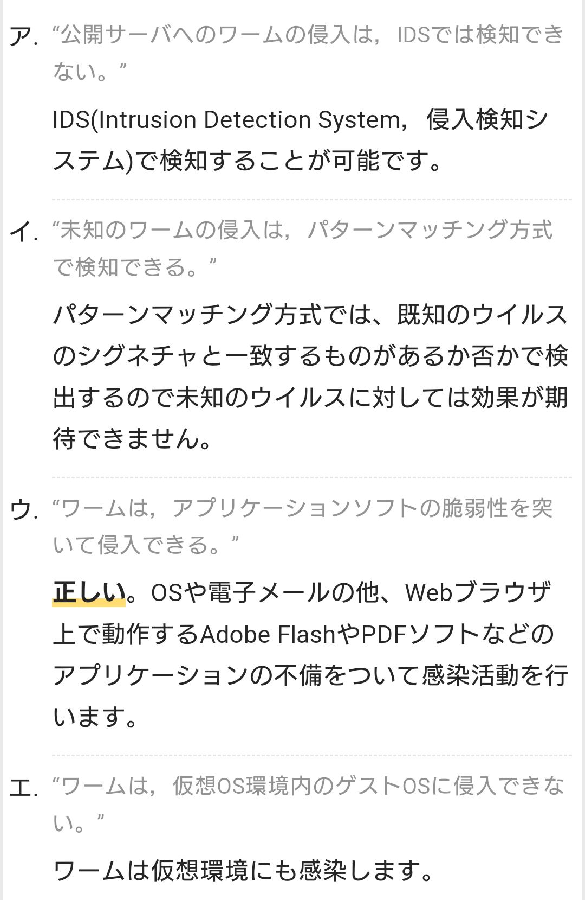

# マルウェア
- コンピュータの正常な利用を妨げたり、利用者やコンピュータに害を成す不正な動作を行うソフトウェアの総称。
    - ウイルスやランサムウェアといった様々な形の有害なソフトウェアを指す。
- “malicious software” （悪意のあるソフトウェア）を縮めた略語。

# ダウンローダ型ウィルス
- 感染したコンピュータのユーザに気付かれないようにインターネット上の悪意のあるWebサイトに接続し、他のマルウェアをダウンロードして感染を拡散させるタイプのウイルス(またはマルウェア)
- ファイアウォールで善悪を区別して遮断することは困難

# バックドア型ウイルス 【backdoor virus】
- コンピュータウイルスの振る舞いについての分類で、感染したコンピュータ上に外部から接続できる窓口を設け、攻撃者が遠隔からコンピュータを不正に操作できるようにするもの。

# トロイの木馬 【Trojan Horse】
- 何らかの有用なソフトウェアなどを装って導入や実行を促し、起動すると利用者に気付かれないよう秘密裏にデータ漏洩や遠隔操作などの有害な動作を行うソフトウェア。
    - セキュリティソフトやメディアプレーヤー、圧縮ソフトなど何らかの有用なソフトウェアを装って利用者に導入（インストール）を促す。
    - Windowsやメールソフトなどのファイル表示の仕様を悪用して文書や動画、画像などのファイルになりすまし、開いて閲覧するよう利用者に促す。

- トロイの木馬の動作は攻撃者の目的により多種多様だが、よく知られる動作として、攻撃者が秘密裏に遠隔からコンピュータを操作できるようにする裏口（バックドア）として機能する。
- また、パスワードなど秘密の情報を盗み取って攻撃者に報告したり、あらかじめ指定された特定の場所にあるファイル（利用者個人のファイル保管場所などが選ばれることが多い）を攻撃者に送信するデータ漏洩の被害も多い。中には個人的なファイル群をP2Pネットワーク上に流出させるといった動作を行うものもある。

- 他にも、ネット上の特定の場所からプログラムをダウンロードして実行するよう仕組まれていたり、プロキシサーバとして外部への接続を代理し、攻撃者が発信元を隠して他のコンピュータを攻撃するための中継拠点にされてしまうこともある。

## キーロガー 【keylogger】 keystroke logger
- コンピュータのキーボード操作を常時監視して時系列に記録する装置やソフトウェア。
- 本来は有害なものではないが、他人のコンピュータにこっそり仕掛けて秘密の情報を盗み取るのに悪用され問題になっている。
- 近年問題になっている悪用事例として、トロイの木馬やコンピュータウイルスにキーロガーが埋め込まれ、利用者が気付かずにネット通販やオンラインバンキングなどでパスワードなど秘密の情報をキー入力すると、それを盗み取って攻撃者にこっそり報告するというものがある。

## ドライブバイダウンロード 【drive-by download】 DBD攻撃
- 不正アクセスの手法の一つで、Webサイトなどに不正なソフトウェアを隠しておき、閲覧者がアクセスすると気づかないうちに自動でダウンロードして実行する攻撃手法。

# ワーム　worm
- 有害な動作を行うソフトウェアの一種で、インターネットなどを通じてコンピュータに侵入し、さらに他のコンピュータへの自身の複製を試みるもの。
- “worm” の原義はミミズや芋虫のような線形の虫や動物のこと。
- 一般的なウイルスと異なり宿主・寄生先となる他のソフトウェアやファイルがなく単体で侵入・活動するため、専門的な分類ではウイルスとは区別されることが多い。
- 感染したコンピュータで自身が起動時に自動的に実行されるようシステム設定を改竄することが多く、利用者が気付かないうちに常時稼働状態となって他のコンピュータへの感染などの動作を繰り返し行う。
- 部の他のコンピュータへの攻撃・妨害活動を自動的に行ったり、外部の攻撃者がインターネットを通じて遠隔から操作できる窓口（バックドア）を設置することもある。
- ワームを介して特定の攻撃者からの指令を受け、一斉に攻撃などを行うよう組織されたコンピュータ群を「ボットネット」（botnet）という。

# ボットネット 【botnet】 ゾンビクラスタ / zombie cluster
- 攻撃者の指令や遠隔操作などを受け入れるよう、コンピュータウイルスなどに感染させた多数のコンピュータを組織したネットワーク。
    - ボットハーダー (bot herder)  
        ボットネットを組織しゾンビ端末に司令を与える攻撃者のこと  　
        “herder” とは牛飼いや羊飼いなど家畜の世話をする人のこと  
        ハーダーからの指示を伝達するコンピュータを「C&Cサーバ」（command and control server）という。

## C&Cサーバ 【Command and Control server】 C2サーバ
- 外部から侵入して乗っ取ったコンピュータを利用したサイバー攻撃で、踏み台のコンピュータを制御したり命令を出したりする役割を担うサーバコンピュータのこと。

- 一般家庭のパソコンなどに外部からウイルス感染や不正アクセスなどを仕掛け、利用者に気づかれないように外部から任意に遠隔操作できる接続窓口（バックドア）を設ける攻撃がある。
- このように外部から乗っ取られた状態のコンピュータを「ゾンビコンピュータ」（zombie computer）という。

- 攻撃者は侵入に成功したゾンビに個別に接続して直に操作することもあるが、同じマルウェアに何万台も感染させた場合などには、これを「ボットネット」（botnet）と呼ばれるネットワークに組織化し、一度の指示で一斉に同じ動作を行えるように管理する。

- その際、各ゾンビへの指示を出し、動作を制御する役割を果たす中央サーバのことをC&Cサーバという。
- どのような司令を出すかは攻撃者次第だが、ウイルスメールやスパムメールの大規模送信や、一斉に特定のサイトやアドレスに接続を試みて相手方を通信過多で機能不全に追い込むDDoS攻撃（分散DoS攻撃）に利用されることが多い。

# ランサムウェア 【ransomware】 身代金型ウイルス
- 悪意のあるソフトウェア（マルウェア）の一種で、感染したコンピュータを正常に利用できないような状態に置き、復元のために犯人への金品の支払いを要求するもの。
- “ransom” は「身代金」の意。

# アドウェア 【adware】
- 利用者の画面に広告を表示する代わりに無料で提供されるソフトウェアのこと。
- ソフトウェア自体に広告表示機能が組み込まれているものと、ソフトウェアに付属し、インストール時に一緒にコンピュータに組み込まれるタイプがあり、通常は後者を指す。

# クリプトジャッキング 【cryptojacking】
- ネットワークを通じて遠隔から行われる攻撃の一種。
- 標的のコンピュータにマルウェアを送り込み、攻撃者が利益を得るための仮想通貨のマイニング処理を勝手に行うこと。
    - 仮想通貨マイニング用のソフトウェアを送り込んで利用者に気付かれないよう実行させる。得られた報酬の仮想通貨が攻撃者の利益となる。
    - 標的上では大量の計算が行われるため、ソフトウェアの実行速度が低下したり、電力消費量（電気代）が増えるといった被害が発生する。
    - マイクロプロセッサ（CPU）など内部の電子回路が常時フル稼働状態となるため、排熱が追いつかなくなり挙動が不安定になったり機能が停止（熱暴走）する場合もある。

