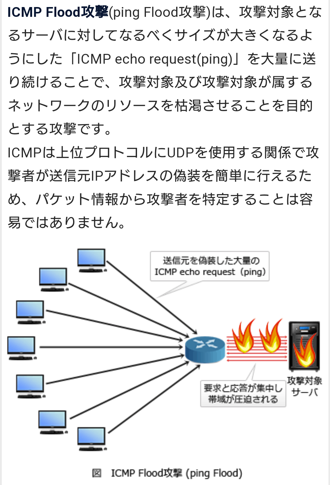
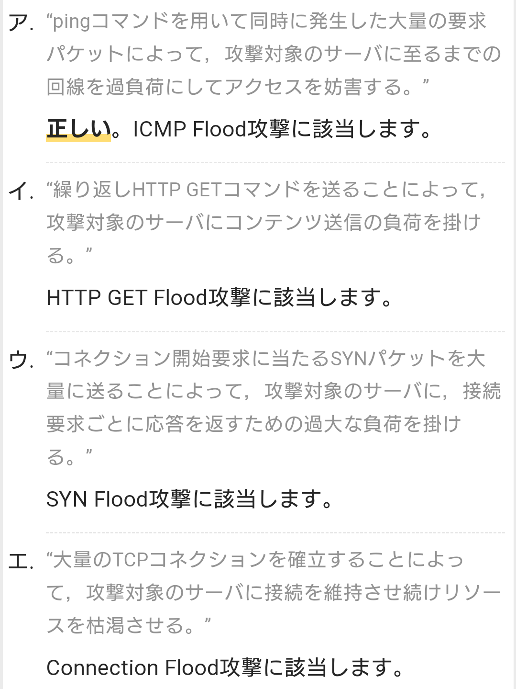
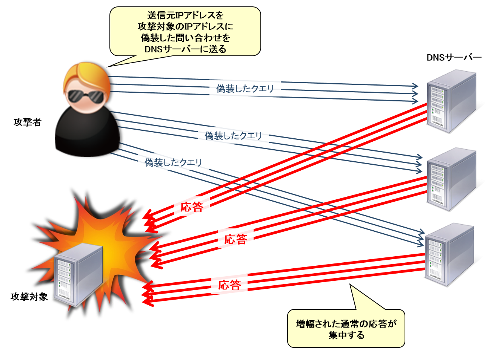
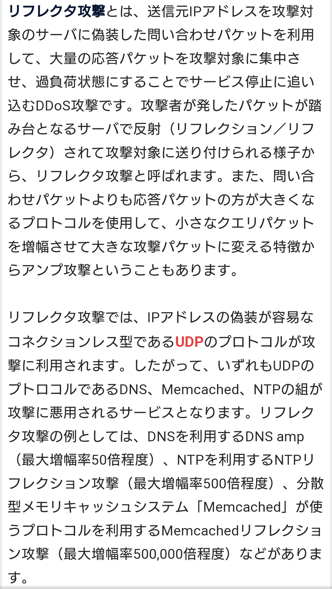
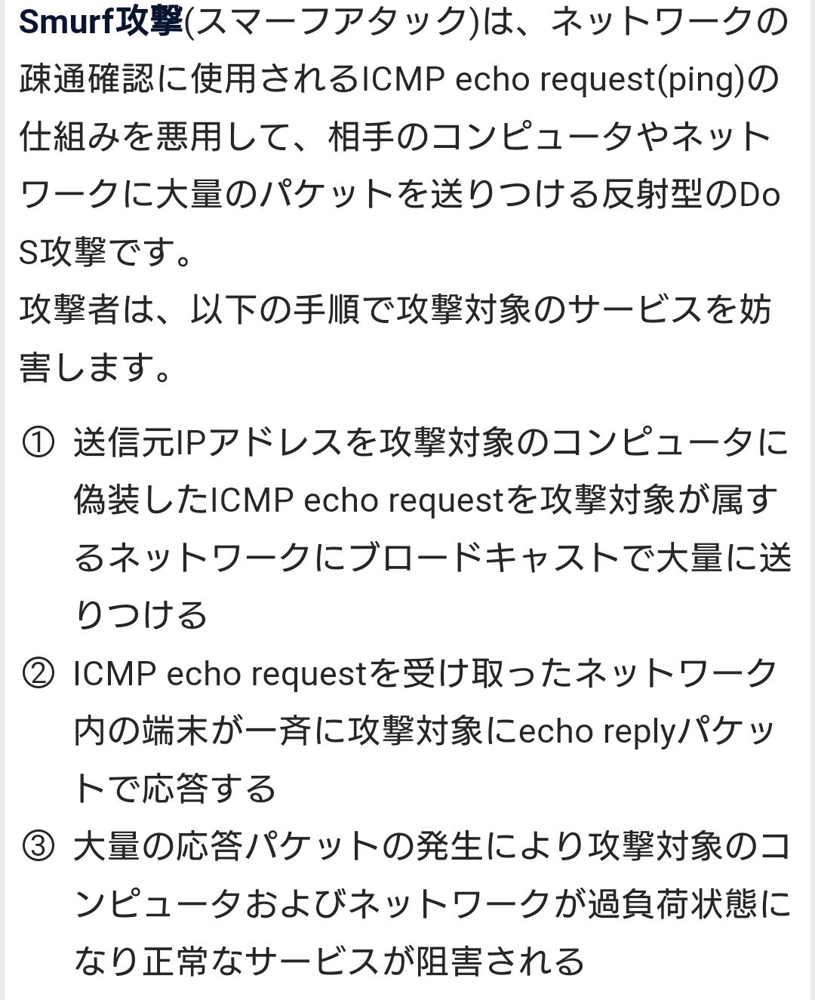
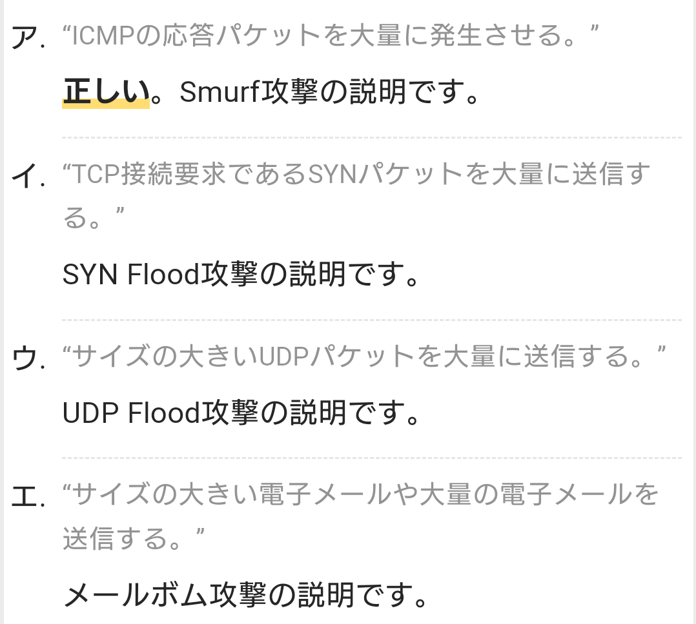

# サービス妨害
# DoS攻撃 【Denial of Services attack】 DoSアタック / サービス拒否攻撃
- DoS攻撃とは、通信ネットワークを通じてコンピュータや通信機器などに行われる攻撃手法の一つで、大量のデータや不正なデータを送りつけて相手方のシステムを正常に稼働できない状態に追い込むこと。  

- 大量のデータを送りつけて通信容量や処理能力を飽和状態にして応答できないようにする手法（フラッド攻撃）と、ソフトウェアの脆弱性などを顕在化させるような不正なデータを送り込み、システムを応答不能にしたりソフトウェアを異常終了させてしまう手法がある。

# DDoS攻撃【Distributed Denial of Service attack】分散DoS攻撃
- インターネット上の多数の機器から特定のネットワークやコンピュータに一斉に接続要求を送信し、過剰な負荷をかけて機能不全に追い込む攻撃手法。
- 攻撃対象が正常に稼働できないよう妨害するDoS攻撃（Denial of Service）の一種で、ネットワーク上に分散した多数の端末が連携して攻撃を行うことがからこのように呼ばれる。
- 攻撃の首謀者がSNSなどで参加者を募り、多数の実行犯が自らコンピュータを操作して攻撃に参加する場合と、攻撃者がコンピュータウイルスなどを用いて事前に乗っ取った多数の端末を遠隔操作して一斉に攻撃させる場合がある。

- 同じ送信元から多数の接続要求を行う場合に比べ、一件一件のアクセス要求は通常のアクセスと見分けがつきにくく、攻撃のみを機械的に判別して遮断することが難しい。
- 標的側のセキュリティ対策だけで対応するのは限界があり、大手ネット企業などもしばしば被害にあう。

## DNS水責め攻撃【DNS water torture attack】
- ランダムサブドメイン攻撃 / random subdomain attack とも言う
- DNSサーバに対する分散DoS攻撃（DDoS攻撃）の一種で、あるドメイン名について実在しないランダムなサブドメインを大量に作り出し一斉に問い合わせることで、当該ドメインを管理する権威DNSサーバを機能不全に陥らせる手法。

- DNSの仕組みでは、あるドメイン名についての情報は権威DNSサーバが管理し、外部のDNSキャッシュサーバやリゾルバからの問い合わせに対して応答する。
- 実在するドメイン名についての応答は一定期間キャッシュに保存され、同じ問い合わせを何度も繰り返し権威サーバに行わないようになっており、リゾルバに大量に問い合わせが行われても権威サーバの負荷が高まることは通常は無い。

- DNS水責め攻撃では、自動生成した出鱈目な文字列によって「qawsedrftgyhujikolp.example.com」といった実在しないサブドメインを大量に作り出し、ボットネットなどに指示して一斉に様々なリゾルバに問い合わせを行う。このとき、インターネットの任意の相手からの問い合わせに応答する設定になっているオープンリゾルバが悪用される。

- 各リゾルバはキャッシュに存在しないドメイン名であるため、権威DNSサーバ（この例ではexample.comを管理するサーバ）への問い合わせを行う。
- 攻撃者はリゾルバに対して存在しないドメイン名を次々に問い合わせ、これに応じてリゾルバはすべてのサブドメインについて権威サーバへ問い合わせを行ってしまう。

- 大量のボットと大量のオープンリゾルバを動員してこのような問い合わせを繰り返すことで、権威DNSサーバへは通常の運用では想定しない大量の問い合わせトラフィックが集中し、外部からのアクセスに応答できない機能不全の状態に陥ってしまう。

- また、一般家庭などに設置されたブロードバンドルータ（ホームルータ）などのうち、オープンリゾルバとして外部からのDNS問い合わせに応答するよう誤って設定されているものを動員することで、特定のISP（インターネットサービスプロバイダ）のDNSキャッシュサーバ（フルサービスリゾルバ）を機能不全に陥れる場合もある。

## フラッド攻撃
### SYNフラッド攻撃
- SYNフラッド攻撃とは、攻撃対象を機能不全に陥らせるDoS攻撃の手法の一つで、TCPの接続要求を行うSYNパケットのみを大量に送りつける攻撃。攻撃側は接続確立にはあえて応じず「応答待ち」状態を大量に作り出し、正規の接続要求にも応じられない状態に追い込む。

- スリーウェイハンドシェイクの手順を悪用し、接続開始を要求するSYNパケットだけを次々送りつけ、ACKパケットの返信をわざと怠り放置する。相手側には応答待ちのまま待機状態のTCP接続が大量に停留し、最後には接続可能数を超えて新規の接続をまったく受け付けられない状態に陥ってしまう。

- あるSYNパケットが正規のものかSYNフラッドを狙ったものかを知る術はないが、全体の接続状態を監視して、単一の（あるいは同時間帯に多数の）ホストがACKに応じず次々に新しいSYNを送ってくるような場合には、攻撃を疑って接続を拒否するといった対策を行うことはできる。

### ICMPフラッド攻撃(Pingフラッド攻撃)

- ICMPフラッド攻撃とは、攻撃対象を機能不全に陥らせるDoS攻撃の手法の一つで、標的にICMPパケットを短時間の間に大量に送りつける攻撃。

- ICMP（Internet Control Message Protocol）はIPネットワーク上で通信制御や状態調査を行うためのプロトコル（通信規約）の一つで、ネットワーク上で相手方までの経路の疎通確認を行う「ping」コマンドなどで利用される。

- ICMPフラッド攻撃はこれを悪用したもので、攻撃者は対象に向けて「ICMPエコー要求」（echo request）と呼ばれる制御用メッセージを短時間の間に大量に送信する。対象の回線容量やシステムの処理能力を飽和状態にすることで、通常の接続要求に応答できない状態にしてしまう。

- 同じICMPを悪用した攻撃でも、一回のICMPメッセージに長大なデータを添付し、短いデータの受信しか想定していないソフトウェアの動作を妨害して通信不能な状態に陥らせる攻撃手法は「Ping of Death」（死のping）と呼ばれる。

### UDPフラッド攻撃
- 攻撃対象を機能不全に陥らせるDoS（Denial of Service）攻撃の一つで、標的に偽の送信元IPアドレスやランダムな宛先ポート番号を設定したUDPデータグラムを大量に送りつける攻撃。

# DNSリフレクター攻撃 【DNS reflector attack】 DNSアンプ攻撃
- DNSリフレクター攻撃とは、多数のコンピュータから一斉に大量のデータを送りつけて攻撃対象を機能不全させる分散DoS攻撃（DDoS：Distributed Denial of Service）の一種で、多数のDNSサーバに問い合わせを送り、応答を攻撃対象に集中して送信させる手法。  

- DNSサーバはクライアントからの問い合わせに対して応答を返すが、攻撃者は送信元IPアドレスを攻撃対象のものに偽装した問い合わせを送ることで、DNSサーバが応答を攻撃対象に送信するよう仕向ける。  

- 攻撃の踏み台として、インターネットで公開されているDNSサーバのうち、外部からの問い合わせに答えてしまう不適切な設定のオープンリゾルバや、ある特定のドメイン名の管理権限を持ち外部からの問い合わせに答えなければならない権威DNSサーバが狙われる。  

## リフレクション攻撃 (reflection attack)
- ネットワークを通じて行う攻撃手法の一つ
- 送信元IPアドレスを偽装したパケットを送りつけるなどして、ネット上の他のコンピュータから攻撃対象のコンピュータに大量の通信を発生させて対象を過負荷で機能停止に追い込む手法をリフレクション攻撃あるいはリフレクター攻撃という。
- 利用する通信プロトコルによってDNSリフレクションやNTPリフレクション、SNMPリフレクションなどの種類がある。

# Pass-the-Ticket攻撃

# Smurf攻撃 【Smurf attack】
- 特定のコンピュータに繋がるかどうか確認する「ping」コマンドで使われるパケットの送信元を偽装し、標的に向けて大量のパケットを送りつける攻撃手法。
    - pingコマンドの仕様では、ICMP（Internet Control Message Protocol）というプロトコルを用いる。
    - 疎通確認したい相手に「エコーリクエスト」（echo request）というパケットを送り、相手は「エコーリプライ」（echo reply）パケットを送り返す。
- 標的となったコンピュータやその所属するネットワークに過重な負荷をかけ、正常な通信ができない状態に陥らせるDoS攻撃の一種である。

