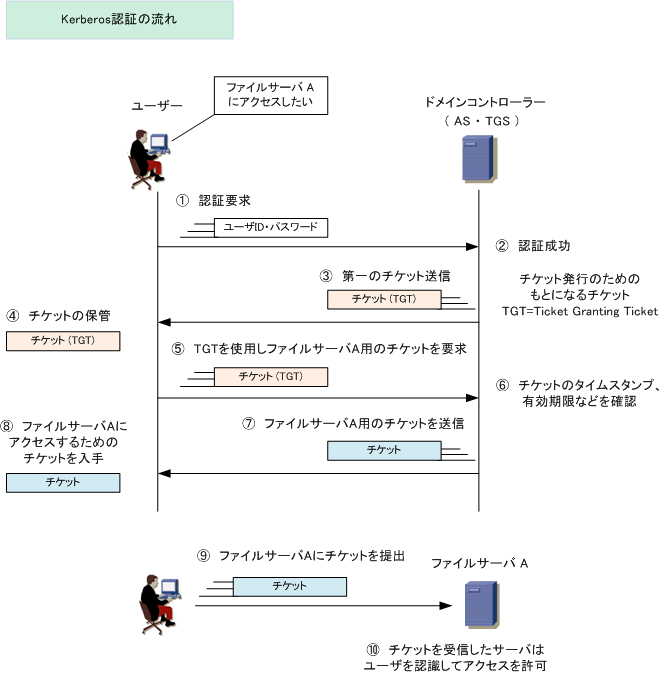

# Active Directoryとは
- Windowsのユーザ管理の仕組みには、以下の2つがある
    - ワークグループ認証
    - ドメイン認証
- ドメイン認証の仕組みを使ったのがActive Directory。
- ドメイン内の機器やユーザを一括管理することができる。

## REFERENCE
https://qiita.com/salmonosushi/items/cfa59f01fd2f71880084

## Golden Ticket (ゴールデンチケット)
- 攻撃者が作成するActive Directoryの正規ドメイン管理者に長期的になりすます認証チケット
- Active Directory認証において攻撃者が作成したTGT(Ticket Granting Ticket)のこと

## ケルベロス認証(Kerberos認証)
- SSO（シングルサインオン）は1つのIDで複数のWebサービスやアプリケーションの認証を可能にする。
- Kerberos認証では1度IDとパスワードを使用して認証するとチケットが発行され、2度目以降はチケットを使用して認証する。

### 認証の流れ
1. 認証要求
    - クライアントからprincipalとパスワードをASに送信する。  
        - principalとパスワードの代わりにkeytabファイルを使用することもできる。  
        - キャッシュにTGTが存在する場合はこの認証要求は行われない。  
    - IDとパスワードを使用した認証が成功すると「チケットを発行するためのチケット」が発行される。  
        - チケットの有効期限が切れるまではIDとパスワードでの認証は必要ない。
1. TGTの発行
    - 対応するIDが存在する（認証成功）とASは、2つの情報をクライアントに送信する。
    - 1つ目の情報は、Client/TGS Session Key
        - セッション毎に生成される共通鍵暗号の共通鍵
        - principal毎に生成された共通鍵で暗号化した情報
    - 2つ目の情報は、TGT
        - クライアントのprincipalとネットワークアドレス、有効期限、Client/TGS Session Keyを一纏めにし、TGSの暗号鍵で暗号化した情報 
1. TGTの保存
    - クライアントはASから受信したTGTをキャッシュに保存する。
1. 「サーバにアクセスするためのチケット」取得
    - クライアントは2つの情報をTGSに送信する。
        - 1つ目の情報はTGTとアクセスしたいサーバのprincipal
        - 2つ目の情報はクライアントのprincipalとマシン日付
            - Client/TGS Session Keyで暗号化した情報
    - TGSはTGTに含まれるprincipalとクライアントから受信したクライアントのprincipalが一致するか確認する。
    - principalが一致することが確認できた場合2つの情報をクライアントに送信
        - 1つ目の情報は「サーバにアクセスするためのチケット」
            - クライアントのprincipalとネットワークアドレス、有効期限、Client/Server Session Keyをひとまとめにし、サーバの暗号鍵で暗号化した情報
        - 2つ目の情報はClient/Server Session Key
            - セッション毎に生成される共通鍵暗号の共通鍵
            - Client/TGS Session Keyで暗号化した情報
1. サーバへのチケット送信
    - クライアントは2つの情報をサーバに送る。  
        Client/Server Session Keyで暗号化してサーバに送信  
        - 1つ目の情報は「サーバにアクセスするためのチケット」
        - 2つ目の情報はクライアントのprincipalとマシン日付
    - サーバは「サーバにアクセスするためのチケット」に含まれるprincipalとクライアントから受信したprincipalが一致するか確認する。  
    principalが一致することが確認できた場合サーバにアクセスするためのチケット」に含まれるマシン日付とクライアントから受信したマシン日付を比較  
    マシン日付の差異が5分以上あると認証失敗  

    - サーバはprincipalとマシン日付の確認に成功すると、クライアントから受信したマシン日付をClient/Server Session Keyで暗号化してクライアントに送信する。
    - クライアントはサーバから受信したマシン日付とサーバに送信したマシン日付を比較する。
        - マシン日付が一致した場合にサーバとのセッションが成立する。

### 用語

#### KDC（Key Distribution Center）
- どのIDがどのサーバに対する権限を持っているかを一括管理する機能  
- principalでユーザやサーバを識別する。
- 

- 以下を含む。
    - AS（Authentication Service）  
    IDとパスワードの認証を行うサービス  
    認証が成功するとTGTを発行
    - TGS（Ticket Granted Service）  
    TGTを認証し、「サーバにアクセスするためのチケット」を発行するサービス  
    サーバ毎に別々のチケットを発行する。

#### TGT (Ticket Granting Ticket)
- 正しいユーザであることを証明するためのチケット

#### ST (Service Ticket)
- ADドメインのサービスを利用するためのチケット

#### principal
- Kerberos認証で管理されるユーザやサーバを表す。

#### realm
- ケルベロス認証ではrealmをグループ名として論理ネットワークを構築する。
- ドメイン名と同じ意味を持つ。

### メリット
- 安全性
    - Kerberos認証では、認証の都度送信内容が変わるため、第三者によるリプレイアタックを実施することができない。
    - Kerberos認証で発行されたチケットにはクライアント情報が含まれてるが、暗号化されており、クライアントで復号することはできない。  
    クライアントではチケットの確認方法がないため、第三者が同じチケットを使用してサーバに認証することもできない。

- トラフィックが少ない
    - Kerberos認証ではチケットの有効期限が切れるまではkdc（ドメインコントローラに該当）に接続しないため、通信時のトラフィックが少なくなる。

### REFERENCE
https://www.infraexpert.com/study/security18.html
https://www.fenet.jp/infla/column/technology/kerberos