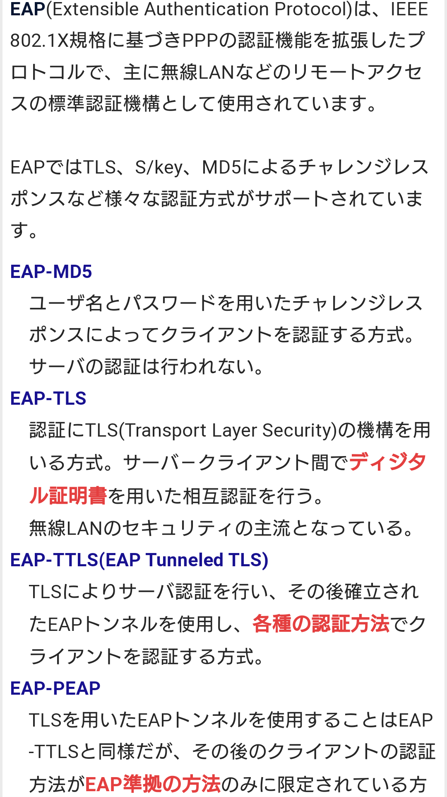
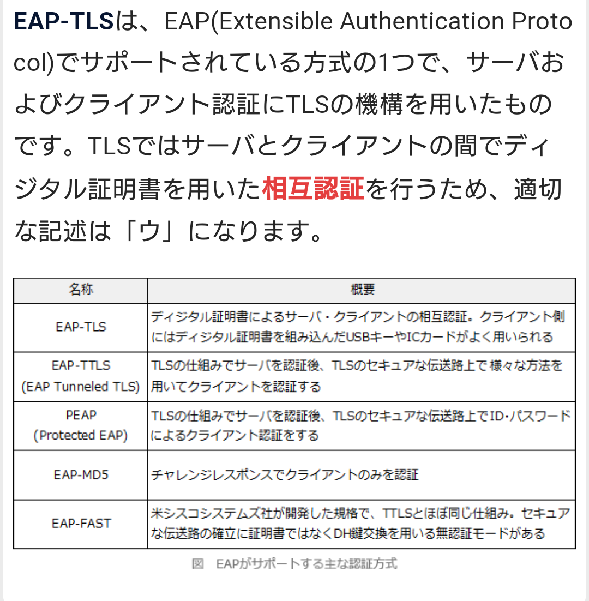
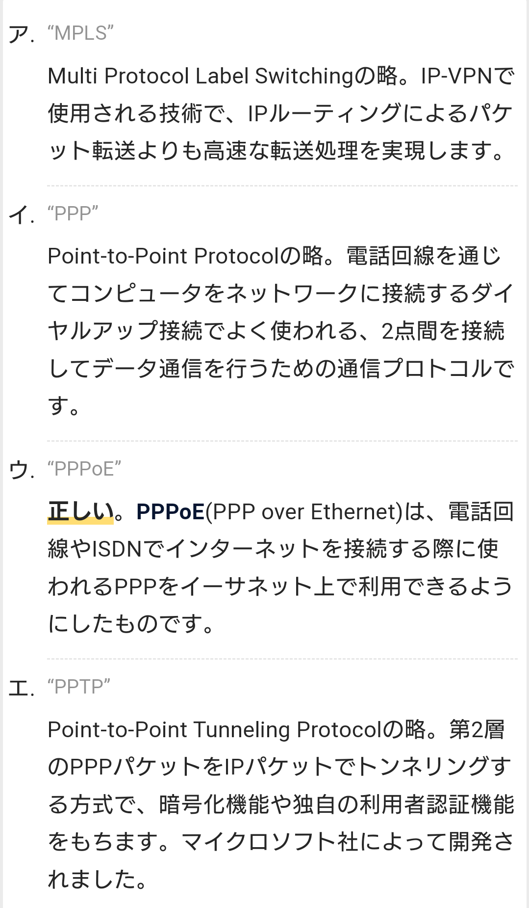
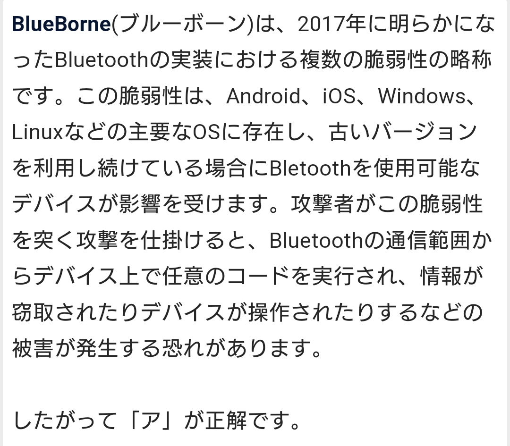

# EAP 【Extensible Authentication Protocol】 PPP EAP
- 二地点間の接続の確立に用いられるPPP（Point-to-Point Protocol）の拡張仕様で、様々な認証方式を利用する手順を定めたもの。
- LAN上で認証を行う方式を定めたIEEE 802.1Xにも標準の認証手順として採用された。
- IEEE 802.1Xで用いられる認証プロトコル

# PPP 【Point-to-Point Protocol】
- 標準的な通信プロトコルの一つで、二台の機器の間で仮想的な専用の伝送路を確立し、相互に安定的にデータの送受信を行うことができるようにするもの。
- 1992年に最初の仕様が策定されたが、1994年にRFC 1661として標準化された仕様が広く普及している。
- OSI参照モデルではデータリンク層（第2層）にあたる。
- 電話回線で発呼や着信ができるようにした方式を「ダイヤルアップPPP」と呼び、1990年代に家庭などからインターネットサービスプロバイダ（ISP）に接続する手段として標準的に使われた。
- 近年主流となったADSLや光ファイバーによるデータ通信専用回線による接続では、EthernetやATMなどの上位層で2地点間の接続を確立するのにも使われ、それぞれ「PPP over Ethernet」（PPPoE）「PPP over ATM」（PPPoA）などと呼ばれる。

# ADSL

# PPPoE「PPP over Ethernet」
- PPPoEとは、標準的な通信プロトコル（通信手順）の一つで、常時接続の通信回線やネットワーク上で、二台の機器の間で仮想的な専用の伝送路を確立し、相互に安定的にデータの送受信を行うことができるようにするもの。
- 家庭などからxDSL（ADSLなど）や光ファイバー（FTTH）、CATVなどの常時接続のインターネット接続サービスを利用する際によく利用される。

- 電話回線やISDN回線を通じてインターネットに接続する際によく用いられていたPPP（Point-to-Point Protocol）を、構内ネットワーク（LAN：Local Area Network）の標準であるEthernet（イーサネット）上で利用できるようにしたもので、家庭内LANに接続されたパソコンやルータ（ブロードバンドルータ）などの機器と、インターネットサービスプロバイダ（ISP）の施設に設置された通信機器の間で接続を確立する手段としてよく利用される。

- PPPoEなどを用いずにEthernetをそのままインターネットなどに接続することも技術的には可能だが、PPPoEを利用すると接続開始時に利用者の識別（ユーザ認証）などを行うことができるため、インターネット接続サービスによく利用されている。

## PPPoEマルチセッション (multiple PPPoE connections)
- ADSLモデムやブロードバンドルータなどが備える機能の一つで、PPPoEに対応した複数の異なる接続先（プロバイダなど）に同時に接続できる機能をPPPoEマルチセッションという。

- 複数のプロバイダと契約していてどちらにも同時に接続したい場合や、インターネットを使いながらNTT東日本・西日本のフレッツ・スクウェアなどのネットワークサービスを同時に利用したい場合などに必要となる。

# PPPoA「PPP over ATM」

# SLIP (Serial Line Internet Protocol)

# QoS  【Quality of Service】
- 機器やシステムが外部に提供するサービスの品質の水準。
- 特に、通信回線やネットワークに様々な種類の通信が混在しているとき、通信内容に応じてそれぞれに適した通信品質を確保すること。また、そのための技術や機能。

## 優先制御：
- フレームの種類や宛先に応じて優先度を変えて中継すること
## アドミッション制御：
- 通信を開始する前にネットワークに対して帯域などのリソースを要求し、確保の状況に応じて通信を制御すること
## ポリシング：
- 入力されたトラフィックが規定された最大速度を超過しないか監視し、超過分のパケットを破棄するか優先度を下げる制御
- 通信量を一定の水準に抑える帯域制御の方式の一つで、規定の通信容量を超えるデータを破棄する方式。

## シェーピング：
- パケットの送出間隔を調整することによって、規定された最大速度を超過しないようにトラフィックを平準化する制御
- 通信量を一定の水準に抑える帯域制御の方式の一つで、規定の通信容量を超えるデータを通信機器内部に保存し、容量に空きができたときに送信する方式。

## ベストエフォート：
- ネットワークでは（最善を尽くすが）利用状況によっては通信の品質を保証しないこと

## blueborne
- マルウェア の名前ではなく、無線通信規格の「Bluetooth」に関する脆弱性の総称
- この脆弱性を悪用されると、ペアリングをすることなくスマートフォンを操作されたり、マルウェアを仕込まれるといったリスクが発生する。
- 遠隔操作によってスマートフォンを起動され、アドレス帳やメールにアクセスされるというようなリスクが発生する。

