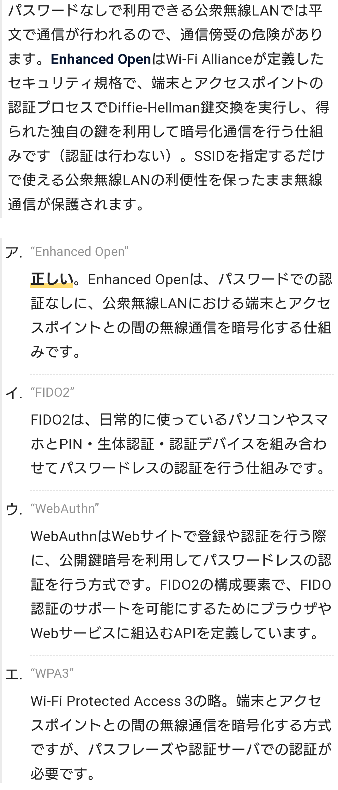

# Wifi
- 電波を用いた無線通信により近くにある機器間を相互に接続し、構内ネットワーク（LAN）を構築する技術。
- 無線LANの規格の一つだが、事実上の唯一の標準としてほぼ同義語として扱われる。

- Wi-Fiの通信は「アクセスポイント」（AP：Access Point）と呼ばれる据え置き型の中継装置を中心に各機器が接続され、機器間の通信はAPを介して行う接続形態が一般的となっている。
- これを「インフラストラクチャーモード」という。

- 無線はケーブル接続と異なり送受信対象を物理的に指定したり制限することが難しいため、周囲の機器は各APに設定されたSSID（正確にはESSID）と呼ばれる固有の識別名を用いてAPを識別する。
- 利用者は近隣にあるAPのSSIDの一覧の中から適切なものを選択して（あるいはSSIDを直接入力・指定して）接続を申請する。

- Wi-Fiでは利用者の認証や通信の暗号化についての技術仕様として「WPA」（Wi-Fi Protected Access）を定めており、多くの機器が標準で対応している。
- 家庭など小規模環境向けの「WPA-Personal」と企業など大規模環境向けの「WPA-Enterprise」がある。

- 接続時の認証方式としては、事前にAPと機器の間で同じパスフレーズ（長いパスワード）を設定して照合するWPA-PSK（Pre-Shared Key）方式がよく用いられるが、WPA-EnterpriseではIEEE 802.1X標準に基づくRADIUS認証サーバを利用する方式も選択できる。

- 通信の暗号化には共通鍵暗号の有力な標準規格であるAES（Advanced Encryption Standard）を採用し、一定の通信量ごとに暗号鍵を切り替えるなどして盗聴を防止する。

# WPA 【Wi-Fi Protected Access】
- 無線LAN（Wi-Fi）上で通信を暗号化して保護するための技術規格の一つで、WEPの代替を企図したもの。
- また、通信機器などが同規格に準拠していることを認定する認証制度。業界団体のWi-Fi Allianceが運用している。

- 通信の暗号化そのものはWEPと同じRC4アルゴリズムをベースとしているが、鍵長が128ビットに拡張され、さらに48ビットの初期化ベクト ル（IV：Initialization Vector）と呼ばれるパラメータを併用する。
- 通信中に一定の送受信データ量毎に暗号鍵を変更するTKIP（Temporal Key Integrity Protocol）と呼ばれる仕組みを採用し、暗号鍵が盗まれにくいようになっている。

## WPA2 【Wi-Fi Protected Access2】
- 無線LAN（Wi-Fi）上で通信を暗号化して保護するための技術規格の一つで、WPAの後継。
- また、通信機器などが同規格に準拠していることを認定する認証制度。
- 業界団体のWi-Fi Allianceが運用している。

## WPA3【Wi-Fi Protected Access 3】
- 無線LAN（Wi-Fi）上で通信を暗号化して保護するための技術規格の一つで、WPA2の後継。
- また、通信機器などが同規格に準拠していることを認定する認証制度。
- 業界団体のWi-Fi Allianceが2018年6月に発表した。

- 基本的な仕様はWPA2に則っており、いくつかの機能が拡張・強化されている。
- WPA3対応機器は古いWPA2対応機器とはWPA2を用いて通信することができる。
- 新たに策定された仕様はWPA3対応機器間でのみ利用できる。

- WPA2およびWPAと同様に、個人・家庭・小規模事業所向けの「WPA3-Personal」（WPA3-SAE/パーソナルモード）と、IEEE 802.1X認証サーバにより利用者や端末の認証を行う大規模ネットワーク向けの「WPA3-Enterprise」（WPA3-EAP/エンタープライズモード）の二つを選択できる。

- パーソナルモードではWPA2までの事前共有鍵（PSK：Pre-Shared Key）方式を改め、利用者の入力したパスワードから一定の手順で算出した値と乱数を用い、楕円曲線暗号によって認証を行う「SAE」（Simultaneous Authentication of Equals）方式が採用された。
- エンタープライズモードでは新たな暗号スイートであるCSNA（Commercial National Security Algorithm）を採用し、192ビット安全性を実現している。

# Enhanced Open
- パスワードでの認証なしに公衆無線LANにおける端末とアクセスポイントとの間の無線通信を暗号化する仕組み

