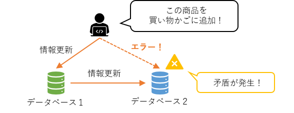
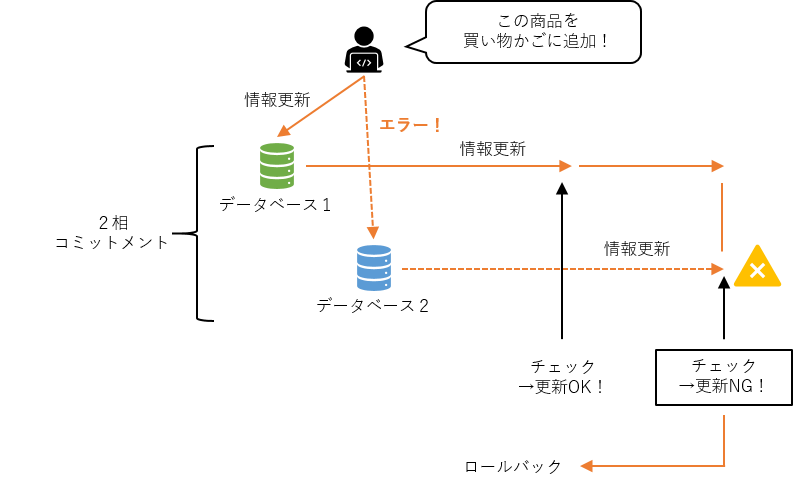
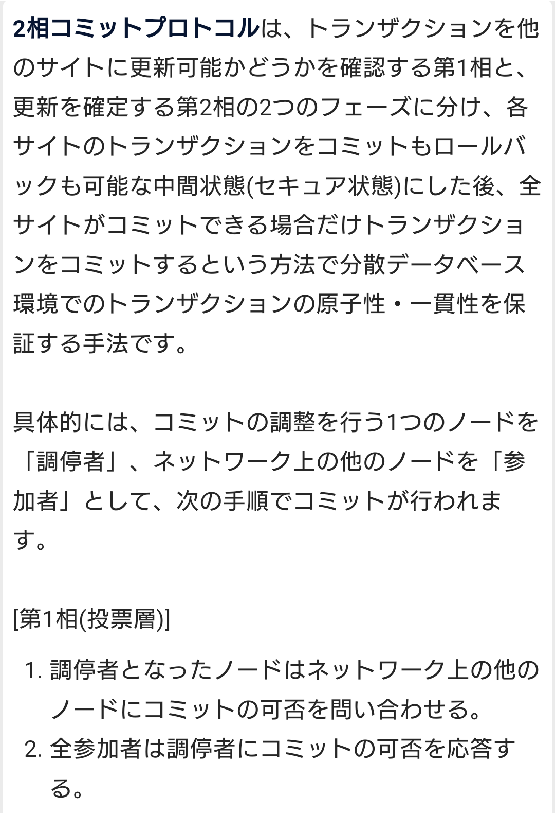
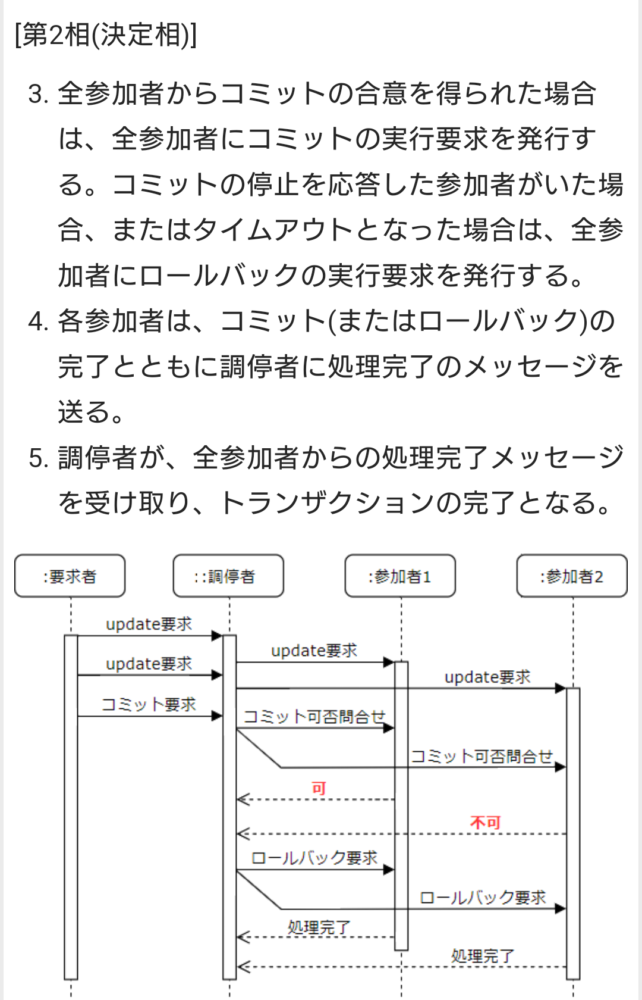
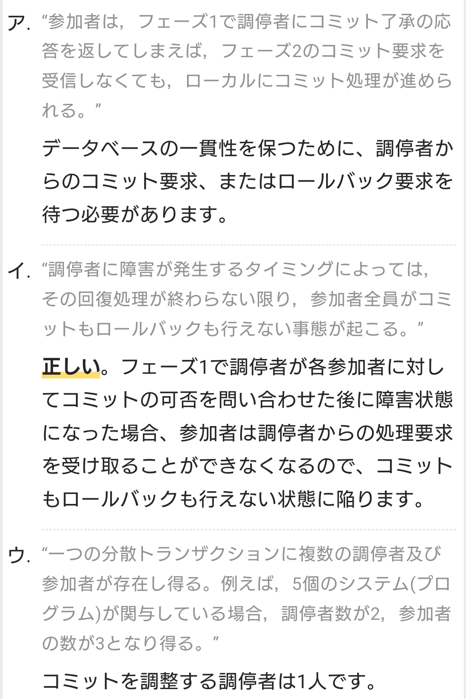
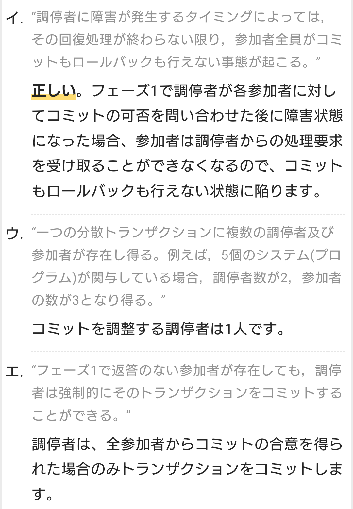

# DB

## ２相コミットメント
- 一相コミットメントでは，あるトランザクション処理が発生して，複数のデータベースが更新されたときに片方がエラーを起こしてしまうと，更新処理に矛盾が起きてトランザクション処理の原則（ACID特性）である「原子性」と「一貫性」を満たさなくなってしまう。

- ２相コミットメントでは「確定することもできるし」「元に戻すこともできる」状態であるセキュア状態を作り出すことで，片方に異常が起こった場合にロールバックを可能にする。

## 主キー
- データベースのデータを一意に識別するための項目のこと

### 復号キー（復号主キー）
- 1つの項目ではなく、複数の項目を主キーとして組み合わせデータを一意に識別すること

## 整合性制約
### 一意制約  	
- データに重複がなく、必ず一意であること。
- 主キーの項目（カラム）に同じデータが登録された場合、この一意制約でエラーとなる。

### NOT NULL制約	  
- NULLを許可しない。主キーの項目（カラム）にNULLが登録された場合、このNOT NULL制約でエラーとなる。

## 外部キー(Foreign Key)
- 他の表を参照するために設定される属性のこと。
- 参照整合性を保つため参照する側の属性には参照される側の表に存在しない値を含むことができない外部キー制約が課される。

## 候補キー(Candidate Key)
- 主キーの候補となるキーのことで、表の中の1つのレコードを特定できる性質を持つ属性、または属性の組合せ。
- 候補キーではnull値が許されます。候補キーにNOT NULL制約を加えたものが主キー制約となる

- 1つの表に複数の候補キーがある場合には、その中で項目の組合せが最小でその表の性質にあったものが主キーとして選択される。

## 関数従属性
- リレーショナルデータベース（RDB）の表で、2つの属性の間で片方の値を決定するともう一方の値が一意に決まるという性質のこと

# 正規化

- 第1正規化
    - 繰り返し項目をなくす
    - 全ての属性が単一値である状態
- 第2正規化
    - 主キーの一部によって一意に決まる属性を別表に移す
    - 第1正規形を満たし、かつ、主キーに部分関数従属する（主キーの真部分集合に関数従属する）属性が存在しない状態
- 第3正規化
    - 主キー以外の属性によって一意に決まる属性を別表に移す
    - 第2正規形を満たし、かつ、主キーからの推移的関数従属が存在しない状態

- 正規化は、データの冗長性を排除して、データの一貫性と整合性を保つために行われます。
    - 逆に正規化を行うと表が複数に分割されるので、結合などに余分な処理時間がかかるようになり、アクセス効率が下がることもあります。

- 正規化を行うと，複数の項目で構成される属性は，単一の項目をもつ属性に分解される。
- 繰り返し項目を持つレコードは、第1正規化の段階でそれぞれの単独のレコードに分割されます。

- 多対多の関係は関係データベースとして実装することができない（非正規形になる）

## 参照制約
- 外部キーを持つ表にレコードを追加する場合に、その外部キー列の値は参照先の表の主キーとして存在するものでなければならない、また、別表から主キーの値を参照されている行は削除することができないという制限を課す制約です。

- 参照制約は、関係データベースの整合性を保つために設定され、その指定には次のように"FOREIGN KEY"と"REFERENCES"が使われます。  

    - FOREIGN KEY 列リスト 
    - REFERENCES 親テーブル(列リスト)  

## キー制約
- キー制約は、PRIMARY KEY句やFOREIGN KEY句を用いて指定します。

## 検査制約
- 検査制約は、CHECK句を用いて指定します。

## 表明
- 表明は、整合性制約の一種でCREATE ASSERTION句で指定します。

## 関係演算

## データベースを設計する際の論理データモデル作成の手順
## トップダウンアプローチ
- E-R図などで表される概念データモデルをもとに具体化を進める方法。
- 概念的なモデルに基づき、将来的な拡張性を含めた理想的な設計を行なえる可能性があるが、逆にユーザニーズを十分反映できない場合もある。

## ボトムアップアプローチ
- ユーザが利用している画面や帳票を抽象化してモデル化を行なう方法。
- 直近のユーザニーズを的確に反映することができるが、将来的な拡張性、柔軟性にかけたモデルになる可能性がある

## べき等(Idempotent)
- 同一の操作を複数回実行した結果と，一回しか実行しなかった結果が同一になる操作
- コンピュータサイエンスの世界で使われる言葉で、ある操作を1回実行しても複数回実行しても結果が同じになる性質です。
- 主要なデータ操作SQL文のうち、SELECTと障害回復時のUNDO・REDOはべき等、INSERT・UPDATE・DELETEはべき等ではありません。

## 原子性
- トランザクション内の全ての処理が成功したか，何も実行されなかったかのいずれかの結果にしかならない操作

## レプリケーション
- 一つのノードへのレコードの挿入処理を，他のノードでも実行する操作

## 直列化可能または一貫性
- 複数のトランザクションを同時に実行した結果と，順番に実行した結果が同一になる操作

## ANSI/SPARC 3層スキーマ
概念スキーマ、外部スキーマ、内部スキーマの3つのグループに分けてデータ定義を行うデータベースモデル

- 物理的・論理的データの独立性を達成するためにDBMSがサポートすべきアーキテクチャとして提案されたものです。

### 概念スキーマ
- データベース化対象の業務とデータの内容を論理的なデータモデルとして表現したもの。
- 概念スキーマを記述するために記号系にはリレーショナルモデルの他にも、ネットワークモデル、階層型モデルなどがある。リレーショナルモデルではE-R図の作成、表定義、表の正規化が概念スキーマに相当する。

### 外部スキーマ
- 概念スキーマで定義されたデータモデル上に利用者ごとの目的に応じた見方を表現したもの。
- リレーショナルモデルのビューやネットワークモデルのサブスキーマが外部スキーマに相当する。

#### サブスキーマ
外部スキーマの別称。

### 内部スキーマ
- 概念スキーマで定義されたデータモデルを記憶装置上にどのような形式で格納するかを表現したもの。
- ファイル編成やインデックスの設定などが内部スキーマに相当する。

## ボイス・コッド正規形
- 第3正規形の条件を満たしつつ、すべての列が主キーに完全関数従属で、他に完全関数従属関係がないものを言います

## オブジェクト指向データベース
- データとその操作手続を併せもったデータ構造を扱う。
- 関係データモデルをオブジェクト指向データモデルに拡張し、オブジェクト指向プログラミングで使うオブジェクトの形式で表現される操作の定義や型の継承関係の定義を格納できるデータベースモデルです。

## 階層型データベース
- 階層構造によって，データの関係を表現する。

## ネットワーク型データベース
- 関連するデータを，ポインタで結合する。

## 関係データベース
- データの集合を幾つかの2次元の表によって表現する。

# SQL

## ストアドプロシージャ(Stored Procedure)
- データベースに対する一連の処理をまとめた手続きにして、データベース管理システムに保存したもの
- 利用者は通常のクエリを発行する代わりに、データベース管理システム内の手続きを呼び出すことによって目的の処理を実行させることができます。

- クライアントからサーバに対してのストアドプロシージャ1回の要求で、データベースに複数のクエリを発行することができるので、クライアントから直に同数のクエリを発行する場合と比較して、クライアントとサーバ間の通信負荷の軽減が期待できます。

## CASCADE
- 参照される側の行が削除・更新された場合、それを参照する側の行も同時に削除・更新する指定です。

## INTERSECT（共通）
- 2つの関係に共通集合を得る演算
- 複数の表から両方に共通する行を抽出する集合演算を行うSQL文です。積集合を求めるのに使います。

## RESTRICT
- 参照制約性を損なう削除や更新処理の要求に対して、データ更新または削除を禁止する指定です。

## UNIQUE
- データベースにデータを追加したり更新する際に、列や列のグループに格納される値が表内のすべての行で一意となるように制限する指定です。

## UNION（和）
- 2つの関係の和集合を得る演算

## CROSS JOIN（直積）
- 2つの関係に存在する行のすべての組み合わせを得る演算

## INNER JOIN（内部結合）
- 2つの関係を共通する属性で結び付ける演算

