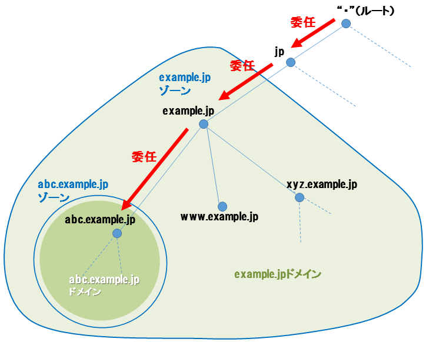
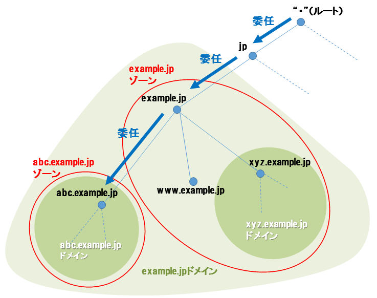
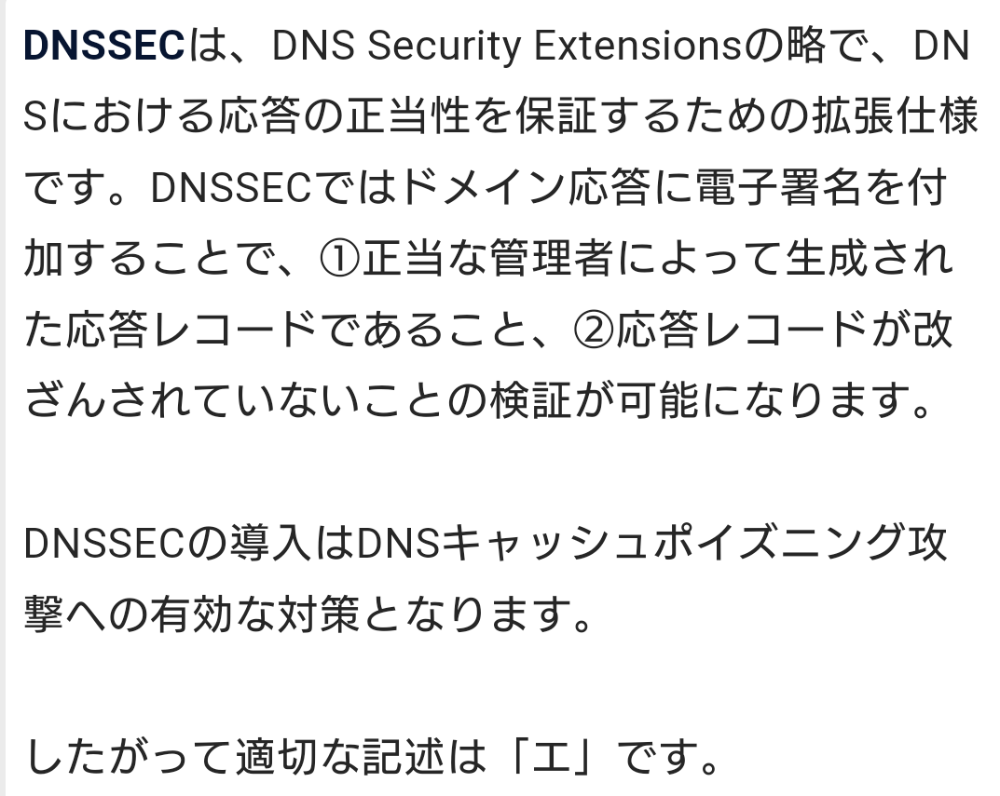
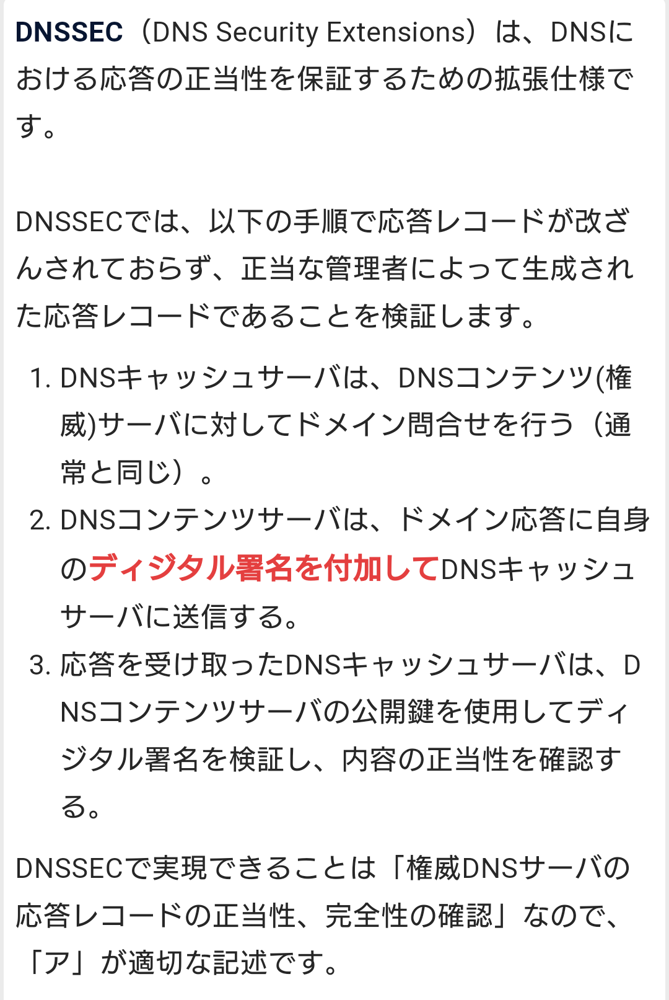
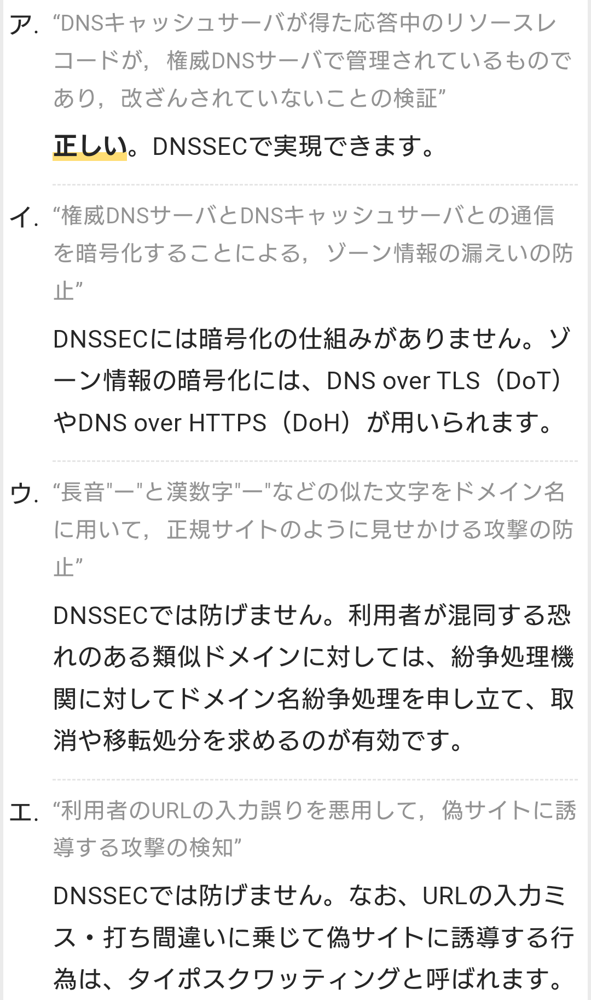

# DNS

- ドメイン名の情報を管理し、外部からの問い合わせに応答するコンピュータやソフトウェアのことを「DNSサーバ」（DNS server）、サーバへの問い合わせを行いDNS情報を参照・利用する側のコンピュータやソフトウェアを「DNSクライアント」（DNS client）あるいは「DNSリゾルバ」（DNS resolver）という。

    - ドメイン名とIPアドレスの対応関係をサーバへの問い合わせによって明らかにすることを「名前解決」（name resolution）と呼ぶ。
    - ドメイン名から対応するIPアドレスを求めることを「正引き」（forward lookup）、逆にIPアドレスからドメイン名を割り出すことを「逆引き」（reverse lookup）という。

- 名前解決を行うためには、 左端のホスト名が解決されるまで問い合わせを再帰的に繰り返す必要がある。
- この問い合わせ手順を末端のDNSクライアントが毎回行っていたのではサーバとクライアント、途中のネットワークの負荷や無駄が大きすぎるため、通常はインターネット接続事業者（ISP）などが用意したDNSキャッシュサーバが各クライアントからの問い合わせを代行し、結果を一定期間保存して同じ問い合わせに代理で応答するという運用が行われる。

## DNSキャッシュサーバ 【DNS cache server】
- 利用者からの任意のドメイン名の名前解決の問い合わせを受け付け、当該ドメイン名を管理するDNSサーバへの問い合わせを（代理で）行い、結果を利用者に返答するコンピュータやソフトウェアのこと。
- 問い合わせ結果は一定期間保存され、期間内に同じ問い合わせが来た時には外部サーバへ新たに問い合わせることはせず自ら返答する。
- これにより上位DNSサーバの負担が軽減され、利用者への応答時間も短縮される。

    - 管理権限は階層構造に沿って移譲され、分散管理されている。
    - 権威DNSサーバは自らが管理権限を有するドメイン名空間（(DNS)ゾーンと呼ばれる）についての情報を保持し、外部からの問い合わせに対して回答する。

- 一般の利用者がコンピュータのネットワーク設定などで指定する「DNSサーバ」は、各ドメイン名を管理しているDNSサーバ（「DNSコンテンツサーバ」あるいは「権威DNSサーバ」と呼ばれる）ではなく、このDNSキャッシュサーバである。

### DNSゾーン
- DNSでは、ある権威DNSサーバが管理するドメインの範囲をゾーンと呼ぶ。
- 管理するドメインにサブドメインを設けた場合、自前で管理すれば同じゾーンに属するが、管理を別のサーバに委任すると別のゾーンとして分割される。

- ドメインによってサブドメインをどのように移譲するかは異なるため、ドメイン名の階層構造とゾーンの範囲は必ずしも一致しない。
- あくまで当該DNSサーバが直接ホスト情報などの管理をしているドメイン領域のみをゾーンという。

### ゾーン情報
- ある権威DNSサーバが管理する範囲（DNSゾーン）について、ホスト名やIPアドレスなどの対応関係、各種の管理用の設定などを記述したデータ。
- テキストファイルの形で管理する場合は「ゾーンファイル」と呼ばれることもある。

- DNSゾーンに関する様々な情報を「リソースレコード」（RR：Resource Record）と呼ばれる形式で列挙したものをゾーン情報という。

### ゾーン転送 【zone transfer】
- インターネット上でドメイン名とIPアドレスの対応付けなどを行うDNS（Domain Name System）において、あるDNSサーバの管理するドメイン群（ゾーン）の情報全体を一括して別のDNSサーバに転送すること。
- また、そのようなDNSサーバの機能。通常は、セカンダリDNSサーバがプライマリDNSサーバの持つデータの複製を作るために利用する。

## 権威DNSサーバ 【authoritative DNS server】 DNSコンテンツサーバ
- あるドメイン名の情報を記録・管理する正当な権限を有し、そのドメインの情報についての外部からの問い合わせに応答するDNSサーバのこと。

# リゾルバ 【resolver】 DNSリゾルバ / ネームリゾルバ
- DNSサーバへドメイン名を照会して対応するIPアドレスを調べたり、その逆（IPアドレス→ドメイン名）を調べたりするソフトウェア。

## フルサービスリゾルバ (full-service resolver)
- 単体でDNSによる再帰的な問い合わせを繰り返し、自力ですべてのドメイン名の名前解決を行なうことができるリゾルバをフルサービスリゾルバという。

- ドメイン名やDNSサーバは階層構造で管理されており、ある特定のホスト名の問い合わせを行うには、最下層の個別ドメインのDNSサーバから対応するIPアドレスの情報を聞き出すという手続きを踏む必要がある。
- この再帰的な問い合わせを行うことができ、自力で名前解決が可能なものをフルサービスリゾルバという。

    - 個々の利用者のコンピュータがこれを用いるのは非効率で上位ドメインのサーバの負荷が大きすぎるため、通常はネットワーク事業者などが設置するDNSキャッシュサーバと呼ばれるDNSサーバのみがこの機能を持ち、クライアント側のプログラムはキャッシュサーバへ名前解決を依頼するだけという運用が一般的となっている。

## スタブリゾルバ (stub resolver)
- フルサービスリゾルバへ問い合わせを行い、結果を取得したり表示したりするだけのリゾルバをスタブリゾルバという。
- DNSの階層構造に合わせて最上位から再帰的に問い合わせる能力は無く、利用者が必要とするドメイン名をフルサービスリゾルバへ問い合わせ、応答を受け取ってIPアドレスを返答する。利用者側のコンピュータで実装されるリゾルバは通常スタブリゾルバであり、インターネット接続事業者などが運用するDNSキャッシュサーバなどのフルサービスリゾルバへ問い合わせを行って名前解決を行う。

### オープンリゾルバ 【open resolver】
- DNSの名前解決の機能を持つ機器（DNSキャッシュサーバなど）が、インターネット上のどの機器からの問い合わせにも応答するよう設定されている状態のこと。
- DoS攻撃の踏み台として悪用されるため好ましくないとされる。

- 通常の運用では、フルサービスリゾルバは自ネットワーク内にあるパソコンなどの端末からの問い合わせを受け付けて応答を返すが、設定によってはアクセス制限を行わず、インターネット上のどこからでも問い合わせに応じるように動作している場合がある。このような設定になっている機器をオープンリゾルバという。

    - どこからでも問い合わせを受け付ける点が攻撃者に悪用され、DNSキャッシュポイズニング攻撃やDNSリフレクター攻撃（DNSアンプ攻撃）の踏み台に使われる危険性があるため、むやみに公開設定でリゾルバを運用すべきでないとされる。

## hostsファイル
- オペレーティングシステム（OS）の設定ファイルの一つで、TCP/IPネットワーク上のIPアドレスとホスト名の対応を記述するテキストファイル。主にLinuxなどのUNIX系OSで用いられる。
    - 「IPアドレス ホスト名1 ホスト名2 …」という形式で一行に一項目ずつ記述する。
    - ホスト名部分は「192.168.0.1 gateway1」のようにローカルのものは単にホスト名を、インターネット上のホストについては「198.51.100.1 www.example.jp」のようにFQDN（省略なしのドメイン名）で記述する。
    - 一つのIPアドレスに複数のホスト名を列挙して対応付けることもできる。

# DNSSEC 【DNS Security Extension】
- インターネット上のドメイン名とIPアドレスの変換などを行なうDNS（Domain Name System）において、DNSサーバからの応答が正当なものであることを確認する方式を定めた規格。

    - DNSクライアントがサーバへ問い合わせを行なう際に、サーバからの応答が悪意の第三者によって差し替えや改竄が行われていないことを検証する手順を定めている。
    - 利用するにはサーバとクライアントの双方がDNSSECに対応している必要がある。
    - 公開鍵暗号とデジタル署名の技術を応用し、サーバ側が送信するメッセージに管理者の持つ秘密鍵で暗号化された署名を付す。
    - 応答を受信したクライアントはサーバ側で公開されている公開鍵を用いてこれを復号することで、確かに正規の管理者からの情報であることを確認できる。

    - 攻撃者がサーバを乗っ取るなどして署名ごと偽造することを防ぐため、管理者はあらかじめ公開鍵を自身の親ゾーン（上位ドメイン）の管理者に送信し、親ゾーンのDNSサーバで署名を付けて公開する。
    - 攻撃者が偽の署名でメッセージを送信しても、親ゾーンで公開されている鍵情報と一致しないため、偽物であることが分かる。
    - 親ゾーンも自身の公開鍵をさらに上位の親ゾーンに渡すようになっているため、攻撃者がトップレベルドメイン以下そのドメインまでのすべてのゾーンを乗っ取らない限り、偽の署名を有効にすることはできない。

    - DNSSECで用いる情報の定義はゾーン情報に専用のリソースレコードを用いて記述する。
    - 公開鍵を記述するDNSKEYレコードや、署名情報を記述するRRSIGレコード、親ゾーンに登録した鍵情報を記述するDSレコード、あるゾーンの不存在を通知するNSECレコードなどが用いられる。

- DNSキャッシュポイズニングへの対策になる。

