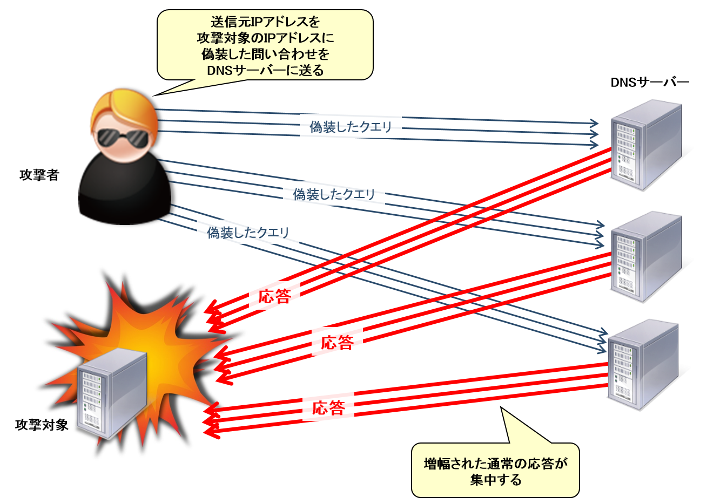

# DoS攻撃
- DoS攻撃 【Denial of Services attack】 DoSアタック / サービス拒否攻撃
- DoS攻撃とは、通信ネットワークを通じてコンピュータや通信機器などに行われる攻撃手法の一つで、大量のデータや不正なデータを送りつけて相手方のシステムを正常に稼働できない状態に追い込むこと。  

- 大量のデータを送りつけて通信容量や処理能力を飽和状態にして応答できないようにする手法（フラッド攻撃）と、ソフトウェアの脆弱性などを顕在化させるような不正なデータを送り込み、システムを応答不能にしたりソフトウェアを異常終了させてしまう手法がある。

## フラッド攻撃
### SYNフラッド攻撃
- SYNフラッド攻撃とは、攻撃対象を機能不全に陥らせるDoS攻撃の手法の一つで、TCPの接続要求を行うSYNパケットのみを大量に送りつける攻撃。攻撃側は接続確立にはあえて応じず「応答待ち」状態を大量に作り出し、正規の接続要求にも応じられない状態に追い込む。

- スリーウェイハンドシェイクの手順を悪用し、接続開始を要求するSYNパケットだけを次々送りつけ、ACKパケットの返信をわざと怠り放置する。相手側には応答待ちのまま待機状態のTCP接続が大量に停留し、最後には接続可能数を超えて新規の接続をまったく受け付けられない状態に陥ってしまう。

- あるSYNパケットが正規のものかSYNフラッドを狙ったものかを知る術はないが、全体の接続状態を監視して、単一の（あるいは同時間帯に多数の）ホストがACKに応じず次々に新しいSYNを送ってくるような場合には、攻撃を疑って接続を拒否するといった対策を行うことはできる。

### ICMPフラッド攻撃(Pingフラッド攻撃)

- ICMPフラッド攻撃とは、攻撃対象を機能不全に陥らせるDoS攻撃の手法の一つで、標的にICMPパケットを短時間の間に大量に送りつける攻撃。

- ICMP（Internet Control Message Protocol）はIPネットワーク上で通信制御や状態調査を行うためのプロトコル（通信規約）の一つで、ネットワーク上で相手方までの経路の疎通確認を行う「ping」コマンドなどで利用される。

- ICMPフラッド攻撃はこれを悪用したもので、攻撃者は対象に向けて「ICMPエコー要求」（echo request）と呼ばれる制御用メッセージを短時間の間に大量に送信する。対象の回線容量やシステムの処理能力を飽和状態にすることで、通常の接続要求に応答できない状態にしてしまう。

- 同じICMPを悪用した攻撃でも、一回のICMPメッセージに長大なデータを添付し、短いデータの受信しか想定していないソフトウェアの動作を妨害して通信不能な状態に陥らせる攻撃手法は「Ping of Death」（死のping）と呼ばれる。

### UDPフラッド攻撃
- 攻撃対象を機能不全に陥らせるDoS（Denial of Service）攻撃の一つで、標的に偽の送信元IPアドレスやランダムな宛先ポート番号を設定したUDPデータグラムを大量に送りつける攻撃。

# 

# DNSリフレクター攻撃 【DNS reflector attack】 DNSアンプ攻撃
- DNSリフレクター攻撃とは、多数のコンピュータから一斉に大量のデータを送りつけて攻撃対象を機能不全させる分散DoS攻撃（DDoS：Distributed Denial of Service）の一種で、多数のDNSサーバに問い合わせを送り、応答を攻撃対象に集中して送信させる手法。  

- DNSサーバはクライアントからの問い合わせに対して応答を返すが、攻撃者は送信元IPアドレスを攻撃対象のものに偽装した問い合わせを送ることで、DNSサーバが応答を攻撃対象に送信するよう仕向ける。  

- 攻撃の踏み台として、インターネットで公開されているDNSサーバのうち、外部からの問い合わせに答えてしまう不適切な設定のオープンリゾルバや、ある特定のドメイン名の管理権限を持ち外部からの問い合わせに答えなければならない権威DNSサーバが狙われる。  

