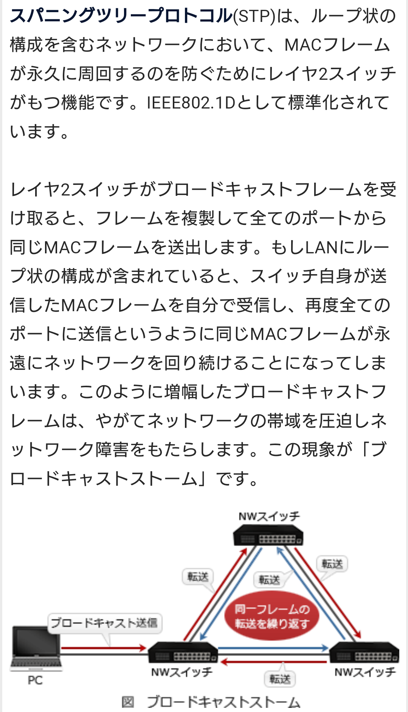
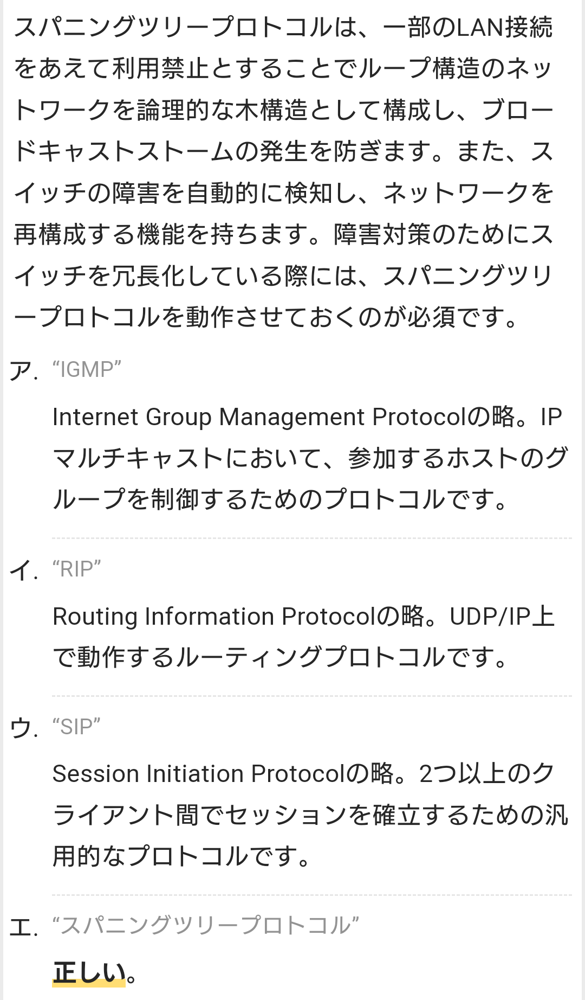

# Ethernet
- 主に室内や建物内でコンピュータや電子機器をケーブルで繋いで通信する有線LAN（構内ネットワーク）の標準の一つで、最も普及している規格。

# CoS 【Class of Service】
- イーサネット（Ethernet）で送受信されるフレームに設定することができる、通信の優先度を表す値。
- 通信品質の保証や帯域確保などを実現するQoS技術の一種で、3ビットのデータで8段階の優先度を設定することができる。
- 優先度は通信の用途や内容に応じて設定され、優先度の高いフレームは優先的に処理され、低いフレームは後回しにされる。
- 音声通話などリアルタイム性を求められる用途で高く設定するといった使い方が想定されている。

- CoSはVLANを利用する際に制御情報の一部として設定することができ、Cisco System社独自のISL方式を用いる場合はISLヘッダの一部として、標準規格のIEEE 802.1Q/IEEE 802.1pを用いる場合にはEthernetフレームのVLANタグの一部として記述する。

# WOL 【Wake On LAN】
- 通信ネットワークに接続されたコンピュータの電源を、他のコンピュータから遠隔操作で起動する機能。また、AMD社が提唱した同機能の技術規格。

## マジックパケット 【magic packet】
- ネットワークを通じてコンピュータの電源投入ができるWOL（Wake On LAN）で、起動の指示を行うための特殊なイーサネットフレーム。
- 具体的な形式はいくつかあるが、最も一般的な「AMD Magic Packet Format」では、2進数で48ビットの「1」が連続し（16進数で「FF:FF:FF:FF:FF:FF」に相当）、続けて、起動したいコンピュータのMACアドレスを16回繰り返した102バイトのデータで構成される。

# STP 【Spanning Tree Protocol】 スパニングツリープロトコル
- 物理的な配線にループ（円環）状の経路を含むネットワークで、データが無限に循環し続けることを避けるための制御方式を定めたプロトコル（通信規約）の一つ。
- IEEE 802.1Dとして標準化され、スイッチやルータなどの通信機器（集線装置）に実装されている。

- STPを用いてネットワーク内の機器が制御用のデータを送受信し、ネットワーク管理者が指定したルートブリッジと呼ばれる装置を根とする木構造（ツリー構造）を構成する。
- 木構造から外れループを構成しているリンクのうち、根から最も遠いものは遮断（ブロック）され、データの送受信が行われなくなる。
- これにより、ブロードキャストフレームなどがループ経路上を永遠に回り続けることを防止することができる。

- BPDU（Bridge Protocol Data Unit）と呼ばれる制御データは一定時間ごとにネットワーク上にブロードキャストされ、ブロックされた経路も疎通確認のため送受信される。
- 経路上で障害が発生し通信が途切れると、これを検知して遮断されていたリンクを開放し、迂回経路としてデータが流れ始める。機器や回線が回復すると代替経路は再び遮断され、元の状態に戻る。

# BPDU 【Bridge Protocol Data Unit】
