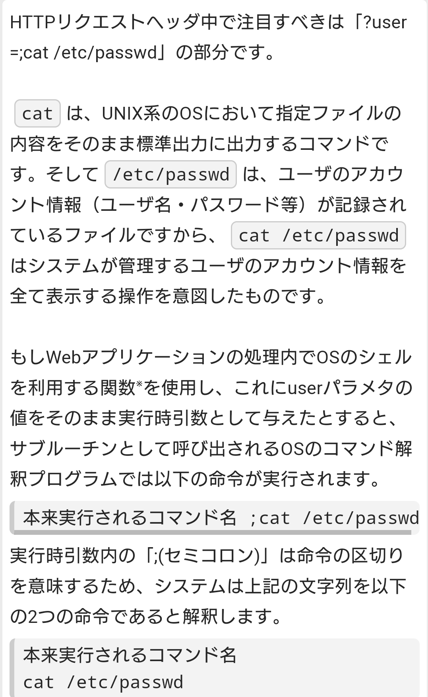
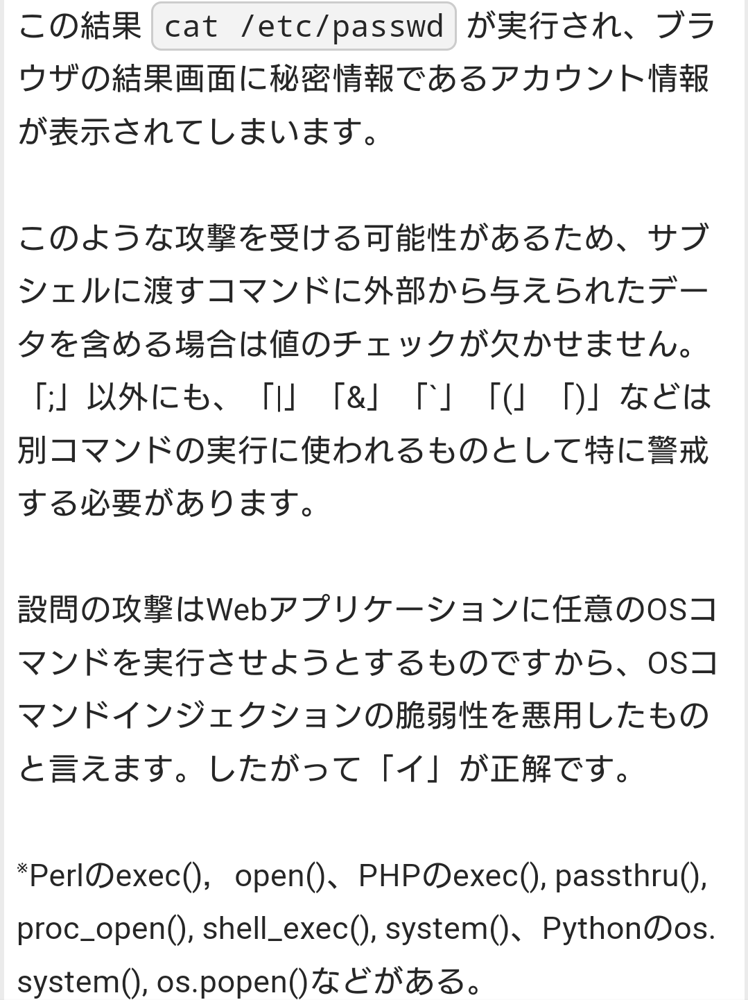

# HTTP 【HyperText Transfer Protocol】

- HTTPとは、WebサーバとWebクライアントの間でデータの送受信を行うために用いられるプロトコル（通信規約）。
- Webページを構成するHTMLファイルや、ページに関連付けられたスタイルシート、スクリプト、画像、音声、動画などのファイルを、データ形式などのメタ情報を含めてやり取りすることができる。

- HTTPはクライアントから要求（HTTPリクエスト）を送り、サーバが応答（HTTPレスポンス）を返すプル型（リクエスト/レスポンス型）の通信を基本としており、WebブラウザやWebクローラなどのクライアントから送信する要求の形式や、Webサーバからの応答の形式などを定めている。

- HTTPリクエストおよびレスポンスは要求や返答の内容、資源の種類や形式などの情報、および関連する情報を記述した「ヘッダ部」（header）と、送受信する資源（ファイルなど）の本体である「ボディ部」（body）で構成される。
- ボディは基本的にはレスポンスに存在するが、クライアント側からデータを送信する際にはリクエストにも付加される。

- HTTPは下位（トランスポート層）のプロトコルとして標準ではTCPを利用することが多いが、SSL/TLSを用いて暗号化されて伝送されることもある。
- この通信手順は「HTTP over SSL/TLS」と呼ばれ、URL/URIのスキーム名として通常の「http:」に代えて「https:」を用いる。

## Cookieによるセッション管理
- HTTPそのものは複数回の通信をまたぐ状態の保存・管理を行わないステートレス型のシンプルなプロトコルだが、「Cookie」（クッキー）と呼ばれる拡張仕様により状態管理ができるようになっている。

- Cookieはサーバがレスポンスヘッダの一部としてクライアントに送付する短い文字データで、クライアントはこれをストレージなどに恒久的（ただし有効期限が切れると消滅する）に保存する。
- 次回サーバへリクエストを送付する際にはヘッダに前回受信したCookieの内容を書き入れて送信する。

- サーバはCookieを参照することで個々のクライアントを識別・同定することができる。サーバとクライアントの間で何往復も繰り返しやり取りが必要な複雑な処理（セッション）を容易に実装することができ、間が空いてから再アクセスしてもサーバは相手がどのクライアントなのか見分けることができる。

## 認証方式
- HTTPではクライアントを用いてアクセスしてきた利用者を識別・認証し、アクセス権限に応じたサービスを提供するため、認証手順（HTTP認証）についても定めている。
- 当初規定されたのは単純にユーザー名とパスワードをやり取りする「基本認証」（BASIC認証）だが、パスワードが通信途上で盗聴される危険性に対処するためにチャレンジ/レスポンス認証の一種である「ダイジェスト認証」（Digest認証）が追加された。

- 現在では利用者の認証が必要な用途ではHTTP通信自体を丸ごと暗号化するSSL/TLSを用いるのが一般的となっており、認証機能もアプリケーション側で実装するようになったため、HTTP自体の認証機能はあまり使われなくなっている。

### HTTPヘッダ
### HTTPリクエスト
### HTTPリクエストヘッダ
### HTTPレスポンス
### HTTPレスポンスヘッダ

### HTTPリクエストメソッド

### HTTPキープアライブ
### HTTPリダイレクト

