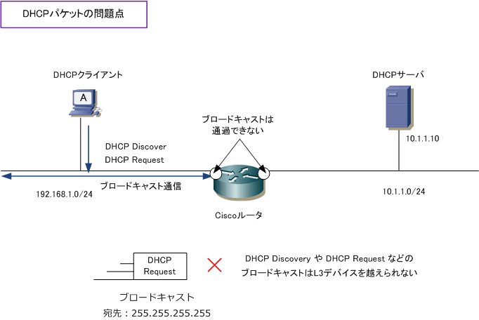
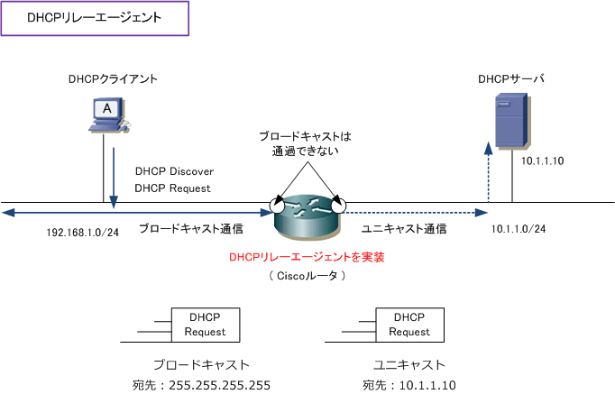
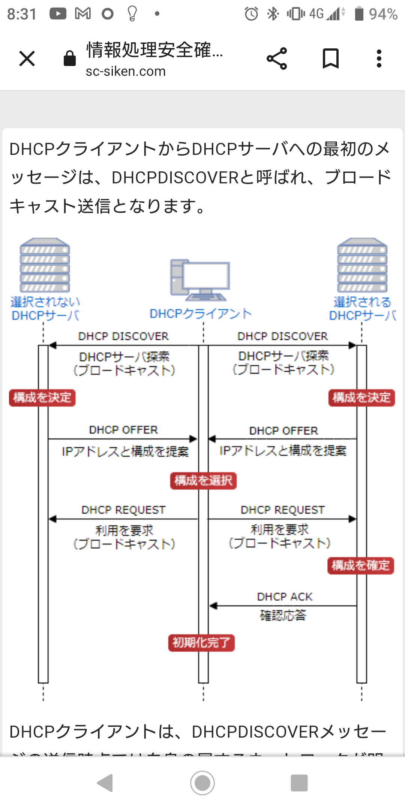
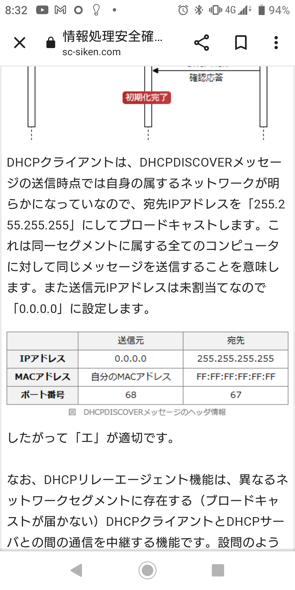
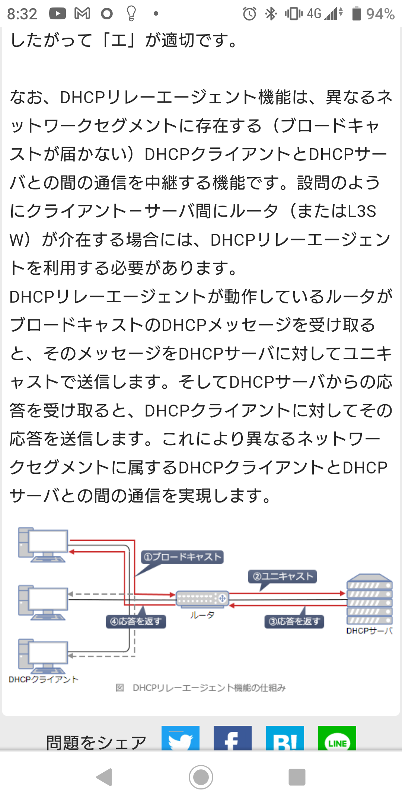

# DHCP
- DHCP（Dynamic Host Configuration Protocol）は、クライアントに対して動的にIP設定パラメーターを提供する機能  
- IPアドレスなどの必要な情報を自動で割り当てるプロトコル  

- DHCPによって通知される設定情報
クライアントが名乗るべきIPアドレス、アドレスのサブネットマスク、当該ネットワークで利用可能なDNSサーバのIPアドレス、外部ネットワークとの出入り口であるデフォルトゲートウェイのIPアドレス、アドレスのリース期間（使用期限）などがある。設定により時刻同期サーバ（NTPサーバ）のアドレスなど他の情報を通知することもできる（が、あまり一般的ではない）。  

## DHCPサーバとDHCPクライアント
- DHCPで設定情報を提供する機能を持ったコンピュータやネットワーク機器を「DHCPサーバ」（DHCP server）、サーバへ問い合わせを行って設定情報を受け取る機器やソフトウェアを「DHCPクライアント」（DHCP client）という。  

## DHCPリレーエージェント

## DHCPメッセージ

- ＤＨＣＰＤＩＳＣＯＶＥＲ  
　ＤＨＣＰサーバを見つけるためにＤＨＣＰクライアントがブロードキャストするメッセージ。  
宛先IPアドレスを[255.255.255.255]にする。  
送信元IPアドレスは未割り当てのため[0.0.0.0]に設定する。  

- ＤＨＣＰＯＦＦＥＲ  
　ＤＨＣＰＤＩＳＣＯＶＥＲメッセージへの応答として、コンフィグレーション情報を含みＤＨＣＰサーバかＤＨＣＰクライアントに送信されるメッセージ。

- ＤＨＣＰＲＥＱＵＥＳＴ  
　ＤＨＣＰクライアントがＤＨＣＰサーバに提供されたコンフィグレーション情報の割り当てを要求するためと、選択されなかったＤＨＣＰサーバに知らせるために ブロードキャストするメッセージ。

- ＤＨＣＰＡＣＫ  
　ＤＨＣＰサーバからＤＨＣＰクライアントに送られる割り当てられたネットワークアドレスを含むコンフィグレーション情報。

- ＤＨＣＰＮＡＫ  
　ＤＨＣＰサーバからＤＨＣＰクライアントに送られる要求の拒否。

- ＤＨＣＰＤＥＣＬＩＮＥ  
　ＤＨＣＰクライアントからＤＨＣＰサーバに送られる無効なコンフィグレーション情報を含むメッセージ。

- ＤＨＣＰＲＥＬＥＡＳＥ  
　ＤＨＣＰクライアントからＤＨＣＰサーバに送られるネットワークアドレスの解放とリースのキャンセルメッセージ。

## 動作の仕組み

1. ＤＨＣＰクライアントは、ＤＨＣＰサーバを探すためにＤＨＣＰＤＩＳＣＯＶＥＲメッセージをブロードキャストします。

1. ＤＨＣＰサーバは、ＤＨＣＰＤＩＳＣＯＶＥＲメッセージの応答として、ＩＰアドレス他の情報を含むＤＨＣＰＯＦＦＥＲメッセージを ダイレクト送信またはブロードキャストします。

1. 複数のＤＨＣＰサーバが存在する場合、ＤＨＣＰクライアントは複数のＤＨＣＰＯＦＦＥＲメッセージを受信することになります。 ＤＨＣＰクライアントは一つのＤＨＣＰサーバを選択し、ＤＨＣＰＲＥＱＵＥＳＴメッセージをブロードキャストします。

1. ＤＨＣＰＲＥＱＵＥＳＴメッセージを受信したＤＨＣＰサーバは、コンフィグレーション情報を含むＤＨＣＰＡＣＫメッセージを送信します。 ＤＨＣＰＡＣＫメッセージのＩＰアドレスフィールドには、割り当てられたネットワークアドレスが挿入されています。
また、要求されたＩＰアドレスが割り当てられない等、ＤＨＣＰＲＥＱＵＥＳＴメッセージの要求に答えられない場合は、ＤＨＣＰサーバは ＤＨＣＰＮＡＫメッセージを送信します。

1. ＤＨＣＰクライアントは、ＤＨＣＰＡＣＫメッセージを受信するとパラメータの チェックを行い、リース期間などを記録しておきます。ＤＨＣＰＡＣＫメッセージにより受信したコンフィグレーション情報に問題があった場合は、 ＤＨＣＰクライアントはＤＨＣＰＤＥＣＬＩＮＥメッセージを送信します。

1. ＤＨＣＰクライアントは、ＤＨＣＰＲＥＬＥＡＳＥメッセージを送信することにより、ネットワークアドレスを解放することができます。

## 問題メモ

