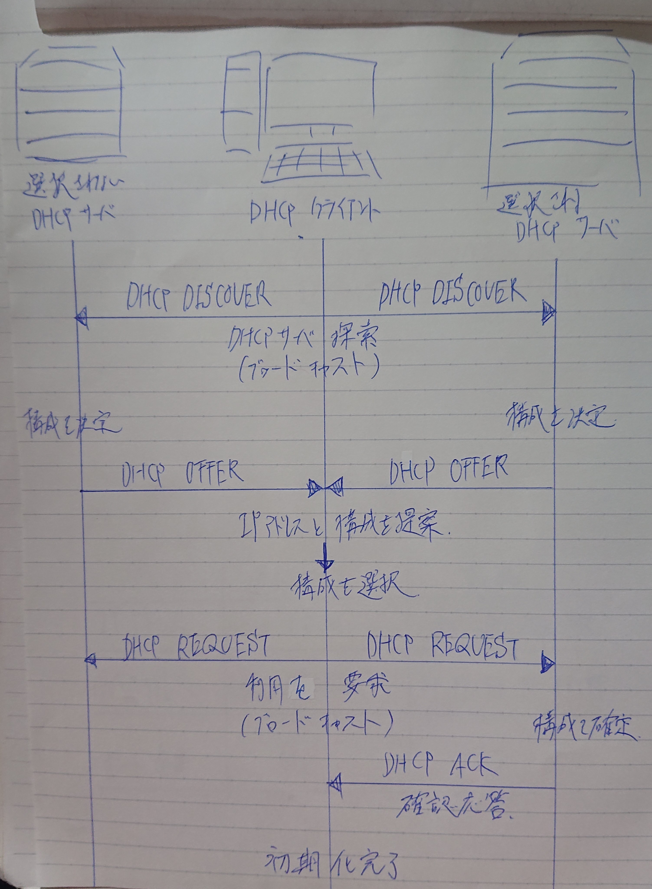

# DHCP
- DHCP（Dynamic Host Configuration Protocol）は、クライアントに対して動的にIP設定パラメーターを提供する機能  
- IPアドレスなどの必要な情報を自動で割り当てるプロトコル  
- インターネットなどのIPネットワークに新たに接続した機器に、IPアドレスなど通信に必要な設定情報を自動的に割り当てるための通信規約（プロトコル）。

- 機器の利用者がネットワーク設定を手動で行わなくても、ネットワーク管理者の側で適切な設定を自動的に適用することができ、技術に詳しくない利用者でも簡単に接続できる。
- 管理者は多くの機器の設定を容易に一元管理することができ、不適切な設定に起因するトラブルを減らすことができる。

- スマートフォンなど持ち運ぶ機器の場合、接続先ごとに詳細な設定を管理者から入手して手動で入力しなくても、DHCPを利用するよう設定しておくだけでネットワークごとに接続開始時に適切な設定情報を入手して適用することができる。

- DHCPの仕様は前身の「BOOTP」（Bootstrap Protocol）を拡張したもので、1993年にIETFによってRFC 1541として標準化され、1997年にRFC 2131として更新された。
- 2018年にはIPv6対応版である「DHCPv6」（RFC 8415）も標準化されたが、IPv6自体に自動的にアドレス設定をメカニズムが組み込まれており、特殊な目的以外ではあまり利用されない。
- 従来のIPv4向けのDHCPをIPv6向けと明確に区別したい時は「DHCPv4」と呼ぶこともある。

- DHCPによって通知される設定情報
クライアントが名乗るべきIPアドレス、アドレスのサブネットマスク、当該ネットワークで利用可能なDNSサーバのIPアドレス、外部ネットワークとの出入り口であるデフォルトゲートウェイのIPアドレス、アドレスのリース期間（使用期限）などがある。設定により時刻同期サーバ（NTPサーバ）のアドレスなど他の情報を通知することもできる（が、あまり一般的ではない）。  

## IPアドレス割り当ての手順
- クライアントがネットワークに接続すると、同じネットワークのすべての機器へ同報送信（ブロードキャスト）でDHCPサーバに応答を求める問い合わせ（DHCPディスカバー）を送信する。DHCPサーバが存在する場合、これに呼応して使用すべきIPアドレスを提案する応答（DHCPオファー）をブロードキャストする。

- クライアントが提案されたIPアドレスを使用することを決めると、追加の設定情報を求める要求（DHCPリクエスト）を再びブロードキャストする。DHCPサーバが複数ある場合、自らの提案が「落選」したDHCPサーバはこのブロードキャストによってそれを知り、アドレスの割り当てを解除して待機状態に戻る。

- 最後に、アドレス提案が採用されたサーバがクライアントに向けてデフォルトゲートウェイなどの追加情報を記載した承認通知（DHCPアック/Acknowledgement）をユニキャスト（アドレス指定送信）で送信し、手続き完了となる。

- DHCPサーバにはあらかじめ、クライアントに払い出して良いIPアドレスの範囲（IPアドレスプール）が管理者によって設定されており、その中から現在使われていないアドレスを提案する。接続が途絶えたクライアントや使用期限が来たアドレスは回収して空き状態としておき、次に接続したクライアントに払い出す。

## DHCPサーバとDHCPクライアント
- DHCPで設定情報を提供する機能を持ったコンピュータやネットワーク機器を「DHCPサーバ」（DHCP server）、サーバへ問い合わせを行って設定情報を受け取る機器やソフトウェアを「DHCPクライアント」（DHCP client）という。  

- 企業のネットワークなどでは専用のサーバコンピュータが他のネットワーク管理機能などと共にDHCPサーバとして稼動している場合が多く、家庭のインターネット接続環境ではブロードバンドルータやWi-FiルータなどがDHCPサーバ機能を内蔵している場合が多い。

- DHCPクライアントはネットワーク接続を利用する機器に必要なもので、単体の装置やソフトウェアとして提供されるものではなく、機器を制御するオペレーティングシステム（OS）などの中に組み込まれている。
- パソコンやスマートフォン、デジタル家電、家庭用ゲーム機など、およそインターネット接続に対応した機器のほとんどはDHCPクライアントとして機能するようにできている。

- 家庭用のルータ製品などの中には、インターネットサービスプロバイダ（ISP）からグローバルIPアドレスなどの設定情報を受信するためのDHCPクライアント機能と、屋内のパソコンやスマートフォンなどにプライベートIPアドレスを払い出すためのDHCPサーバ機能を内蔵し、両方同時に使用する例もある。

- なお、DHCPは標準では下位のトランスポート層のプロトコルとしてUDP（User Datagram Protocol）を利用し、サーバがクライアントからの通信を待ち受けるのはUDPの67番ポート、クライアントがサーバからの返信を待ち受けるのはUDPの68番ポートと定められている。

## DHCPリレーエージェント
- DHCPサーバとDHCPクライアントとの通信ではブロードキャストアドレスが使用されるので、DHCPサーバとDHCPクライアントは同じネットワーク（サブネット）にいる必要があるが、現在のLANネットワークは多くのサブネットが存在し、そのサブネットをルータやL3スイッチで分離している。
    - ルータやL3スイッチはブロードキャストを通過させないのでDHCP環境を構築したい場合、サブネットごとにDHCPサーバを導入する必要があるが、コスト的に現実的ではない。

- DHCPリレーエージェント機能により、DHCPサーバとDHCPクライアントが異なるサブネットに存在しても、DHCPクライアントから受信したブロードキャストをユニキャストに変換して、DHCPサーバに転送する。
    - 現在では、ルータやL3スイッチのネットワーク機器でDHCPリレーエージェント機能を持たせるのが一般的。

## DHCPメッセージ

- ＤＨＣＰＤＩＳＣＯＶＥＲ  
　ＤＨＣＰサーバを見つけるためにＤＨＣＰクライアントがブロードキャストするメッセージ。  
宛先IPアドレスを[255.255.255.255]にする。  
送信元IPアドレスは未割り当てのため[0.0.0.0]に設定する。  

- ＤＨＣＰＯＦＦＥＲ  
　ＤＨＣＰＤＩＳＣＯＶＥＲメッセージへの応答として、コンフィグレーション情報を含みＤＨＣＰサーバかＤＨＣＰクライアントに送信されるメッセージ。

- ＤＨＣＰＲＥＱＵＥＳＴ  
　ＤＨＣＰクライアントがＤＨＣＰサーバに提供されたコンフィグレーション情報の割り当てを要求するためと、選択されなかったＤＨＣＰサーバに知らせるために ブロードキャストするメッセージ。

- ＤＨＣＰＡＣＫ  
　ＤＨＣＰサーバからＤＨＣＰクライアントに送られる割り当てられたネットワークアドレスを含むコンフィグレーション情報。

- ＤＨＣＰＮＡＫ  
　ＤＨＣＰサーバからＤＨＣＰクライアントに送られる要求の拒否。

- ＤＨＣＰＤＥＣＬＩＮＥ  
　ＤＨＣＰクライアントからＤＨＣＰサーバに送られる無効なコンフィグレーション情報を含むメッセージ。

- ＤＨＣＰＲＥＬＥＡＳＥ  
　ＤＨＣＰクライアントからＤＨＣＰサーバに送られるネットワークアドレスの解放とリースのキャンセルメッセージ。

## 動作の仕組み

1. ＤＨＣＰクライアントは、ＤＨＣＰサーバを探すためにＤＨＣＰＤＩＳＣＯＶＥＲメッセージをブロードキャストします。

1. ＤＨＣＰサーバは、ＤＨＣＰＤＩＳＣＯＶＥＲメッセージの応答として、ＩＰアドレス他の情報を含むＤＨＣＰＯＦＦＥＲメッセージを ダイレクト送信またはブロードキャストします。

1. 複数のＤＨＣＰサーバが存在する場合、ＤＨＣＰクライアントは複数のＤＨＣＰＯＦＦＥＲメッセージを受信することになります。 ＤＨＣＰクライアントは一つのＤＨＣＰサーバを選択し、ＤＨＣＰＲＥＱＵＥＳＴメッセージをブロードキャストします。

1. ＤＨＣＰＲＥＱＵＥＳＴメッセージを受信したＤＨＣＰサーバは、コンフィグレーション情報を含むＤＨＣＰＡＣＫメッセージを送信します。 ＤＨＣＰＡＣＫメッセージのＩＰアドレスフィールドには、割り当てられたネットワークアドレスが挿入されています。
また、要求されたＩＰアドレスが割り当てられない等、ＤＨＣＰＲＥＱＵＥＳＴメッセージの要求に答えられない場合は、ＤＨＣＰサーバは ＤＨＣＰＮＡＫメッセージを送信します。

1. ＤＨＣＰクライアントは、ＤＨＣＰＡＣＫメッセージを受信するとパラメータの チェックを行い、リース期間などを記録しておきます。ＤＨＣＰＡＣＫメッセージにより受信したコンフィグレーション情報に問題があった場合は、 ＤＨＣＰクライアントはＤＨＣＰＤＥＣＬＩＮＥメッセージを送信します。

1. ＤＨＣＰクライアントは、ＤＨＣＰＲＥＬＥＡＳＥメッセージを送信することにより、ネットワークアドレスを解放することができます。

## 問題メモ

