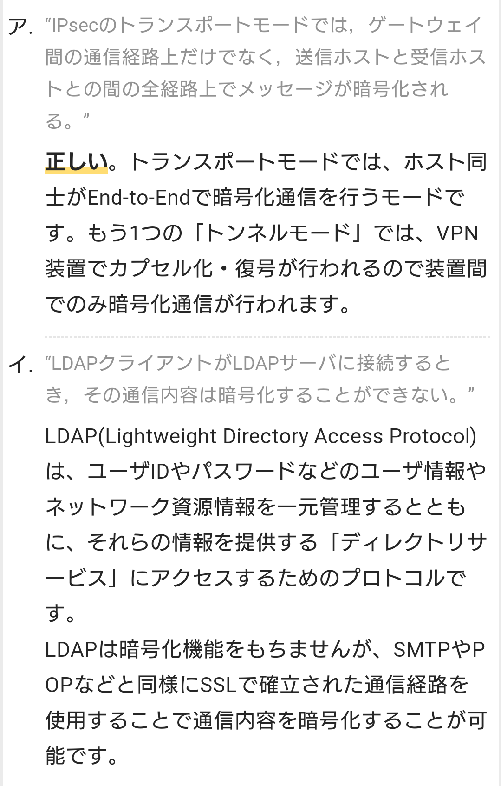

# ICMP
- インターネットなどIP（Internet Protocol）を利用するネットワークで用いられるプロトコルの一つで、IP通信の制御や通信状態の調査などを行なうためのもの。

- IPと同じネットワーク層のプロトコルに分類され、IPの働きを補完する役割を果たす。単にICMPといった場合はIPv4向けのICMPv4を表すことが多く、これとは別に、IPv6と併用するためのICMPv6が定義されている。

- 「ICMPメッセージ」と呼ばれる短いメッセージを送受信して相手方へ問い合わせや通知を行なうことができる。よく使われるメッセージには、通信可能なら応答するよう要求する「エコー要求」（echo request）や、それに対する返答である「エコー応答」（echo reply）、相手方に到達できない場合にその理由を経路途中のルータなどが送信元に知らせる「到達不能通知」（destination unreachable）などがある。

https://www.infraexpert.com/study/tcpip4.html

# UDP 【User Datagram Protocol】
- インターネットなどのIPネットワークで、IP（Internet Protocol）の上位層であるトランスポート層のプロトコル（通信規約）として標準的に使われるものの一つ。シンプルで低遅延だが信頼性は低い。

- ネットワーク層のIPと、DHCPなど各用途ごとに固有のアプリケーション層のプロトコルとの橋渡しをするもので、「ポート番号」という識別番号を用いて、各IPデータグラムが運んでいるデータがどの上位プロトコルのものであるかを識別し、担当のソフトウェアに振り分ける。

- UDPは仮想的な伝送路の確立（ハンドシェイク）を行わないコネクションレス型のプロトコルで、送信先が確実にデータを受領したかを確認したり、データの欠落を検知して再送したり、受信データを送信順に組み立て直すといった制御を行わず、データを「送りっぱなし」にする。

- このため、UDP自体はデータの配達に関して特に信頼性を保証しないが、このような制御を行わない分だけ転送効率が高く、
遅延が発生しにくい。データに多少の損失が生じても高速性や即時性（リアルタイム性）を重視する用途（通話、放送など）、信頼性はアプリケーション層で確保するためとにかくシンプルにデータを伝送してほしい用途などで用いられる。

- UDPでのデータの送信単位は「データグラム」（UDPデータグラム）で、前半8バイトが制御情報を記したヘッダ、残りの後半部分が伝送するデータ本体（アプリケーション層から伝送を依頼されたデータ）であるペイロードとなる。ヘッダ構造は極めてシンプルで、先頭から2バイトずつ送信元ポート番号、宛先ポート番号、（データグラム全体の）データ長、チェックサム（誤り検出符号）となっている。

- UDPはインターネット開発の初期に考案され、1980年にRFC 768として標準化された。高信頼性のTCP（Transmission Control Protocol）と共に主要なトランスポート層プロトコルとして広く普及している。標準的なアプリケーション層プロトコルはTCPを利用するものが多いが、DNSやSNMP、DHCP、NTPなどがUDPを利用することでよく知られる。動画や音声のストリーミング配信などはUDPを用いることが多い。

# TCP【Transmission Control Protocol】
- インターネットなどのIPネットワークで、IP（Internet Protocol）の上位層であるトランスポート層のプロトコル（通信規約）として標準的に使われるものの一つ。
- 信頼性が高いが即時性や高速性は得られにくい。

- ネットワーク層（インターネット層）のIPと、HTTPなど各用途ごとに固有のアプリケーション層のプロトコルの橋渡しをするもので、ポート番号という識別番号を用いて、各IPデータグラムが運んでいるデータがどの上位プロトコルのものであるかを識別し、担当のソフトウェアに振り分けることができる。

- TCPはコネクション型のプロトコルで、接続相手との通信の開始時に「スリーウェイハンドシェイク」と呼ばれる3段階から成る制御情報のやり取りを行い、通信相手の状況を確認して仮想的な伝送路（TCPコネクション）を確立する。一連のデータ伝送が終わると伝送路を切断して通信を終了する。

- 二者間で制御情報を双方向にやり取りすることで、送信したデータが受信側に到着したかどうかを確かめる「確認応答」、受信側が伝送途上でのデータの欠落や破損を検知して送信側に再送を要求する「再送制御」、送信時に通し番号を割り当てて到着順が入れ替わっても受信側で本来の順序に並べ直す「順序制御」などの機能が利用できる。

- IP上で用いられるトランスポート層の有力なプロトコルには「UDP」（User Datagram Protocol）もあり、こちらは細かな制御はせず「送りっぱなし」にするシンプルな仕様となっている。
- TCPはUDPに比べる伝送の信頼性が高くアプリケーション層に対して確実にデータを送り届けることができるが、通信効率は低く性能は高めにくい。

- また、品質の低い通信経路（回線など）では確実性を高めるための仕様が足かせとなり極端に性能が低下したり、接続が頻繁に途絶えることがある。
- 信頼性や確実性が必要な通信にはTCPを、転送効率や即時性が必要な用途や通信環境が悪くても断片的にデータが届けば良い用途ではUDPを、というように使い分けられる。

# SNMP 【Simple Network Management Protocol】
- IPネットワーク上のルータやスイッチ、サーバ、端末など様々な機器をネットワーク経由で遠隔から監視・制御するためのプロトコル（通信規約）の一つ。
- 組織内の構内ネットワーク（LAN）の管理でよく用いられる。

# IPsec 【Security Architecture for Internet Protocol】
- インターネットなどのTCP/IPネットワークで暗号通信を行うための通信規約（プロトコル）の一つ。
- いくつかの要素技術の組み合わせとして実現され、通信相手を確認して成りすましを防止したり通信途上での改竄を防止するAH（Authentication Header）、伝送するデータの暗号化を行うESP（Encapsulated Security Payload）、公開鍵暗号を用いて安全に暗号鍵の交換・共有を行うIKE（Internet Key Exchange）などが利用される。

## ESP (Encapsulated Security Payload)
- IPsecによる暗号化通信で送受信される、ペイロード（通信内容）を暗号化して付加情報を付け足したもの。
- IPパケットのヘッダ部に続くペイロード部を暗号化したもので、暗号化されたデータ本体に一定の形式で暗号化方式や鍵についての情報、認証データなどが付与された構造になっている。

## AH (Authentication Header：認証ヘッダ)
- IPsecの仕様の一部で、送信元の認証や改ざん防止（完全性の保証）を実現するための仕組み。IPパケットの中でヘッダの直後に挿入されるデータで、通信内容や秘密鍵などから一定の計算によって割り出したハッシュ値を含み、これにより送信元の偽証や通信内容の改ざんを防止する。
- ESPと異なり通信内容の暗号化は行わず、データ本体は平文で送受信される。

## SA (Security Association：セキュリティアソシエーション)
- IPsecやIPv6を利用した暗号化通信において、通信をはじめる前に暗号化方式や暗号鍵などの情報を交換・共有し、安全な通信路を確立すること。確立された仮想的な暗号通信路（トンネル）のことを指す場合もある。
- IPsecにおけるSAでは、IKE（Internet Key Exchange）という標準手順によって、暗号化方式の決定や鍵の交換、相互の認証が行われる。SAは定期的に更新され、身元の確認と暗号鍵の再発行・再交換が行われる。

## IKE (Internet Key Exchange)
- IPsecで暗号化通信を行うのに先立って、暗号鍵を交換するために利用される通信プロトコル。
- その場限りの暗号化通信を行って、IPsecに必要な暗号化アルゴリズムの決定と暗号鍵の共有を行う。
- IKEではDiffie-Hellman鍵交換と呼ばれる手順によって暗号鍵を交換し、IKE限定の暗号化通信を行う。
- その際にIPsecでの通信に必要な各種の情報の交換などの手続きが行われ、IPsecによる通信を開始する。
- IKEの通信を盗み見られても、それ自体が暗号化されているため、IPsecの通信を解読される恐れはない。

# FTP 【File Transfer Protocol】 ファイル転送プロトコル
- インターネットなどのTCP/IPネットワークでファイル転送を行うことができるプロトコル（通信規約）の一つ。

    - FTPサーバ、FTPクライアントの二種類のソフトウェアを用い、両者の間で接続を確立し、クライアントからの要求に基づいてファイルを送受信することができる。
    - サーバ側ではアカウント名とパスワードによる利用者の認証を行い、それぞれの利用者に許可された権限や領域（ディレクトリ）で送受信が行われる。

    - コマンドや応答など制御データの送受信用と、ファイルの一覧やファイルの内容などデータ本体の送受信用に二つの伝送路（コネクション）を確立する。
    - 特に指定がない場合、サーバ側では制御用にTCPの21番ポート、データ用にTCPの20番ポートを用いる。

    - 制御用コネクションはクライアント側からサーバ側へ接続を開始して確立し、利用者認証、現在位置（カレントディレクトリ）のファイル一覧の要求や別の位置への移動、ファイルの指定や送受信の開始の指示などに使われる。

- アクティブモードとパッシブモード
    - データ本体のコネクションはサーバ側からクライアントの指定したポートへ接続を開始する「アクティブモード」（ポートモード）と、制御用と同様にクライアント側から接続を開始する「パッシブモード」（PASVモード）がある。

    - サーバもクライアントも同じネットワークに接続され直接双方向に通信可能な状況ではアクティブモードを用いるが、家庭や企業の内部ネットワークでプライベートIPアドレスを使用している機器がインターネット上のサーバにアクセスする場合など、クライアントに外部から接続を確立することができない場合はパッシブモードを用いる。

- セキュリティの確保
    - FTPは設計が古く、認証時にパスワードを平文（クリアテキスト）のまま送受信してしまったり、伝送内容を暗号化する機能が用意されていないなど、現在ではインターネット上でそのまま用いるのは危険であるされる。

    - このため、FTPによるファイル転送を利用したい場合は、トランスポート層の暗号化を行うSSL/TLSと組み合わせてFTPによる通信全体を暗号化するFTPS（FTP over SSL/TLS）を利用したり、SSH上でFTPに似たファイル転送を行えるSFTPを用いることが多い。

- anonymous FTP
    - FTPサイトでは、不特定多数の利用者にファイルを配布するなどの目的のため、サーバ側に利用者登録を行っていない者でも自由に接続できる「anonymous」（匿名）と呼ばれる特殊なアカウントが用意されていることがある。

    - このような利用形態を「anonymous FTP」と呼び、誰でも任意のパスワード（空欄でもよい）で接続して（管理者がanonymousアカウントに設定した権限に応じて）ファイルの送受信を行うことができる。
    - 20世紀にはインターネット上のフリーソフトウェアの配布などでよく利用された。