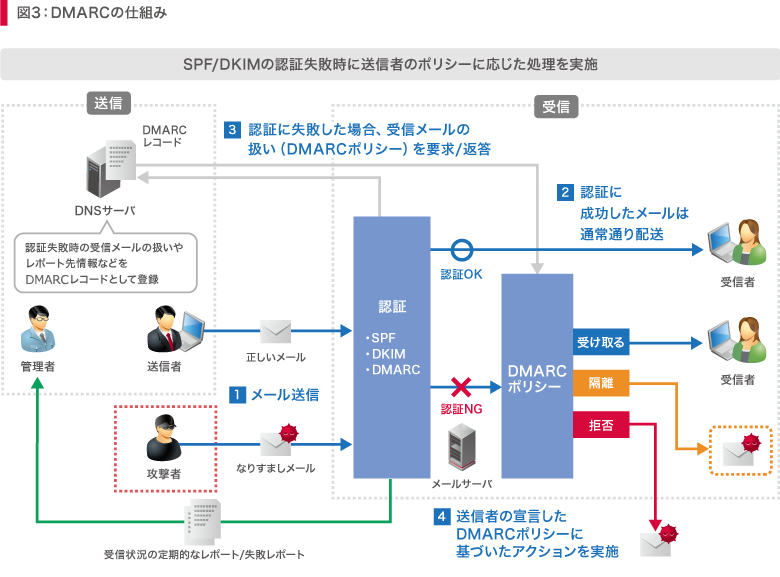

# DMARC (Domain-based Message Authentication, Reporting, and Conformance)
- DMARCとは、電子メールのなりすまし送信を防止するための通信規約（プロトコル）の一つ。SPFやDKIMと連携し、不審なメールの取り扱いを送信元として名乗っているドメインの所有者が指定できるようにするもの。IETFによってRFC 7489として標準化されている。

- SPFやDKIMの認証が失敗した場合の対応策を定めたもの。

- 送信側は受信側の認証失敗時の推奨アクションをDNSに「DMARCポリシー」として宣言しておき、受信側は認証失敗時にこのDMARCポリシーを参照して、受信メールをどう扱うか判断する。

