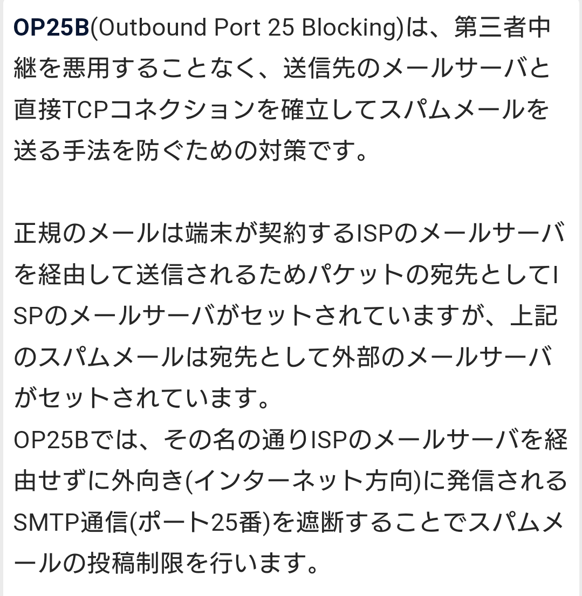
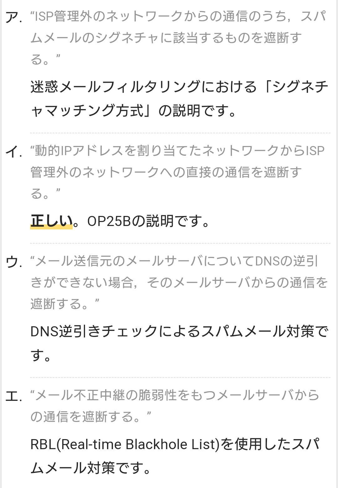
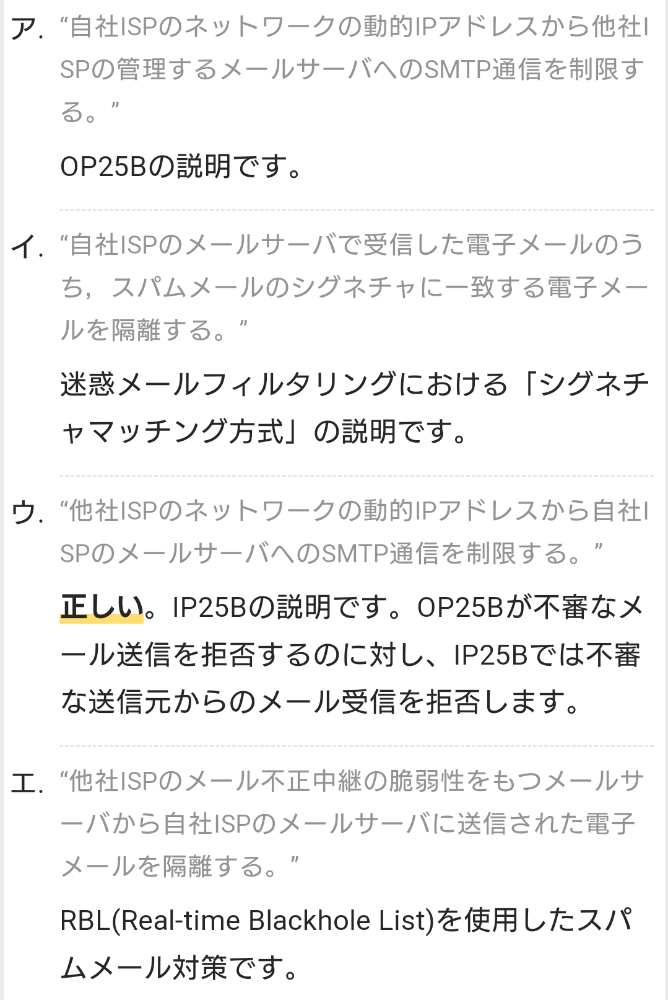
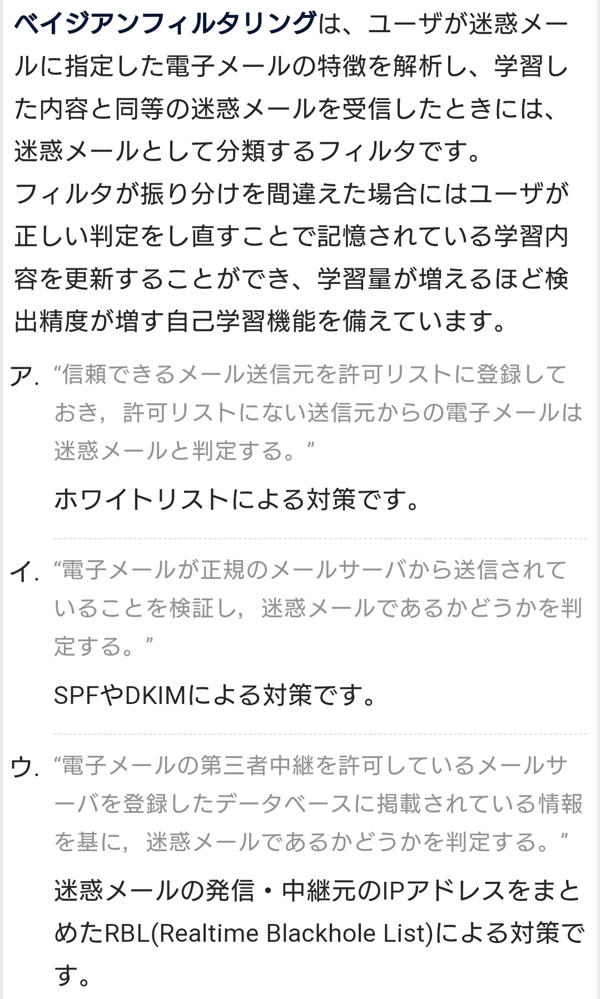

# メール送信の仕組み

## メールヘッダ
- メールの詳細情報が書かれている部分の
- 具体的には、メールが配送された経路や時間、経由したサーバーなどが記録されている

## MTA (Mail Transfer Agent)
- メールの中継（配送）の機能
- ネットワーク上でメールを転送・配送するソフトウェア。いわゆるメールサーバの中心的な役割の一つで、利用者がメールソフト（MUA：Mail User Agent）などで送信したメールを受け取り、宛先に基づいて振り分け、相手方のMTAなどに転送する。

## MUA (Mail User Agent)
- パソコン、携帯、スマホなどのメールソフト、アプリの機能

## MDA (Mail Transfer Agent)
- メールサーバ―にあるメールボックス（メールスプール）への保存の機能

## MSA (Mail Submission Agent)
- メールサーバ―に含まれるメールの発信受付、ユーザ認証の機能

## MRA (Mail Transfer Agent)
- ユーザ認証、メールボックス（メールスプール）からのメールの取り出しの機能

  
  

# OP25B (Outbound Port 25 Blocking)
- OP25Bとは、ネットワークの境界にあるルータなどの機器で、ネットワーク内から外部のコンピュータのTCPポート25番への通信を禁止すること。インターネットサービスプロバイダ（ISP）などが会員のパソコンからスパムメールが送信されるのをブロックするために行っている。

- 25番ポートはメールの送信に使うSMTPが利用するポートで、これを塞ぐことでメールの送信ができなくなる。会員がプロバイダのメールサーバでスパムメールを送信しようとする場合は、これを個別に遮断したり会員を退会処分にしたりすることができるが、外部のメールサーバを利用されるとこうした措置を取ることができない。
そこで、ネットワークの境界で外部のSMTPサーバへの通信を遮断することにより、会員のコンピュータが外部のメールサーバを利用してスパムメールなどを送ることを根こそぎ防ぐことができる。あくまで外部サーバへの通信を遮断するだけで自ネットワーク内にあるメールサーバへの通信は可能なため、プロバイダのメールサーバを利用した通常のメールの送受信は影響を受けない。

## 25番ポート
- インターネットなどの通信でアプリケーションの種類や通信規約（プロトコル）の識別に用いられるポート番号の一つ。通常はTCPの25番を電子メールの送信・配達（SMTP）のために用いる。

## IP25B (Inbound Port 25 Blocking)
- ネットワークの境界にあるルータなどの機器で、外部ネットワークで動的に割り当てられたIPアドレスなどからのTCPポート25番への着信を禁止すること。インターネットサービスプロバイダ（ISP）などが、不審な送信元から自社会員へのメール送達を阻止するために行う。

# サブミッションポート 【submission port】 587番ポート / 465番ポート
- 利用者の電子メールソフトからメール送信サーバにメールを投稿（submission）する際に用いる、専用のTCPポート。
- サーバの運用者が個別に指定できるが、標準では587番が、SSL/TLS接続の場合は465番が用いられる。

    - メールソフトなどのクライアントからサーバへのメール送信（発信）やサーバ間の転送にはSMTP（Simple Mail Transfer Protocol）と呼ばれるプロトコル（通信規約）が用いられ、標準ではTCPの25番ポートが接続窓口に使用される。

    - SMTPサーバは従来、同じ25番ポートで利用者からの送信依頼と外部サーバからの転送・配信依頼を両方受け付けていたが、不正送信の拒否や迷惑メール対策などを行う上で両者が混在するのは不都合が大きくなってきた。
    - スパムメール対策のOP25Bが行われていると、正当な利用者さえ、外部のメールサーバと直接コネクションを確率することができなくなってしまう。

    - このため、25番はサーバ間の転送にのみ使用し、利用者からの送信の受付には専用のサブミッションポートを使う運用が定着した。
    - 一般的にはTCPの587番ポートが用いられ、SMTP認証（SMTP Authentication）によるユーザー認証が行われることが多い。
    - また、SSL/TLSによる伝送路の暗号化を行うSMTPS（SMTP over SSL/TLS）を用いる場合は465番ポートを使用することが多い。

## エンベロープヘッダとメールヘッダ
- エンベロープTo
    - 受信サーバへの宛先

- エンベロープFrom
    - エラーとなったメールの戻り先、実際に送信した差出人（送信元）

-  ヘッダーTo
    - 各受信サーバからエンドユーザ に送られる際の宛先

- ヘッダーFrom
    - ヘッダFromはメールの仕様上送信者が自由に記載できるため、実際の送信者とは異なる情報を表示させることも可能 

### エンベロープとヘッダが分かれているメリット・デメリット

- メリット
    1. BCC機能が使える
    1. 転送や代理送信など、柔軟なメール配信が可能になる

- デメリット  
    - なりすまし

## S/MIME (Secure Multipurpose Internet Mail Extensions)
- S/MIMEとは、電子メールの内容を暗号化したりデジタル署名を付加したりする方式の標準の一つ。
- 証明書を利用して、電子メールに暗号化とデジタル署名のセキュリティを提供する。
    - メールの暗号化とデジタル署名の付与が実現できる。

- メールの添付ファイル（MIME：Multipurpose Internet Mail Extension）の仕組みを応用し、本文を暗号化して添付ファイルとして送信し、正規の受信者でなければ復号できないようにしたり、暗号化された署名情報を添付して、送信者が確かに本人であることを確認したりできるようにする。暗号化と署名は同時に用いることも、必要に応じて片方のみ用いることもできる。

- S/MIMEによる暗号化では、送信者はまず受信者が公開している公開鍵を入手し、これを暗号鍵として本文を暗号化、メールに添付して送信する。受信者は自分しか知らない秘密鍵を用いて復号し、暗号化前の本文を復元して読むことができる。公開鍵暗号では、公開鍵で暗号化されたデータは対になる秘密鍵でしか復号できないため、転送中に第三者に覗き見られるのを防止することができる。

- 署名の付加では、送信側で本文を元にハッシュ値（メッセージダイジェスト）を生成し、これを送信者の秘密鍵で暗号化したものを署名データとしてメールに添付し、本文と共に送信する。受信者は送信者の公開鍵で署名を復号し、共に送られてきた本文から生成したハッシュ値と一致すれば、転送途上で本文が改竄されておらず、送信者が確かに公開鍵の所有者に一致することを確認することができる。

- 機能
    - 認証  
        - X.509証明書とデジタル署名を利用し、メールの送信者とメッセージの認証を行う。  
    - 守秘性  
        - メールを暗号化して送信することで、第三者への漏えいを防ぐ。  
        - 暗号化には送信者が生成した共通鍵が使用される。
    - 否認防止
        - デジタル署名により、送信した事実の否認を防止
    - 完全性
        - 添付ファイルを含むメール本文が送信時と相違ないことの確認

# ベイジアンフィルタ 【Bayesian filter】
- ベイズ推定と呼ばれる統計的手法を応用し、データを分類したり判別したりするソフトウェア
    - 判定が正しければこの新しいメールの内容も学習し、以後の判定に利用する。
    - 判定を誤った場合は利用者がそれを指摘することで、学習内容に反映させることができる。
    - メールが届くたびにこの過程を繰り返すことで判定の精度が次第に向上していく。

