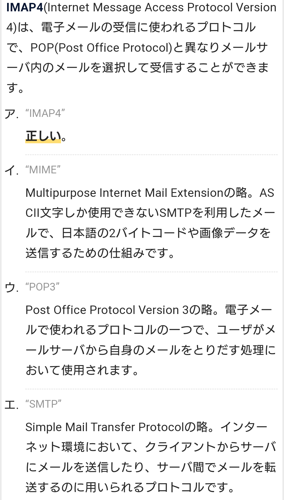

# SMTP

- SMTPとは、インターネットなどのTCP/IPネットワークで標準的に用いられる、電子メール（eメール）を伝送するための通信手順（プロトコル）の一つ。
- 利用者（の使うメールソフト）からメールサーバに送信依頼する際や、メールサーバ間でメールを転送する際にシステム間で交わされる要求や応答のデータ形式、伝送手順などを定めている。
- SMTPでメールを転送するソフトウェアをMTA（Mail Transfer Agent）あるいはSMTPサーバ（SMTP server）という。一方、受信側でクライアントへメールを配送するソフトウェアはMRA（Mail Retrieval Agent）と呼ばれ、受信プロトコルの違いによりPOP3サーバ、IMAP4サーバなどに分かれる。

### SMTPメールサーバ
-  SMTPサーバとは、SMTP（Simple Mail Transfer Protocol）と呼ばれる通信手順（プロトコル）で電子メール（eメール）を送信、転送するコンピュータのこと。メールソフトの設定画面などでは「送信サーバ」「メール送信サーバ」などと記載されていることもある。

- SMTPサーバはメールアドレスの「@」以降の部分であるドメイン名ごとに存在し（複数のドメインの管理を一台が兼ねる場合もある）、送信者は自分のアドレスのドメインを管理するSMTPサーバにアクセスしてメールを送信する。サーバは受け取ったメールの宛先のアドレスを見て、宛先のドメインを管理するSMTPサーバにメールを転送する。

### POP 【Post Office Protocol】 POP3
- 利用者が自分宛ての電子メールを保管しているメールサーバにアクセスし、新しいメールが届いているか調べたり、手元のメールソフトに受信する通信手順やデータ形式を定めている。
- 送信やサーバ間の配達にはSMTP（Simple Mail Transfer Protocol）という別のプロトコルを用いる。

- POPを利用する場合は原則として、サーバに届いたメールはすべてクライアント（メールソフト）側にダウンロードしてから閲覧や未既読の管理、フォルダ分けなどを行い、受信済みのメールはサーバから削除される。

- ポート番号
    - POP2
        TCPの109番ポート
    - POP3
        110番ポート
    - POP3S
        995番ポート

### POPサーバ
- 電子メールを受信者へ送り届ける機能を持ったサーバ
- メールクライアント側ではサーバ側がPOP3でもIMAP4でも通信できるよう両対応になっているものが多い。

### POP3S
- 電子メールの受信に用いるプロトコル（通信規約）であるPOP3に、伝送路を暗号化するSSL/TLSを組み合わせたもの。
- 認証情報やメールを暗号によって保護し、安全に送受信することができる。

### POP before SMTP（PbS）
- メールの送信に使われる SMTP サーバーを利用する前に決められた POP サーバーに アクセスさせることにより、SMTP サーバーのアクセス許可を与える、メール送信の際の認証方法
- POP3によるメール受信（におけるユーザー認証）を行った利用者に一定時間送信を許可する。

- 送信前に必ず受信動作を行わなければならないという決まりが分かりにくく、しばしばメールが送信できないという苦情や問い合わせに繋がった。

- 送信を許可したIPアドレスを使って一定時間内に悪意のある第三者がなりすまして迷惑メールを送信することができるリスクが存在する

### IMAP4
- メールをPC等のクライアントにダウンロードせずメールサーバーに置いたまま読むことができるプロトコル
- IMAPでは原則として、届いたメールをメールサーバ上にメールアドレス（アカウント）ごとに設けられた専用の保存領域（メールボックス）で管理する。
- 利用者はサーバからメールの一覧を取得して必要な物を選択し、手元のコンピュータにダウンロードして閲覧する。

### IMAP4サーバ
- 電子メールを受信者へ送り届ける機能を持ったサーバ（コンピュータおよびソフトウェア）
- IMAP4（Internet Mail Access Protocol versison 4）という通信プロトコル（通信規約）に従って利用者のソフトウェアと通信するもの

SMTPは1980年代から使われている古いプロトコルで、最初の仕様はIETFによって1982年にRFC 821として規格化された。幾度かの改訂を経て2008年に最新版のRFC 5321が発行されている。

### IETF

## 認証や暗号化の拡張
SMTPの当初の仕様には利用者の認証や送信元ドメインのチェックなどの機能が欠けていたため、SMTPコマンドを拡張して認証を行う「SMTP Authentication」（SMTP-AUTH）や、POP3の認証機能を借用してPOP3で認証した相手に一定時間SMTPによる接続を許可する「POP before SMTP」（PbS）などの仕様が策定された。

また、SMTP自体には送受信データの暗号化の機能は用意されていないため、一階層下のトランスポート層でSSL/TLS接続を行い、SMTP通信全体を暗号化するSMTPS（SMTP over SSL/TLS）が用意されている。

### SMTP-AUTH

### SMTPS

## サブミッションポートの分離
元はTCPポート25番を使うのが標準だったが、利用者からの送信依頼とサーバ間転送に同じポートを使うのは通信経路の暗号化や迷惑メール対策などを行うのに不都合であったことなどから、現在ではサーバ間転送にのみ25番を用い、送信依頼はTCP587番を用いるのが標準となっている。このポートのことを「サブミッションポート」（submission port）ともいう。

### サブミッションポート

- 元来は送信者からの受付もサーバ間の転送も同じように処理していたが、インターネットが一般に普及するに連れて迷惑メールなど電子メールの不正利用、濫用が問題となってきたため、いくつかの拡張仕様が利用されるようになった。

- SMTPは標準ではTCPの25番ポートを用いるが、インターネットサービスプロバイダ（ISP）などのSMTPサーバでは登録利用者以外の不正利用を防止するため、利用者からの接続に専用のポートを利用する。標準ではTCPの587番ポートが用いられ、これを「サブミッションポート」などと呼ぶ。このポートでは利用権限の確認のためアカウント名やパスワードによるユーザー認証（SMTP認証）が行われることが多い。

## SMTPコマンド一覧

|コマンド |	説明 |
|:------|:--------:|  
| HELO/EHLO	| クライアントからサーバへの挨拶 |  
 MAIL|	 メールの送信者を示す
 RCPT|	 メールの受信者を示す
 DATA|	 メッセージデータを送る
 VRFY|	 アドレスを参照する
 EXPN|	 エイリアスを展開する
 QUIT|	 セッションを終了させる
 HELP|	 SMTPコマンドのhelpを要求する
 NOOP|	 操作なし
 RSET|	 セッションの状態をリセット
 SEND|	 ユーザ端末に送られるメッセージの送信者を示す
 SOML|	 端末に出力あるいはメール
 SAML|	 端末出力とメール
 TURN|	 クライアントとサーバの役割の交換

### REFERENCE
 http://solaris-user.com/sendmail/smtp-command.html