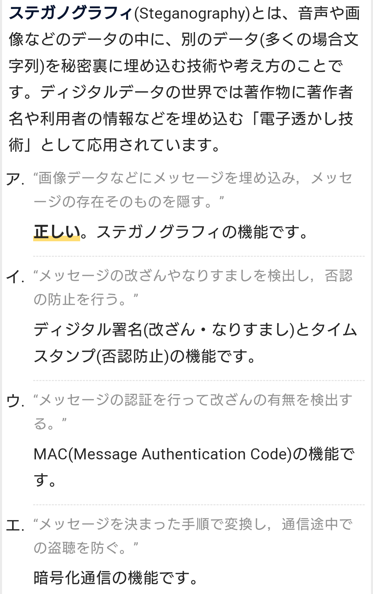

# SECURITY ACTION
- 中小企業が情報セキュリティ対策に自ら取り組んでいることを宣言する制度。
- 経済産業省の外郭団体、情報処理推進機構（IPA）が推進している。

# ISMS適合性評価制度 【ISMS認証】
- 組織内での情報の取り扱いについて、機密性、完全性、可用性を一定の水準で確保するための仕組みが整っていることを認定する制度。
- 2002年から一般財団法人日本情報経済社会推進協会（JIPDEC）の情報マネジメントシステム認定センターが運用している。

# ステガノグラフィ 【steganography】
- 画像や動画、音声などのデータに、人間には知覚できない形式で情報を埋め込んで伝達する技術。
- 電子透かしの元になった技術で、画像データなどの一部をわずかに改変し、一見して分からないよう情報を埋め込むことができる。

