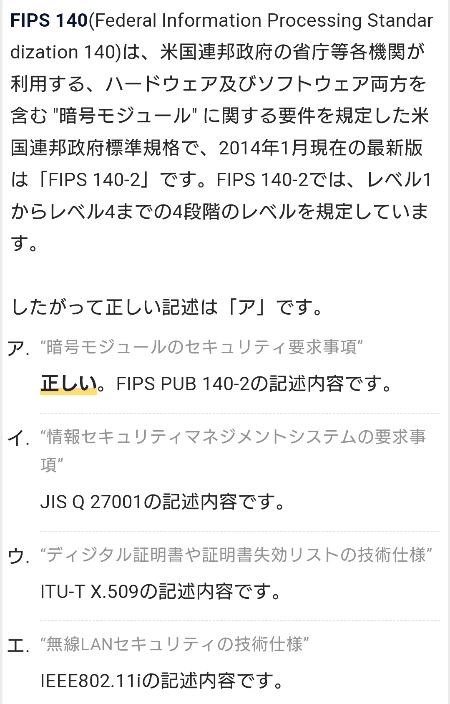

# SECURITY ACTION
- 中小企業が情報セキュリティ対策に自ら取り組んでいることを宣言する制度。
- 経済産業省の外郭団体、情報処理推進機構（IPA）が推進している。

# NIST 【National Institute of Standards and Technology】
- アメリカ合衆国の連邦政府機関の一つで、科学技術に関連する標準についての研究などを行う機関。
- 主に度量衡や計測・計量についての標準を管理したり、関連する科学研究や技術開発を推進している。
- 1988年に前身のNBS（National Bureau of Standards：国立標準局）から改組された。

- 連邦政府の利用する暗号技術などの情報セキュリティ関連規格が有名で、DESやAES、FIPS-140/140-2など、NISTに標準として採用された技術が世界的な標準として広く普及することが多い。

# FIPS 【Federal Information Processing Standards】 連邦情報処理標準
- アメリカ合衆国の連邦政府機関が軍事以外の用途で購買・利用する情報・通信機器が満たすべき技術標準を定めた規格。
- 工業技術の標準化を推進するNIST（米国立標準技術研究所）によって策定されている。

    - 個々の規格は「FIPS 46」のように通し番号で識別され、改版があった場合は「FIPS 46-3」のようにハイフンで世代番号を付加して識別する。
    - 多くはANSI（米国家規格協会）やIEEE（米国電気電子学会）、ISO（国際標準化機構）などが定めた規格を一部改変するなどして取り入れたものだが、独自に制定したものもある。

    - 米政府調達に限らず他国の標準や世界的な業界標準にも影響を与える規格としてしばしば注目されるのは暗号・セキュリティ関連の標準で、著名なものには「FIPS 46」（DES）、「FIPS 140」（暗号モジュールのセキュリティ要件/最新はFIPS 140-2）、「FIPS 197」（AES）などがある。

# ISMS適合性評価制度 【ISMS認証】
- 組織内での情報の取り扱いについて、機密性、完全性、可用性を一定の水準で確保するための仕組みが整っていることを認定する制度。
- 2002年から一般財団法人日本情報経済社会推進協会（JIPDEC）の情報マネジメントシステム認定センターが運用している。

- 「認証機関」「要員認証機関」「認定機関」の3つの機関で構成される制度
- 「認証機関」は、企業が構築したISMSが「ISO/IEC 27001:2013」および「JIS Q 27001:2014」に適合しているかを審査して登録する。
- 「要員認証機関」は、審査員の資格を付与する役割を担う。
- 「認定機関」は、「認定機関」「要員認証機関」がそれぞれの業務を行う能力があるかをチェックする。

## ISMSクラウドセキュリティ認証
- クラウドサービスに関する情報セキュリティを適切に管理している組織だと証明するための第三者認証
- ユーザーが安心してクラウドサービスを利用できることを目的としている。

- 「ISMSクラウドセキュリティ認証」を得るには
    - 「ISMSクラウドセキュリティ認証」を得るには、前提として「ISO/IEC 27001:2013」を取得していなければならない。
    - その前提に加えて、クラウドサービス固有の管理策である「ISO/IEC 27017:2015」が適切に実施されていることが必要。

    - 「ISO/IEC 27001:2013」とはマネジメントシステムの国際規格
    - 「JIS Q 27001:2014」は、「ISO/IEC 27001:2013」を日本語訳したもの

    - 「ISO/IEC27017:2015」とは、クラウドサービスに関する情報セキュリティ管理策を規定した国際規格
        - クラウドサービスにおける責任範囲の明確化
        - クラウドサービス固有のリスクを考慮したアセスメントと管理策の実施
        - ISMSの内部監査よりも厳しい水準での内部監査の実施

# CVSS (Common Vulnerability Scoring System)
- 情報システムの脆弱性に対するオープンで汎用的な評価方法
- ベンダーに依存しない共通の評価方法を提供
    - 脆弱性の深刻度を同一の基準で定量的に比較できる。

## 基本評価基準(Base Metrics)
- 脆弱性そのものの特性を評価する基準
- 情報システムに求められる３つのセキュリティ特性、「機密性(Confidentiality)」「完全性(Integrity Impact)」「可用性(Availability Impact)」に対する影響をネットワークから攻撃可能か、といった基準で評価
- CVSS基本値を算出
    - 時間の経過や利用環境によって変化しないベンダーや脆弱性を公表する組織が固有の深刻度を表すための評価基準   

## 現状評価基準(TemporalMetrics)
- 脆弱性の現在の深刻度を評価
- 攻撃コードの出現有無や、対策情報が利用可能であるかといった基準で評価
- CVSS現状値を算出
    - 脆弱性への対応状況に応じ、時間経過によって変化

## 環境評価基準(Environmental Metrics)
- ユーザの利用環境を含めた最終的な脆弱性の深刻度を評価
- CVSS環境値を算出
    - 脆弱性に対して想定される脅威に応じ、ユーザによって変化
    - ユーザが脆弱性への対応を決めるための評価基準

# ステガノグラフィ 【steganography】
- 画像や動画、音声などのデータに、人間には知覚できない形式で情報を埋め込んで伝達する技術。
- 電子透かしの元になった技術で、画像データなどの一部をわずかに改変し、一見して分からないよう情報を埋め込むことができる。

# DTCP 【Digital Transmission Content Protection】
- コンピュータやAV機器などを接続してデータを送受信する際、著作権で保護されたコンテンツを暗号化して不正や複製や傍受を阻止するための仕様を定めた規格。
- 当初はIEEE 1394（i.LINK/FireWire）接続を対象としていたが、様々な接続規格に対応するようになった。

    - 著作権で保護された商用のコンテンツなどが不正にコピーされないように、伝送経路を暗号化する仕組み。
    - DVDやBlu-ray Discなどの映像作品、デジタルテレビ放送の録画など、複製に制限を課しているコンテンツを扱う場合に利用される。

    - DTCPではコンテンツの送信側をソース（source device）、受信側をシンク（sink device）と呼ぶ。
    - コピー制限されたコンテンツをソースが発信してシンクが受信・再生できる（シンク側でデータは保存されない）ほか、機器間でコンテンツを移動（ムーブ）することができる。
    - 移動したコンテンツは移動元からは削除される。

    - 接続された機器はまず互いに相手が正規のライセンスを受けた機器かどうかを認証し、正しい相手であると確認されると56ビットの暗号鍵の交換が行われる。
    - この鍵を使用してM6と呼ばれる暗号方式によってデータを暗号化して送信し、受信側で復号する。
    - データにはコンテンツのコピー制御情報（複製可、不可、一世代のみ可など）が付加され、受信側での取り扱い方法が指定される。

- 初期の規格ではIEEE 1394を対象としていたが、USBやBluetoothなど他の通信方式での転送に対応した仕様も用意された。
- また、家庭内LANなどのIPネットワーク上でのコンテンツの伝送に対応する規格としてDTCP-IPおよび拡張仕様のDTCP+が定義され、DLNA対応機器などの間で使用された。

## DTCP-IP 【Digital Transmission Content Protection over Internet Protocol】
- DTCPを拡張し、ローカルなIPネットワーク上でコンテンツを保護しながら伝送する標準的な方式を定めている。
- 暗号化には128ビット長の暗号鍵を用いるAES（Advanced Encryption Standard）が採用され、DTCPより安全性が強化されている。
- また、インターネットなどを通じてどこまでも転送することができないよう、ルータなどによる転送回数は2回まで（TTL3以下）、相手先までの到達時間は往復（RTT）7ミリ秒までに制限されている。

## DTCP+
- 2012年に策定されたDTCP-IP 1.4で追加された機能を総称して「DTCP+」と呼ぶことがある。インターネットなどを通じて遠隔からストリーミング再生できるようになった。