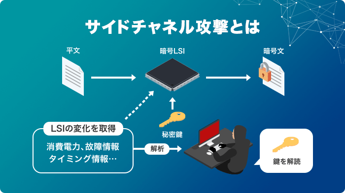
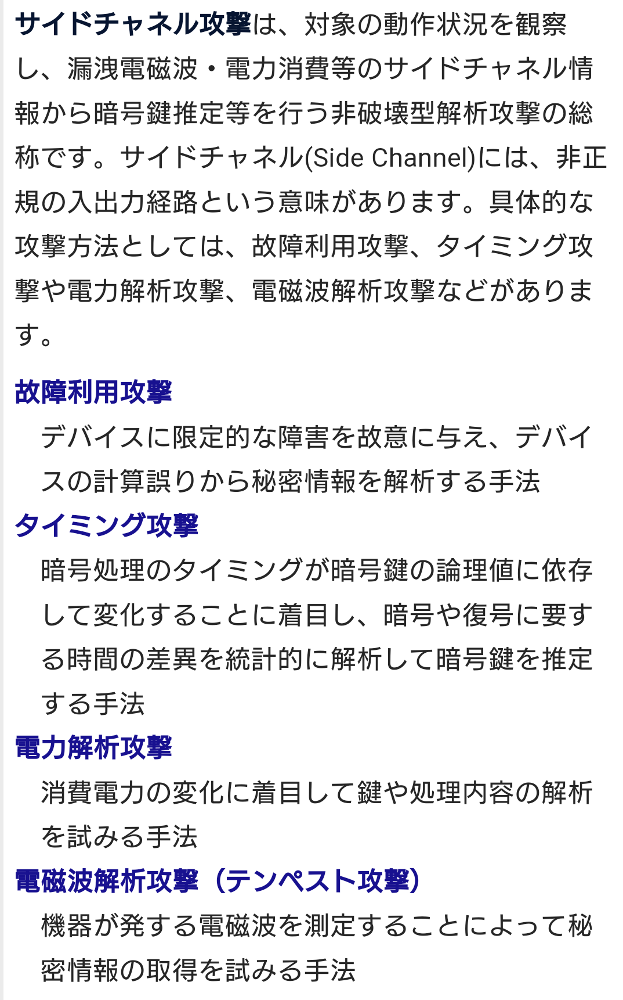
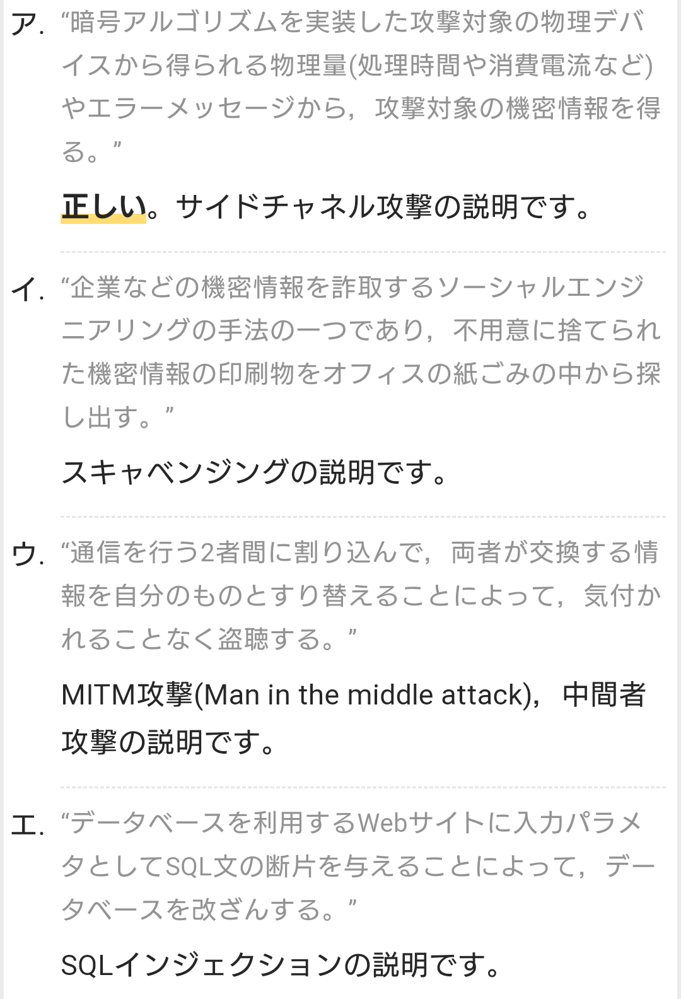

# ATTACK
# サイドチャネル攻撃 【side channel attack】
- IT機器に対する攻撃手法の一つで、装置の物理的な特性の変化を外部から観測・解析することにより、本来読み取ることができない情報を盗み取る手法。 
    - 機器が発する信号や正常時と異常時の動作の違いなどから情報を盗み取る。

- 暗号鍵の盗聴などに応用される。
- 機器を破壊せずそのままの状態で暗号を解読するため「非破壊攻撃」

1. タイミング攻撃
    - 器に様々な命令を出し、命令を処理する時間差を分析して情報を盗む攻撃

1. 電力解析攻撃
    - 「電力消費」の違いで暗号を解読する。
    - 消費電力の変化からカギや処理に内容の解析を試みる手法

1. 電磁波解析攻撃
    - コンピュータやIoT機器などの本体やケーブルから発せられる、微量の電磁波から情報を盗み取る攻撃

1. 故障利用攻撃
    - ICカードについているICチップなどに衝撃を加えて正常に動作しないようにし、ICチップの仕様や設定を変えてしまう攻撃
    - 限定的な障害によるデバイスの計算誤りから秘密情報を解析する

1. キャッシュ攻撃
    - データの取り出しや使用するまでの時間差を利用する

1. 音響解析攻撃
    - コンピュータが動くときに発するノイズを解析して、情報を推測し盗もうとする攻撃（音声解析攻撃）

# テンペスト攻撃
- テンペスト攻撃は盗聴を目的に行われる。
- ラジオのように電磁波や信号を受信することはできるが、暗号を解読することはできない。

