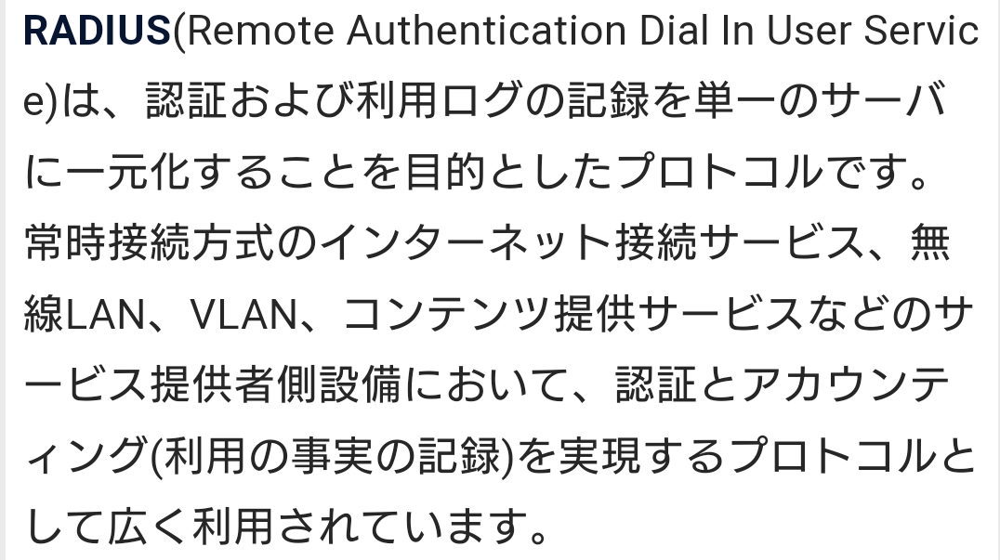
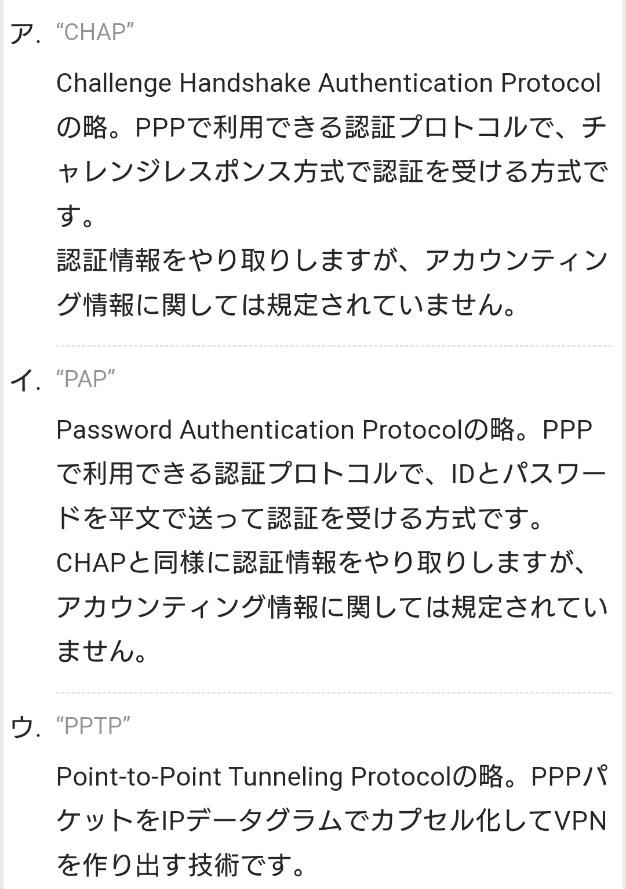
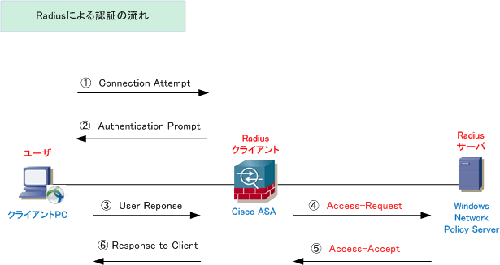
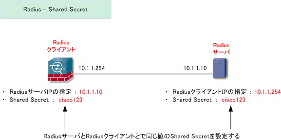

# RADIUS 【Remote Authentication Dial-In User Service】
- ネットワーク上で利用者の認証や権限の付与、利用状況の記録などを行うための通信プロトコルの一つ。
- RADIUSサーバとRADIUSクライアントの間の通信方式を規定したもので、利用者の情報はRADIUSサーバが一元的に管理し、クライアントからの要求に応じて認証の可否や資源へのアクセスの可否などを通知する。

    - 「RADIUSクライアント」とは末端の利用者からの接続を受け付けるルータやリモートアクセスサーバ、ダイヤルアップサーバなどのことを意味し、利用者との間でPAP、CHAP、EAPなどの認証プロトコルで認証情報のやりとりを行う。
    - RADIUSクライアントと利用者側の端末などの間の認証方式はRADIUSでは特に定めていない。
    - 利用者から見ると、認証サーバが2階層の構成になっており、サーバ間の通信方式を定めたのがRADIUSであるとも言える。

    - RADIUSの通信はIP（Internet Protocol）とUDPを用いて行われ、RADIUSクライアントからRADIUS要求パケットを送信し、サーバがRADIUS応答パケットを返信するという形で認証が行われる。
    - パスワードなど秘密の情報は共通鍵暗号（共通鍵暗号）により暗号化されて送受信される。

# RADIUSサーバ 【RADIUS server】
- 登録利用者の認証情報を管理し、認証を実行する機器にRADIUSという通信規約（プロトコル）に基づいて機能を提供するサーバ。大規模なネットワークで利用される。

- RADIUSによる認証は、利用者-RADIUSクライアント-RADIUSサーバという三層構造
    - 「RADIUSクライアント」が一般的な認証システムにおける認証サーバの役割を果たす。
    - RadiusクライアントはNAS（Network Access Server）とも呼ばれる。
    - アクセスしてくるユーザの認証要求を受け付けてRadiusサーバにその情報を転送する

    - 認証要求に応じて認証を実行してアクセスを許可するかどうかを決定するのはRadiusサーバ

    - 利用者側の端末はネットワークに接続する際にPAP、CHAP、EAPなどの認証プロトコルでRADIUSクライアントに認証要求を行い、ユーザー名やパスワードなどを送信する。
    - 認証情報自体はRADIUSサーバが保管しており、RADIUSクライアントはRADIUSサーバに接続可否を問い合わせる。

    

- 不正なRadiusクライアント（サーバ）からの接続要求の排除
    - 不正なRadiusクライアント、または不正なRadiusサーバからの接続要求を排除するために、Radiusクライアント ⇔ Radiusサーバ間で共有暗号鍵（Shared Secret）を事前に設定しておく
    - また、RadiusサーバとRadiusクライアントともに連携する同士のIPアドレスを指定する。
    - これらの設定によって、不正なRadiusクライアント、Radiusサーバとが通信を行うこと(不正な接続要求)を防止することができる。

    

- Radiusパケット
    - Radiusプロトコルでは、「属性と値」のペアで構成される属性値ペアというフォーマットで、情報をやりとりする。
    - 属性値ペアはAVペアと呼ばれたりアトリビュートとも呼ばれている。
    - ユーザ名やパスワード情報もこの属性値ペアによって、Radiusサーバに引き渡されている。
    - 値は「数字」または「文字列」が渡される。

| 属性番号 | IETF Attribute | 説明 |
|:------|:--------:|-------:|
|1	|User-Name| Radiusサーバにより認証されるユーザ名|
|2	|User-Password | ユーザのパスワード、またはAccess-Challengeに続くユーザの入力|
|3	|CHAP-Password | CHAPのパスワード。Access-Challengeに対する応答（ユーザが入力した応答値）|
|4	|NAS-IP Address	| 認証を要求しているNetwork Access Server(NAS）のIPアドレス。|
|5	|NAS-Port | ユーザを認証しようとしているNASの物理ポート番号。16ビットの値で構成。|
|6	|Service-Type | 要求されたサービスのタイプ。 特定の数値で示される。1：Login、 2：Framed　3：Callback-Login、4：Callback-Framed、 5：Outbound、 6：Administrative、　7：NAS-Prompt、8 uthenticate Only、 9：Callback-NAS-Prompt|
|7	|Framed-Protocol | フレーム構成。フレーム構成は以下の数値で指定される。1：PPP　2：SLIP　3：ARA　4：Gandalf独自プロトコル　5：Xylogics 独自のIPX/SLIP|
|8	|Framed-IP-Address | ユーザに指定するIPアドレス。Access-Request内でユーザのIPアドレスをRADIUSサーバに送信することで、ユーザに対して設定するIPアドレスを示す。Cisco IOSでは次のコマンドで有効
になる。 (config)# radius-server attribute 8 include-in-access-req　※受け入れられる値は、0xFFFFFFFF(ユーザーがアドレスを選択 ) と0xFFFFFFFE (リモートアクセスサーバーがアドレスを選択 ) のみとなる。|