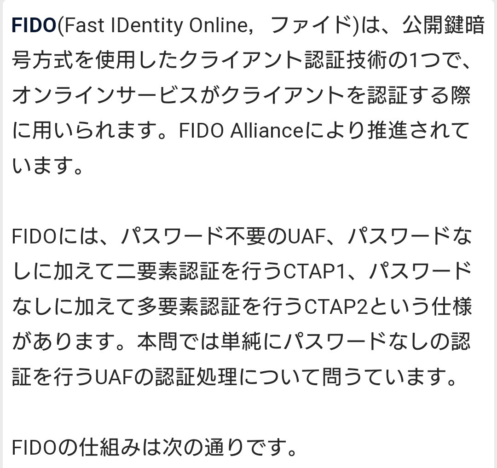
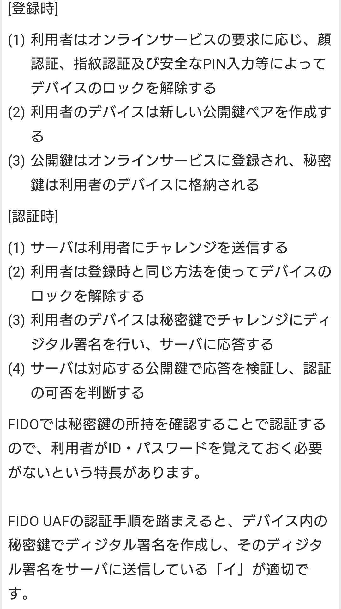
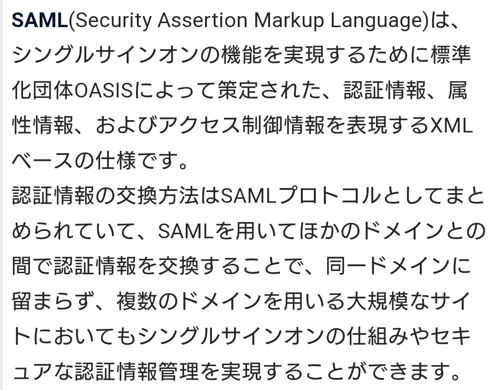
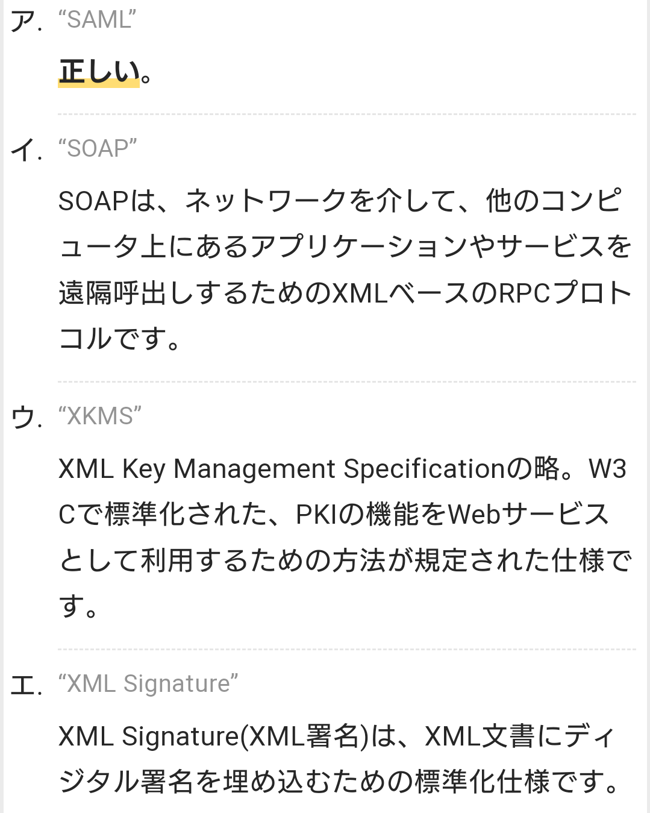
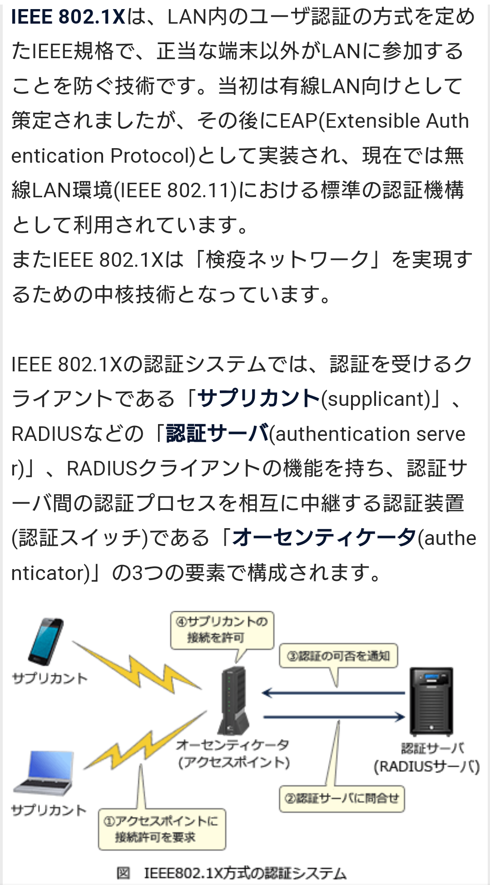
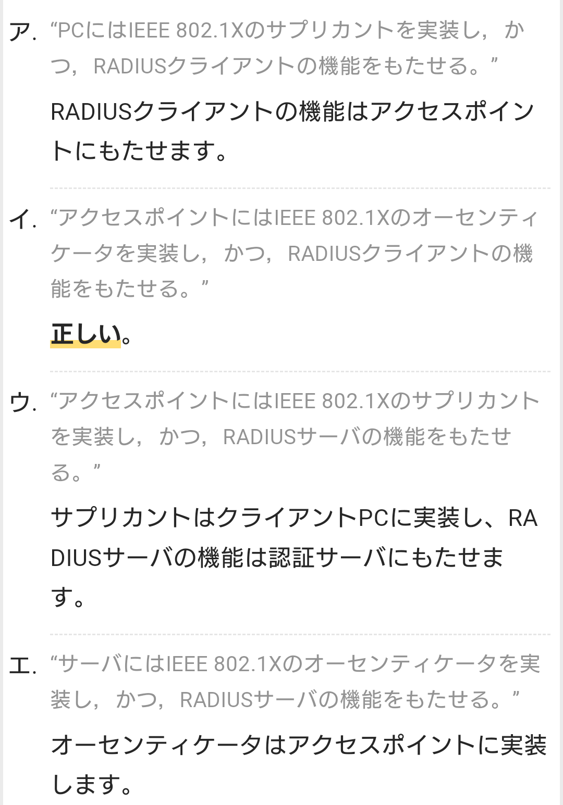
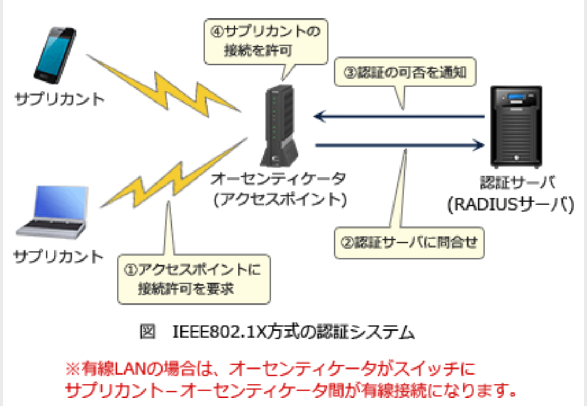
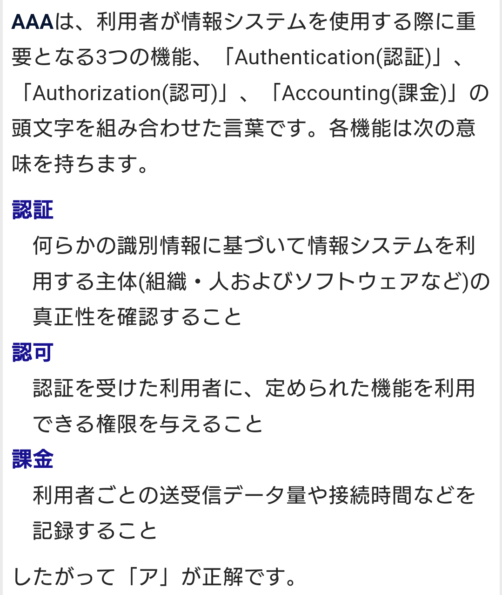
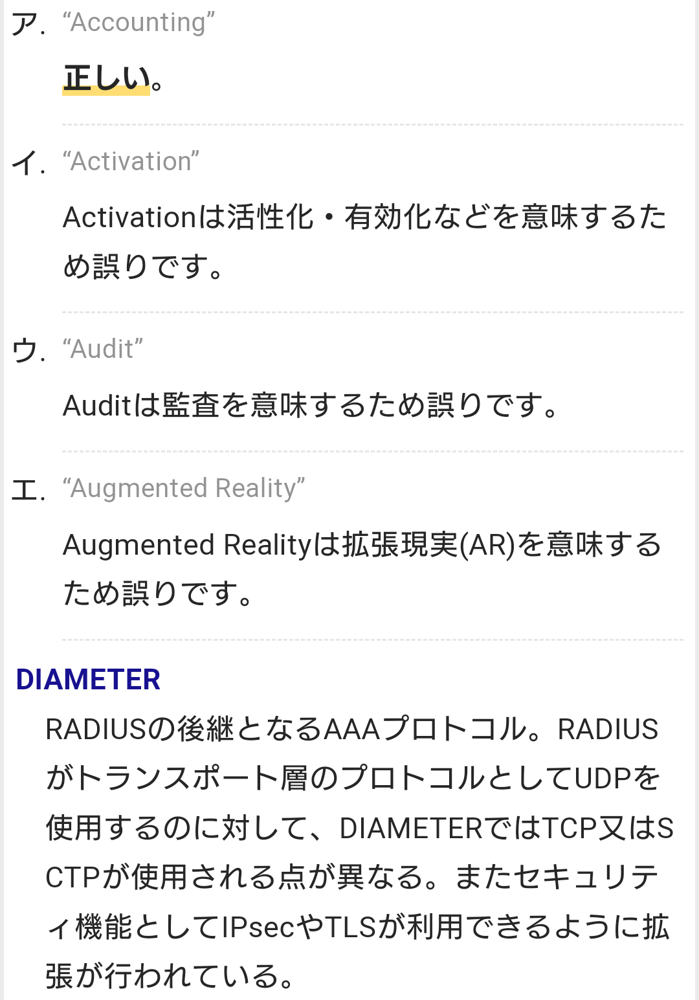

# 認証 【authentication】 certification

## PIN 【Personal Identification Number】 暗証番号 / 個人識別番号
- 情報システムが利用者の本人確認のために用いる秘密の番号。

## FIDO 【Fast IDentity Online】
- 生体認証（バイオメトリクス認証）や公開鍵暗号を組み合わせ、パスワード不要のオンライン認証を実現する技術。
- 業界団体FIDO Allianceが仕様を策定している。

# SAML 【Security Assertion Markup Language】
- 利用者の認証や認可に関する情報を伝達するためのXMLベースのマークアップ言語の一つ。標準化団体のOASISによって策定された。
- 複数の互いに独立したシステムの間で、利用者の認証要求や認証の可否、利用者の属性、認可された権限などについての情報（アサーションと呼ばれる）をやり取りするためのデータ形式を定めている。
- パスワードなどの認証情報そのものをやり取りするための仕様ではない。
- システム間がSAMLで連携することにより、利用者が一つのユーザーアカウントやログイン手順で様々なシステムやサービスを横断的に使用できるシングルサインオン（SSO：Single Sign-On）やID連携（ID federation）を実現することができる。

# BASIC認証 【基本認証】 basic authentication / ベーシック認証 / HTTP基本認証
- Webコンテンツの送受信などに用いられるプロトコル（通信規約）HTTP（Hypertext Transfer Protocol）の利用者認証の方式の一つで、最も単純で基本的なもの。

# LDAP 【Lightweight Directory Access Protocol】
- インターネットなどのTCP/IPネットワークでディレクトリサービスにアクセスするための通信プロトコルの一つ。
- ディレクトリサービスとは、ネットワーク上のコンピュータの利用者や接続された機器、その他何らかの資源に関する情報をサーバ上のデータベースで一元管理する仕組み。
- 利用者アカウントをディレクトリに登録し、複数のコンピュータで共用するといったことができる。
- LDAP自体にはデータの暗号化やパスワードの秘匿といったセキュリティ保護機能がない。
    - そのため、暗号化プロトコルのSSL/TLSと併用してLDAPによる通信全体を暗号化するLDAPS（LDAP over SSL/TLS）と呼ばれる通信方式が用いられることがある。
- 通常のLDAPはTCPの389番ポートを利用するが、LDAPSは636番を利用することが多い。
- LDAPサーバとしては米マイクロソフト（Microsoft）社の「Active Directory」（アクティブディレクトリ）やオープンソースソフトウェアの「OpenLDAP」（オープンLDAP）などがある。

# IEEE 802.1X
- ネットワークに接続するコンピュータなどの端末を認証する方法を定めた標準規格の一つ。
- 正当な登録利用者のみがLAN（構内ネットワーク）や無線LAN（Wi-Fi）に接続することができるようにする。
- 「サプリカント」,「オーセンティケータ」,「認証サーバ」の3つの要素から構成される。

    - IEEE 802.1Xを利用するには端末（クライアント）側に「サプリカント」（supplicant）と呼ばれるソフトウェアが必要となる。
    - また、IEEE 802.1Xによる認証機能を持つスイッチやアクセスポイント、ルータなどのことを「オーセンティケータ」（authenticator）という。
    - オーセンティケータは単体で認証を行うことはできず、必ず同じネットワークに「認証サーバ」がなくてはならない。

- IEEE 802.2X標準では、実際に端末側と認証に関するやり取りを行うネットワークスイッチや無線アクセスポイントなどのことをオーセンティケータという。
- 認証情報はRADIUSサーバなどの認証サーバに集約されて管理されている。
- スイッチなどが端末（クライアント）側の認証用ソフトウェア（サプリカント）から接続要求を受信すると、端末側が提示した認証情報を認証サーバへ送信し、接続可否を問い合わせる。

## サプリカント 【supplicant】
- ネットワーク上の利用者や端末の認証において、認証を要求する側（クライアント側）の機器やソフトウェアのこと。
- また、クライアント側で認証のやり取りを実行するソフトウェアのこと。
- 認証サーバに対して認証を求める端末や、サーバとのやり取りの手順を実装したソフトウェアを指す。

## オーセンティケータ 【authenticator】
- 認証器、認証子、認証符号などの意味を持つ英単語。
- 利用者や端末などとやり取りして認証を実施するシステムや装置という意味で用いられることが多い。
- 稀にパスワードなど認証に用いる秘密の符号を指すこともある。

## 認証サーバ
- インターネット接続のために通信事業者が契約者に行う認証ではPAPやCHAPなどが、企業内ネットワークなどで無線LANを利用する場合などにはEAPなどの方式が用いられる。

    - コンピュータシステムへのログインをネットワーク上に設置した認証サーバでまとめて行うシステムが用いられることもある。
    - 利用者は一度のログイン操作でそのコンピュータだけでなく認証サーバの管理下にあるネットワーク上の様々なサーバや資源を利用できるようになる。
    - このような仕組みを「シングルサインオン」（SSO：Single Sign-On）という。
    - Windows ServerのActive Directoryではドメインコントローラがこの認証サーバの役割を果たす。

### PAP 【Password Authentication Protocol】
- ネットワークへの接続時に正規の利用者かどうかを確認する認証プロトコル（通信規約）の一つ。
- 接続を試みる端末（クライアント）から認証サーバへIDとパスワードを送信し、サーバが接続の可否を応答するための手順やデータ形式を定めている。

### CHAP 【Challenge-Handshake Authentication Protocol】
- PPPなどで利用される認証方式の一つ。パスワードを原文（平文）のまま送るのではなく、ハッシュ化して送ることで伝送路上での盗み見、漏洩を防止する。

## AAA 【Authentication, Authorization, and Accounting】
- 情報システムが利用者を識別し、利用者に応じた制御を行う際に重要な要素を表した標語
- 以下の3つの単語の頭文字を合わせたもの。
    - “Authentication” （認証）
    - “Authorization” （認可）
    - “Accounting” （アカウンティング）

