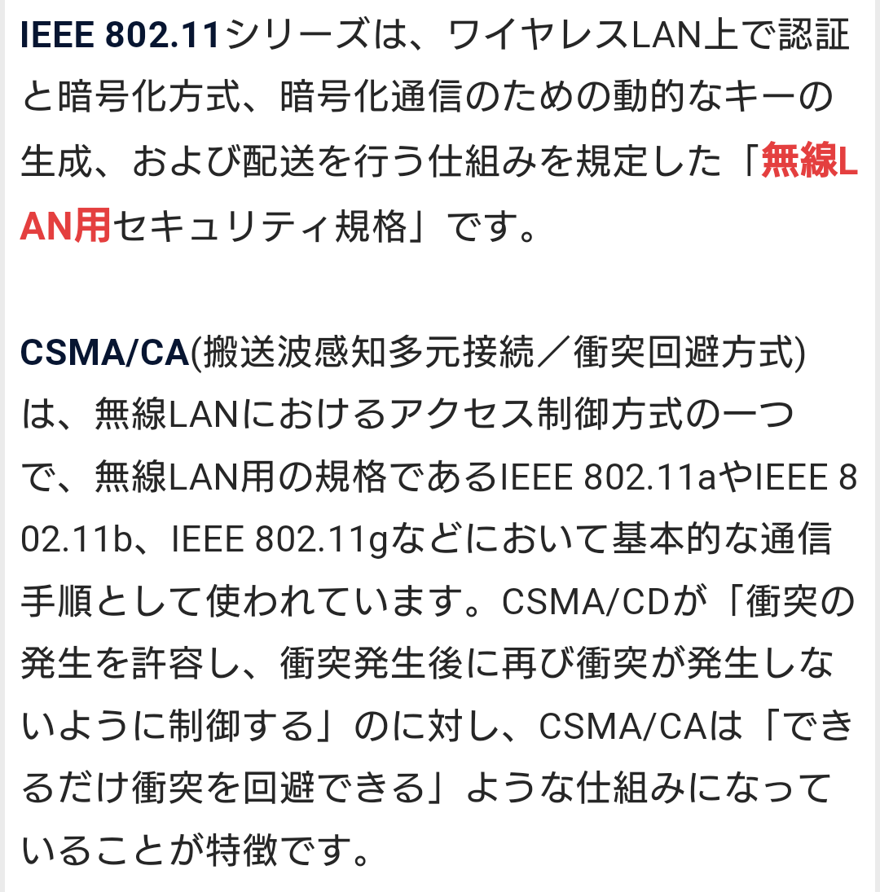
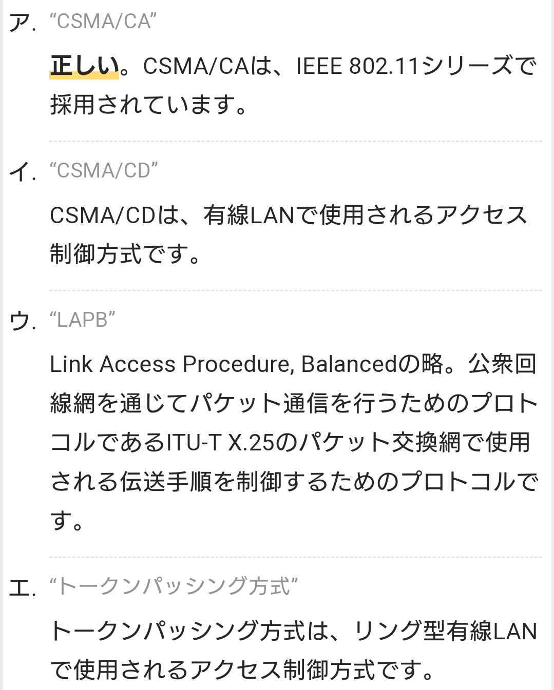

# 認証 【authentication】 certification

## PIN 【Personal Identification Number】 暗証番号 / 個人識別番号
- 情報システムが利用者の本人確認のために用いる秘密の番号。

## FIDO 【Fast IDentity Online】
- 生体認証（バイオメトリクス認証）や公開鍵暗号を組み合わせ、パスワード不要のオンライン認証を実現する技術。
- 業界団体FIDO Allianceが仕様を策定している。

# SAML 【Security Assertion Markup Language】
- 利用者の認証や認可に関する情報を伝達するためのXMLベースのマークアップ言語の一つ。標準化団体のOASISによって策定された。
- 複数の互いに独立したシステムの間で、利用者の認証要求や認証の可否、利用者の属性、認可された権限などについての情報（アサーションと呼ばれる）をやり取りするためのデータ形式を定めている。
- パスワードなどの認証情報そのものをやり取りするための仕様ではない。
- システム間がSAMLで連携することにより、利用者が一つのユーザーアカウントやログイン手順で様々なシステムやサービスを横断的に使用できるシングルサインオン（SSO：Single Sign-On）やID連携（ID federation）を実現することができる。

# BASIC認証 【基本認証】 basic authentication / ベーシック認証 / HTTP基本認証
- Webコンテンツの送受信などに用いられるプロトコル（通信規約）HTTP（Hypertext Transfer Protocol）の利用者認証の方式の一つで、最も単純で基本的なもの。

# LDAP 【Lightweight Directory Access Protocol】
- インターネットなどのTCP/IPネットワークでディレクトリサービスにアクセスするための通信プロトコルの一つ。
- ディレクトリサービスとは、ネットワーク上のコンピュータの利用者や接続された機器、その他何らかの資源に関する情報をサーバ上のデータベースで一元管理する仕組み。
- 利用者アカウントをディレクトリに登録し、複数のコンピュータで共用するといったことができる。
- LDAP自体にはデータの暗号化やパスワードの秘匿といったセキュリティ保護機能がない。
    - そのため、暗号化プロトコルのSSL/TLSと併用してLDAPによる通信全体を暗号化するLDAPS（LDAP over SSL/TLS）と呼ばれる通信方式が用いられることがある。
- 通常のLDAPはTCPの389番ポートを利用するが、LDAPSは636番を利用することが多い。
- LDAPサーバとしては米マイクロソフト（Microsoft）社の「Active Directory」（アクティブディレクトリ）やオープンソースソフトウェアの「OpenLDAP」（オープンLDAP）などがある。

# IEEE 802.1X
- ネットワークに接続するコンピュータなどの端末を認証する方法を定めた標準規格の一つ。
- 正当な登録利用者のみがLAN（構内ネットワーク）や無線LAN（Wi-Fi）に接続することができるようにする。
- 「サプリカント」,「オーセンティケータ」,「認証サーバ」の3つの要素から構成される。

    - IEEE 802.1Xを利用するには端末（クライアント）側に「サプリカント」（supplicant）と呼ばれるソフトウェアが必要となる。
    - また、IEEE 802.1Xによる認証機能を持つスイッチやアクセスポイント、ルータなどのことを「オーセンティケータ」（authenticator）という。
    - オーセンティケータは単体で認証を行うことはできず、必ず同じネットワークに「認証サーバ」がなくてはならない。

- IEEE 802.2X標準では、実際に端末側と認証に関するやり取りを行うネットワークスイッチや無線アクセスポイントなどのことをオーセンティケータという。
- 認証情報はRADIUSサーバなどの認証サーバに集約されて管理されている。
- スイッチなどが端末（クライアント）側の認証用ソフトウェア（サプリカント）から接続要求を受信すると、端末側が提示した認証情報を認証サーバへ送信し、接続可否を問い合わせる。

## サプリカント 【supplicant】
- ネットワーク上の利用者や端末の認証において、認証を要求する側（クライアント側）の機器やソフトウェアのこと。
- また、クライアント側で認証のやり取りを実行するソフトウェアのこと。
- 認証サーバに対して認証を求める端末や、サーバとのやり取りの手順を実装したソフトウェアを指す。

## オーセンティケータ 【authenticator】
- 認証器、認証子、認証符号などの意味を持つ英単語。
- 利用者や端末などとやり取りして認証を実施するシステムや装置という意味で用いられることが多い。
- 稀にパスワードなど認証に用いる秘密の符号を指すこともある。

## 認証サーバ
- インターネット接続のために通信事業者が契約者に行う認証ではPAPやCHAPなどが、企業内ネットワークなどで無線LANを利用する場合などにはEAPなどの方式が用いられる。

    - コンピュータシステムへのログインをネットワーク上に設置した認証サーバでまとめて行うシステムが用いられることもある。
    - 利用者は一度のログイン操作でそのコンピュータだけでなく認証サーバの管理下にあるネットワーク上の様々なサーバや資源を利用できるようになる。
    - このような仕組みを「シングルサインオン」（SSO：Single Sign-On）という。
    - Windows ServerのActive Directoryではドメインコントローラがこの認証サーバの役割を果たす。

### PAP 【Password Authentication Protocol】
- ネットワークへの接続時に正規の利用者かどうかを確認する認証プロトコル（通信規約）の一つ。
- 接続を試みる端末（クライアント）から認証サーバへIDとパスワードを送信し、サーバが接続の可否を応答するための手順やデータ形式を定めている。

### CHAP 【Challenge-Handshake Authentication Protocol】
- PPPなどで利用される認証方式の一つ。パスワードを原文（平文）のまま送るのではなく、ハッシュ化して送ることで伝送路上での盗み見、漏洩を防止する。

## AAA 【Authentication, Authorization, and Accounting】
- 情報システムが利用者を識別し、利用者に応じた制御を行う際に重要な要素を表した標語
- 以下の3つの単語の頭文字を合わせたもの。
    - “Authentication” （認証）
    - “Authorization” （認可）
    - “Accounting” （アカウンティング）

## IEEE 802.11
- 無線LAN用セキュリティ規格
- ワイヤレスLAN上での認証と暗号方式、暗号化通信のための動的なキーの生成、及び配送を行う仕組みの規定

# OAuth
- 運営主体の異なる複数のWebサイトやネットサービス、ソフトウェアなどの間で、データや機能へのアクセス権限の認可（authorization）情報を送受信するためのプロトコル（通信規約）の一つ。

    - ある利用者がネット上のサービスAとサービスBに加入しているとする。通常ならばAの機能や保管しているデータは利用者本人しかアクセスできないが、OAuthを用いると、Bに対して「自分がAで利用している機能やデータにアクセスしても良い」という許諾を与え、Aに対して「Bが自分についての操作やデータを求めてきたら提供しなさい」と指示することができる。

    - これにより、BではAが提供する機能やデータと連携したサービスを利用者に対して提供することができる。
    - 例えば、写真共有サービスに写真を投稿すると、利用者が操作しなくてもSNSの自分のアカウントにも自動的に投稿される、といった機能が実現できる。

    OAuthではシステム間でアクセストークン（access token）と呼ばれる機能ごとに発行される短い符号を受け渡すことで権限の認可を行っており、利用者の認証情報そのものはやり取りしていない。
    - これにより、利用者は自分のアカウント名やパスワードといった身元確認に用いる秘密の情報を渡すことなく、サービス同士を連携させることができる。

- OAuth 1.0の仕様は2007年に米ツイッター（Twitter）社のブレイン・クック（Blaine Cook）氏らが発表した。これとは互換性のないOAuth 2.0は2012年にIETFによりRFC 6749/6750として標準化された。

## OAuth認証
- OAuthにより利用者の認証情報そのものをシステム間でやり取りし、他のサービスのIDでログインできるようにする「OAuth認証」を提供している事例もある。

- 利用者アカウントを取得しなくても著名SNSや大手ネットサービスなどのIDでサービスを利用できて便利だが、連携先に認証情報そのものを丸ごと渡してしまう形になるため、連携先に悪意がある場合なりすましや不正操作の被害に遭うほか、連携先のデータ管理が不適切で認証情報が流出するリスクにも晒される。

OAuthはそもそも認証のために用いるものではないため、外部IDによるログインなどを実装したい場合はOpenID ConnectなどのID連携のための仕組みを用いるべきであるとされる。

## OpenID
- 管理主体の異なる様々なシステムやサービス間で利用者の識別情報を共通して使えるようにする連携方式を定めた規格の一つ。また、同規格の策定・普及を進める業界団体（OpenID Foundation）。
- OpenIDに対応したサービス間では、他サービスの発行したIDを用いてサービスへの加入やログインを行うことができる。
- 発行元に登録したユーザー名やパスワードなどを連携先には知らせずに認証を行うことができ、利用者のプライバシーが守られる。
- また、発行元と連携先が必ずしも提携や契約、システムやデータの共有などを行う必要はない。このような仕組みをID連携（Federated Identity）という。

### OpenID Connect (OIDC)
- 利用者は連携先のサービスを利用する際、OpenID ConnectによりID発行元による認証を行うよう要求する。
- 連携先は発行元の認証サーバへ利用者を誘導し、利用者はパスワードなどを入力して認証を行う。
- 認証に成功すると利用者に認可コード（authorization code）が発行され、これを連携先に伝達する。
- 連携先は認可コードを用いて発行元にアクセスし、アクセストークンやIDトークンを取得することができる。
- これらのトークンには認証や認可に関する情報が記載されており、サービスによって必要なものを取り寄せる。