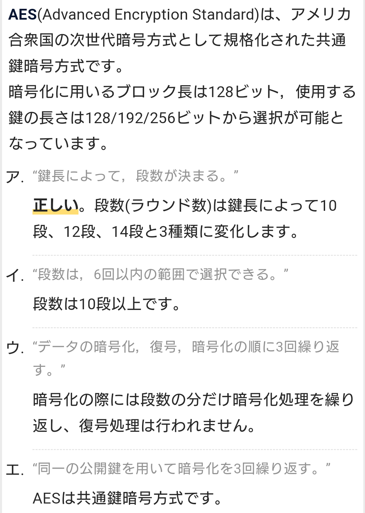
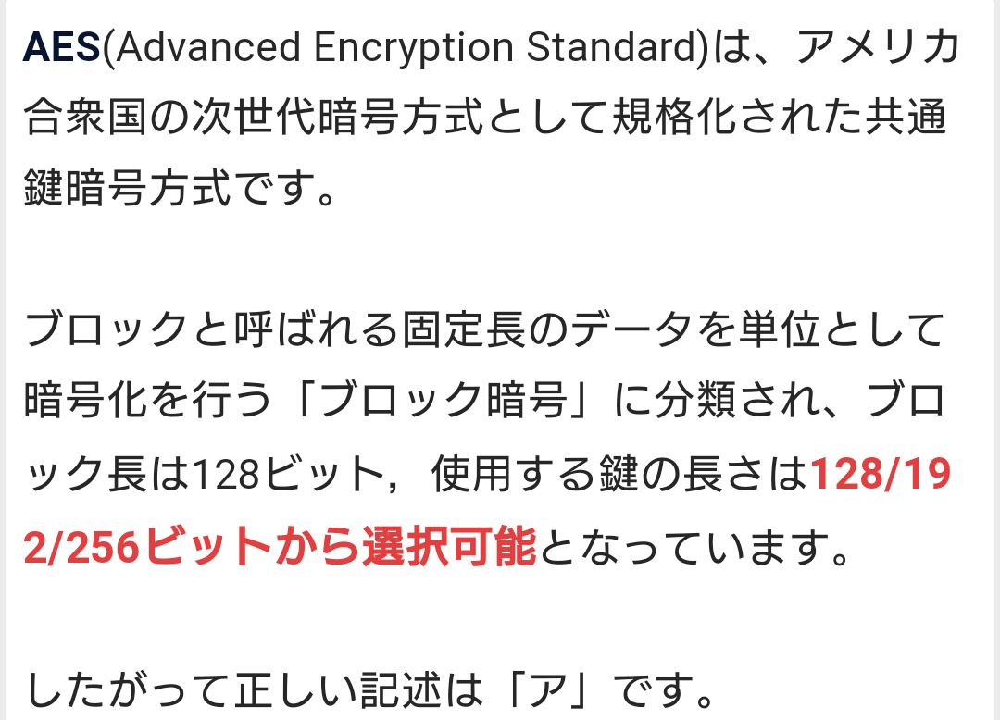
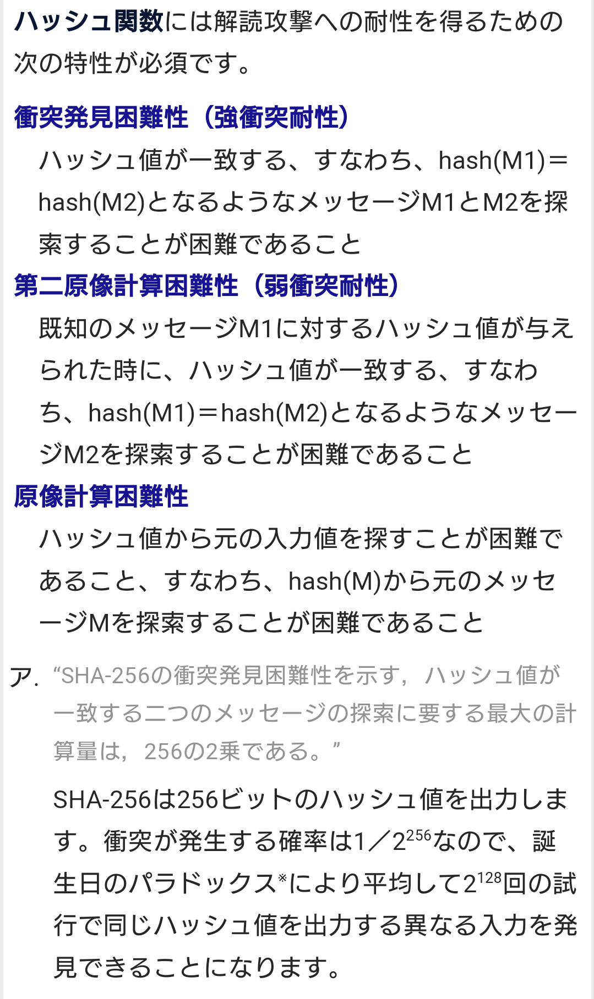
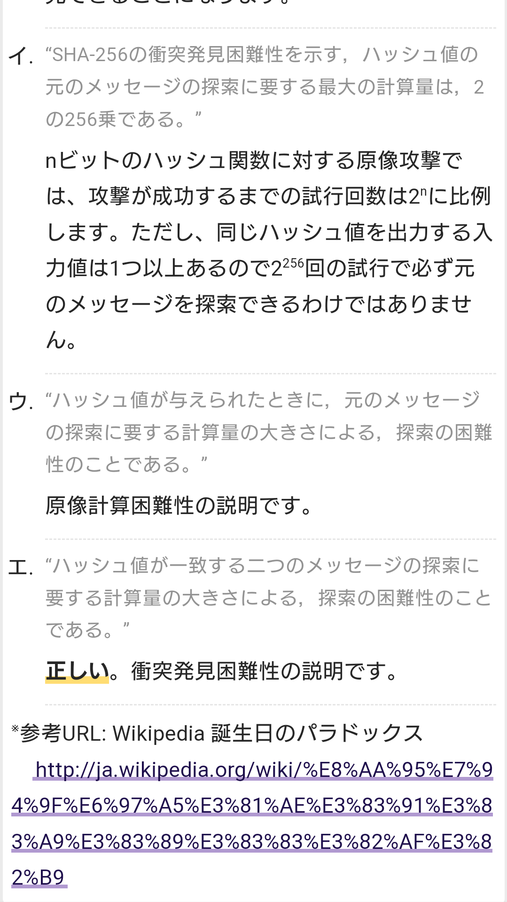

# 暗号

- 暗号化と復号に同じ暗号鍵を用いる暗号方式を「共通鍵暗号」（common key cryptosystem/共有鍵暗号）あるいは「秘密鍵暗号」（secret key cryptosystem）という。
- 情報の送信者と受信者は安全な方法で鍵を共有する必要がある。

- 一方、対になる二つの鍵を用いて片方で暗号化、もう一方で復号を行う方式を「公開鍵暗号」（public key cryptosystem）という。
- 暗号化に用いた鍵では復号できず、一方の鍵からもう一方を割り出すことも困難という性質があり、片方は所有者の元で秘匿され、対になるもう片方は公開されるためこのように呼ばれる。

# 共通鍵暗号 【common key cryptosystem】 秘密鍵暗号 / secret key cryptosystem
- 暗号化と復号に同じ暗号鍵を用いる暗号方式。
- 暗号文の送信者と受信者で同じ鍵を共有する必要があり、あらかじめ安全な経路で鍵を共有しなければならない。

- 代表的な共通鍵暗号方式として、1977年に米IBM社が開発し米政府標準に採用されたDES（Data Encryption Standard）や、その後継として2000年に米政府標準となったAES（Advanced Encryption Standard/暗号アルゴリズムとしてはRijndael）、ストリーム暗号の標準的な方式として広く普及しているRC4（ARCFOUR）などがよく知られる。

## PSK 【Pre-Shared Key】 事前共有鍵 / プリシェアードキー / 事前共有キー
- 通信を暗号化する際、事前に別の手段で共有された秘密の符号をもとに暗号鍵を生成する方式。
- また、そのような符号による接続認証。実用上はパスワードやパスフレーズの形で設定する。

### Wi-FiにおけるPSK
- Wi-Fiのセキュリティ規格であるWPA/WPA2では、家庭など小規模ネットワーク向けのパーソナルモードにおいてPSK方式による認証と暗号化が用意されている。
- この方式をWPAでは「WPA-PSK」、WPA2では「WPA2-PSK」という。

- 利用者はWi-Fiアクセスポイントと端末に同じパスフレーズ（8～63文字）を設定し、これを用いて接続認証を行う。
- 接続後はパスフレーズから一定の演算手順でPMK（Pairwise Master Key）と呼ばれるマスター鍵を算出し、通信中に用いる暗号鍵の生成などに用いる。

- 認証サーバを用意したり端末や利用者ごとにパスワードや暗号鍵を管理しなくて良いため手軽に利用できるが、一つのパスフレーズを同じネットワーク内のすべての端末や利用者で使い回すため、大規模ネットワークでの使用は推奨されない。

## AES 【Advanced Encryption Standard】
- 2000年にアメリカ連邦政府標準の暗号方式として採用された、共通鍵（秘密鍵）暗号方式の一つ。
- 「AES」は米国立標準技術研究所（NIST）の標準規格としての名称であり、暗号方式（暗号アルゴリズム）そのものを指す場合は「Rijndael」（ラインダール）と呼ばれることもある。

- 暗号化と復号に同じ暗号鍵を用いる共通鍵暗号（秘密鍵暗号）で、平文を一定の長さごとに暗号文に変換するブロック暗号である。
- ブロック長は128ビットで、鍵長は128ビット（AES-128）、192ビット（AES-192）、256ビット（AES-256）の三種類から選択できる。

- 暗号化は複数の演算を連続して行うラウンドと呼ばれる処理単位を繰り返すことによって行われ、128ビット鍵では10ラウンド、192ビット鍵では12ラウンド、256ビット鍵では14ラウンドを繰り返す。
- 各ラウンドは置換表によるデータの入れ替え、左巡回シフト、行列変換、ラウンド鍵とのXOR演算の4つの処理からなり、暗号鍵から導出されたラウンドごとに変化するラウンド鍵を用いてパラメータを決定する。

## Rijndael
## DES
## 3DES
## FEAL
## MISTY
## Camellia
## IDEA
## RC2
## RC4
## Blowfish
# 公開鍵暗号
## RSA
## ElGamal暗号
## 楕円曲線暗号
## 離散対数問題
## PKCS
# PKI

# ハッシュ関数 【hash function】 メッセージダイジェスト関数
- 入力されたデータに一定の手順で計算を行い、入力値の長さによらずあらかじめ決められた固定長の出力データを得る関数。得られた値は「ハッシュ値」（hash value）と呼ばれる。
- ハッシュ関数のうち暗号や電子署名など保安上の用途に適した性質を持つものを暗号学的ハッシュ関数あるいは一方向性ハッシュ関数という。

- 入力値と出力値の間に規則性がなく、入力値が少しでも異なればまったく異なる出力値となり、ある特定の出力値が得られるような入力値を効率よく求めることはできず（弱衝突耐性）、同じ出力値となる別の入力値も容易には見つけられない（強衝突耐性）ような性質を持つものがこのように呼ばれる。

- 認証情報のハッシュ値からパスワードなどの秘密の情報を割り出したり、デジタル署名が施されたメッセージを改竄して同一の署名を付け直すといった攻撃を阻止することができる。

# SHA-256 【Secure Hash Algorithm 256-bit】
- 任意の長さの原文から固定長の特徴的な値を算出するハッシュ関数（要約関数）の一つ。
- どんな長さの原文からも256ビットのハッシュ値を算出することができる。