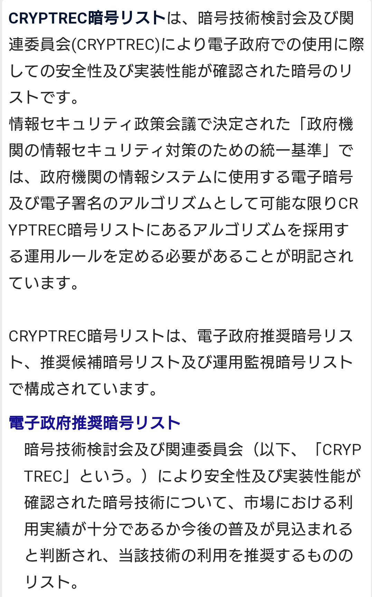
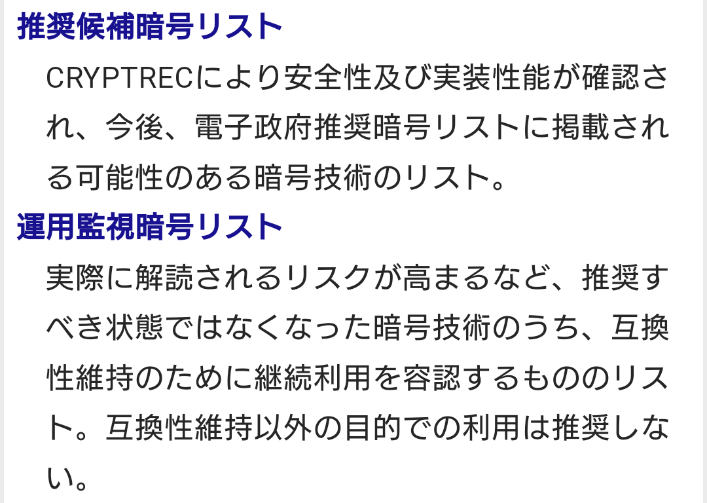
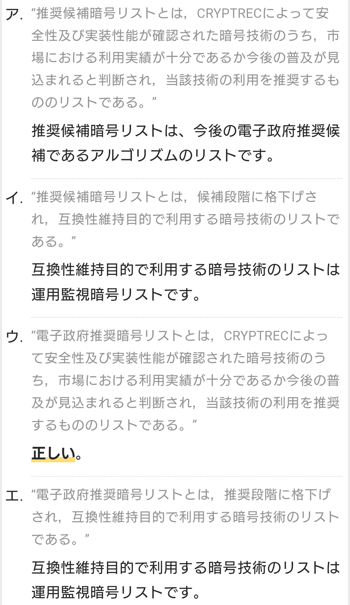

# 暗号

- 暗号化と復号に同じ暗号鍵を用いる暗号方式を「共通鍵暗号」（common key cryptosystem/共有鍵暗号）あるいは「秘密鍵暗号」（secret key cryptosystem）という。
- 情報の送信者と受信者は安全な方法で鍵を共有する必要がある。

- 一方、対になる二つの鍵を用いて片方で暗号化、もう一方で復号を行う方式を「公開鍵暗号」（public key cryptosystem）という。
- 暗号化に用いた鍵では復号できず、一方の鍵からもう一方を割り出すことも困難という性質があり、片方は所有者の元で秘匿され、対になるもう片方は公開されるためこのように呼ばれる。

# 共通鍵暗号 【common key cryptosystem】 秘密鍵暗号 / secret key cryptosystem
- 暗号化と復号に同じ暗号鍵を用いる暗号方式。
- 暗号文の送信者と受信者で同じ鍵を共有する必要があり、あらかじめ安全な経路で鍵を共有しなければならない。

- 代表的な共通鍵暗号方式として、1977年に米IBM社が開発し米政府標準に採用されたDES（Data Encryption Standard）や、その後継として2000年に米政府標準となったAES（Advanced Encryption Standard/暗号アルゴリズムとしてはRijndael）、ストリーム暗号の標準的な方式として広く普及しているRC4（ARCFOUR）などがよく知られる。

## PSK 【Pre-Shared Key】 事前共有鍵 / プリシェアードキー / 事前共有キー
- 通信を暗号化する際、事前に別の手段で共有された秘密の符号をもとに暗号鍵を生成する方式。
- また、そのような符号による接続認証。実用上はパスワードやパスフレーズの形で設定する。

### Wi-FiにおけるPSK
- Wi-Fiのセキュリティ規格であるWPA/WPA2では、家庭など小規模ネットワーク向けのパーソナルモードにおいてPSK方式による認証と暗号化が用意されている。
- この方式をWPAでは「WPA-PSK」、WPA2では「WPA2-PSK」という。

- 利用者はWi-Fiアクセスポイントと端末に同じパスフレーズ（8～63文字）を設定し、これを用いて接続認証を行う。
- 接続後はパスフレーズから一定の演算手順でPMK（Pairwise Master Key）と呼ばれるマスター鍵を算出し、通信中に用いる暗号鍵の生成などに用いる。

- 認証サーバを用意したり端末や利用者ごとにパスワードや暗号鍵を管理しなくて良いため手軽に利用できるが、一つのパスフレーズを同じネットワーク内のすべての端末や利用者で使い回すため、大規模ネットワークでの使用は推奨されない。

## AES 【Advanced Encryption Standard】
- 2000年にアメリカ連邦政府標準の暗号方式として採用された、共通鍵（秘密鍵）暗号方式の一つ。
- 「AES」は米国立標準技術研究所（NIST）の標準規格としての名称であり、暗号方式（暗号アルゴリズム）そのものを指す場合は「Rijndael」（ラインダール）と呼ばれることもある。

- 暗号化と復号に同じ暗号鍵を用いる共通鍵暗号（秘密鍵暗号）で、平文を一定の長さごとに暗号文に変換するブロック暗号である。
- ブロック長は128ビットで、鍵長は128ビット（AES-128）、192ビット（AES-192）、256ビット（AES-256）の三種類から選択できる。

- 暗号化は複数の演算を連続して行うラウンドと呼ばれる処理単位を繰り返すことによって行われ、128ビット鍵では10ラウンド、192ビット鍵では12ラウンド、256ビット鍵では14ラウンドを繰り返す。
- 各ラウンドは置換表によるデータの入れ替え、左巡回シフト、行列変換、ラウンド鍵とのXOR演算の4つの処理からなり、暗号鍵から導出されたラウンドごとに変化するラウンド鍵を用いてパラメータを決定する。

### Rijndael
- 米国政府の暗号標準であるAES（Advanced Encryption System）の暗号アルゴリズムに採用された共通鍵（秘密鍵）暗号方式。
- ベルギーの暗号学者フィンセント・ライメン（Vincent Rijmen）氏とホアン・ダーメン（Joan Daemen）氏により考案された。

- 暗号化は複数の演算を連続して行うラウンドと呼ばれる処理単位を繰り返すことによって行われ、128ビット鍵では10ラウンド、256ビット鍵では14ラウンドを繰り返す。
- 各ラウンドは置換表によるデータの入れ替え、左巡回シフト、行列変換、ラウンド鍵とのXOR演算の4つの処理からなり、暗号鍵から導出されたラウンドごとに変化するラウンド鍵を用いてパラメータを決定する。

## DES
- 1977年にアメリカ連邦政府標準の暗号方式として採用された、共通鍵（秘密鍵）暗号方式の一つ。
- DESは旧米国立標準局（NBS、現NIST）の標準規格としての名称であるため、暗号方式（暗号アルゴリズム）そのものを指す場合は「DEA」（Data Encryption Algorithm）と呼ばれることもある。
- データを64ビット単位に区切って処理するブロック暗号である。
- 鍵長は56ビットだが、パリティチェック用の8ビットを加えた64ビットを鍵データとして管理する。

- DESでは変換処理を行った結果に再度同じ処理を行うという繰り返し（ラウンド）を16回行うが、それぞれのラウンドでは元の鍵から一定の計算により生成した異なる鍵データ（ラウンド鍵）を用いる。
- 最初にデータを32ビットずつ半分（L,R）に分割し、一回のラウンドでは半分（R）を変換して残りの半分（L）と合成する処理を行う。
- 次のラウンドでは前回の合成結果を新たなR、変換に用いた半分（R）を新たなLとして同じ処理を行う。
- このような処理方式は「Feistel構造」（ファイステル構造）と呼ばれ、暗号化と復号が同じアルゴリズムになる（適用する鍵データを変えるだけでよい）ことからDES以外にも様々な暗号方式に広まった。

- 1990年代になりコンピュータの処理性能が向上すると56ビットという鍵長では解読が容易になってしまい、また、暗号研究の進展により差分解読法や線形解読法などの効率的な攻撃法が見出されたため、現代では安全な暗号方式ではないとされている。
- 応急的に安全性を高める方式として、異なる2つまたは3つの暗号鍵を用いてDESによる暗号化・復号を3回繰り返す「Triple DES」（トリプルDES、3DES、TDESとも）が考案された。
- 1999年には、より安全で高速な暗号標準としてAES（Advanced Encryption Standard）が米政府に採用され、DESに代わって利用されるようになった。

### 3DES
- 暗号方式のDES（Data Encryption Standard）の安全性を高めるために考案された処理方式の一つ。
- 異なる2つまたは3つの暗号鍵を用いて、DESによる暗号化と復号の処理を3回繰り返すことにより解読されにくくしたもの。
- DESより安全性は格段に高まるが、暗号化にも復号にも非常に長い時間がかかってしまう。

## FEAL
## MISTY
## Camellia
## IDEA
## RC2
## RC4
## Blowfish
# 公開鍵暗号

## RSA
- 巨大な素数同士をかけ合わせた整数を素因数分解するのが困難であることを利用した公開鍵暗号の一つ。
- 概念としては知られていた公開鍵暗号の具体的な実装方式として世界で初めて発表されたもので、1977年にロナルド・リベスト（Ronald L. Rivest）氏、アディ・シャミア（Adi Shamir）氏、レオナルド・エーデルマン（Leonard M. Adleman）氏が考案した。

- 公開鍵暗号は対になる二つの鍵を用いて一方で暗号化を、もう片方で復号を行う暗号方式で、一方を公開し（公開鍵）もう一方は秘匿する（秘密鍵）ためこのように呼ばれる。
- 暗号化に使った鍵で復号することはできず、一方の鍵からもう一方の鍵を割り出すのが困難であることが安全性の根拠となるが、RSAではこの困難さを巨大な数の素因数分解の難しさに依存している。

- 二つの巨大な素数について、これを掛け合わせて積を求めるのは簡単だが、積を二つの素因数に分解する効率的な方法は見つかっていない、という非対称性を利用する。
- 素数の積を元に公開鍵を、二つの素数を元に秘密鍵を生成することにより、公開鍵を入手しても対になる秘密鍵を割り出すのは困難となる。

- 鍵を生成する際、大きな桁数の素数を発見するのは時間がかかるため、実用上は簡易な判定手法を用いて素数である確率が高い数を見つけ出し、これを利用する場合が多い。

- RSAの応用
    - 公開鍵暗号全般に共通するが、公開鍵で暗号化、秘密鍵で復号することにより、事前に暗号鍵を共有・交換することなく通信を暗号化することができる。
    - 受信者の公開鍵（送信者以外に知られても構わない）で暗号化されたデータを復号できるのは受信者しか知らない秘密鍵のみだからである。

    - また、秘密鍵で暗号化、公開鍵で復号することにより、デジタル署名（本人確認、真正性の証明）を行なうことができる。
    - 暗号化された署名を署名者の公開鍵で復号できれば、その署名は署名者本人しか知らない秘密鍵によって暗号化されたことが確認できるからである。

    - RSAは初めて実用化された公開鍵暗号方式として通信ネットワーク上の暗号化やデジタル署名に幅広く普及し、多くの標準規格の一部としても採用されている。

## ElGamal暗号
## 楕円曲線暗号
## 離散対数問題
## PKCS
# PKI

# ハッシュ関数 【hash function】 メッセージダイジェスト関数
- 入力されたデータに一定の手順で計算を行い、入力値の長さによらずあらかじめ決められた固定長の出力データを得る関数。得られた値は「ハッシュ値」（hash value）と呼ばれる。
- ハッシュ関数のうち暗号や電子署名など保安上の用途に適した性質を持つものを暗号学的ハッシュ関数あるいは一方向性ハッシュ関数という。

- 入力値と出力値の間に規則性がなく、入力値が少しでも異なればまったく異なる出力値となり、ある特定の出力値が得られるような入力値を効率よく求めることはできず（弱衝突耐性）、同じ出力値となる別の入力値も容易には見つけられない（強衝突耐性）ような性質を持つものがこのように呼ばれる。

- 認証情報のハッシュ値からパスワードなどの秘密の情報を割り出したり、デジタル署名が施されたメッセージを改竄して同一の署名を付け直すといった攻撃を阻止することができる。

# SHA-256 【Secure Hash Algorithm 256-bit】
- 任意の長さの原文から固定長の特徴的な値を算出するハッシュ関数（要約関数）の一つ。
- どんな長さの原文からも256ビットのハッシュ値を算出することができる。

# CRYPTREC 【Cryptography Research and Evaluation Committees】
- 政府機関で利用すべき暗号技術の推奨リストを作成するプロジェクト。
- 総務省、経済産業省、情報通信研究機構（NICT）、情報処理推進機構（IPA）が共同で運営している。
- 共通鍵暗号（秘密鍵暗号）や公開鍵暗号、ハッシュ関数、暗号利用モード、メッセージ認証コードなど暗号に関連する技術に関して、暗号技術の専門家が安全性や利用実績、調達の容易さなどを多角的に評価・検討する。

