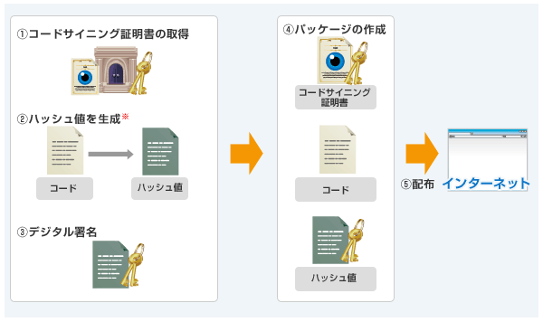
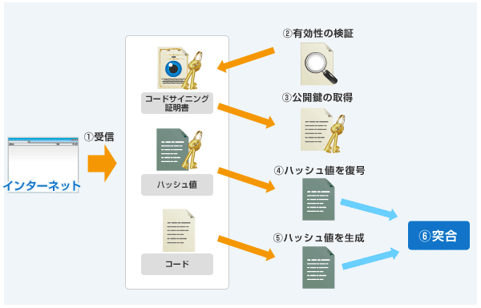

# 電子署名
- 電子署名とは、文書やメッセージなどのデータの真正性を証明するために付加される、短い暗号データ。作成者を証明し、改竄やすり替えが行われていないことを保証する。欧米で紙の文書に記されるサイン（signature）に似た働きをするためこのように呼ばれる。

- 公開鍵暗号の原理（必ずしも公開鍵暗号そのものとは限らない）と暗号学的ハッシュ関数を組み合わせた仕組みで、メッセージの送信者は本人しか知らない秘密鍵と本文を元に一定の手順で算出した固定長の暗号データをメッセージに添付し、相手方に送る。

- 受信者が署名を検証するには送信者の公開鍵が必要だが、インターネットなど信頼できない経路で伝送すると攻撃者によるすり替えの危険があるため、公開鍵データに送信者と受信者の双方が信用する第三者のデジタル署名を添付するという手法が考案された。これをデジタル証明書（公開鍵証明書）と呼び、信頼できる第三者を認証局（CA：Certificate Authority）という。

## 証明書失効リスト（CRL：Certificate Revocation List）
- 何らかの理由で有効期限前に失効させられたデジタル証明書（公開鍵証明書）のリスト。
- 証明書の発行元の認証局（CA）が管理・公開しており、定期的に更新される。

    - 誤発行や秘密鍵の漏洩などが判明し、悪用の可能性があると判断された証明書は有効期間が残っていてもCAの判断で効力が停止される。
    - 無効になった証明書を周知するための手段として、CAはCRLに証明書のシリアル番号を記載して公開し、使用しないよう呼びかける。

- 利用者側からはOCSP（Online Certificate Status Protocol）などのプロトコル（通信規約）でVA(検証局)に問い合わせを行う方式がよく用いられる

## OCSP 【Online Certificate Status Protocol】
- TCP/IPネットワークを通じてデジタル証明書（公開鍵証明書）の有効性を問い合わせる手順を定めたプロトコル（通信規約）。
- 暗号化やデジタル署名に用いるX.509証明書が何らかの理由により有効期限前に失効している場合、そのことを速やかに知ることができる。

    - OCSPレスポンダは認証局の証明書失効リスト（CRL：Certificate Revocation List）を参照して当該証明書の状態を確認し、有効、失効、不明のいずれかの応答を返す。
    - 応答が改竄されることを防ぐためデジタル署名が添付される。
    - OCSPレスポンダは認証局に設置される場合と、認証局からCRLを受け取りOCSP応答に専念する検証局（VA：Validation Authority）により提供される場合がある。

## 認証局（CA：Certificate Authority）
- 電子商取引事業者などに、暗号通信などで必要となるデジタル証明書を発行する機関。
- 認証局にはルート認証局（root CA）と中間認証局（intermediate CA）がある。

    - ルート認証局
        - 上位の認証局による認証を受けず、自分の正当性を自ら証明する。
        - 他の認証局に対してデジタル証明書を発行し、認証局に対する信頼の拠り所となる。
        - ルート証明書の信頼性は、厳しい監査を受けることや、認証業務運用規程（CPS）を公開すること、運用実績や知名度など、デジタル証明書以外の方法で示される。

    - 中間認証局
        - ルート認証局以外の認証局が中間認証局で、ルート認証局など上位の認証局からデジタル証明書を発行してもらうことで、自らの正当性を証明する。

## ルート証明書

- 認証の連鎖への対策？
- 認証をたどっていき、大手の認証局や政府機関の認証局にたどり着いた場合、正しく検証されたと判断する。

    - 通信に公開鍵暗号を利用するには暗号文の送信者の公開鍵を受信者が安全に入手する必要があり、送信者が公開鍵に第三者のデジタル署名を付したデジタル証明書を受信者に渡すという方法がよく用いられる。デジタル証明書を発行する第三者を認証局（CA：Certificate Authority）というが、その署名が信用できるか確かめるには認証局の公開鍵を安全に入手して検証しなければならない。

    - そのためには上位の認証局が署名して発行した認証局自身のデジタル証明書を入手すればよいが、その署名が信用できるか確かめるにはさらに上位の認証局の発行した証明書を入手して…という具合に、限りなく上位の認証局をたどっていかなければならなくなってしまう。

    - このため、Webブラウザなど公開鍵暗号を利用するソフトウェアの開発者は、世界的に有力な大手の商用認証局や政府機関の認証局など、信頼するに足ると思う機関が自ら発行する証明書を事前に入手して組み込んでおき、証明書を上位にたどっていった結果その機関の証明書に行き当たったら正しく検証されたと判断するようにしている。

    - この信用の連鎖により安全に公開鍵暗号を運用する社会的な基盤のことをPKI（Public Key Infrastructure/公開鍵基盤）と呼び、その最上位に位置する機関をルート認証局（ルートCA）、その発行する自らのデジタル証明書をルート証明書という。通常はソフトウェアにあらかじめ組み込まれたものを指すが、利用者が安全に入手した証明書をソフトウェアに登録してルート証明書とすることもできるようになっている場合もある。

## SSL/TLSサーバ証明書
- 公開鍵が正しいことを確認する
- Webサイトの身元の証明やSSL/TLSによる暗号通信の暗号鍵の配送に用いられるデジタル証明書。公開鍵暗号の公開鍵が確かにサイト運営者本人のものであることを証明する。

- SSLサーバ証明書はCAが申請者の情報をどこまで確認したかによっていくつかの種類に分かれる。

### DV証明書 （Domain-Validated certificate）
- SSL/TLSで用いられるデジタル証明書（SSLサーバ証明書）のうち、最も簡易な確認手順で発行されるもの。
- 単にSSLサーバ証明書といった場合は通常これを指す。
- Webブラウザ上では取得者の情報はドメイン名しか表示されない。

- 証明書の発行時にサーバのドメイン名を確認するもので、クライアントは「確かにそのドメイン名に対して発行された証明書である」ことを検証できる。

### OV証明書（Organization-Validated certificate）
- 発行時に法人登記などで申請者の実在性を確かめ、公開された連絡先などから申請確認を行って「なりすまし」でないことを確かめる。
- ドメイン名の所有権が申請者にあることも確認する。
- クライアントは実在の特定の法人や人物に発行されたものであることを検証できる。

### EV証明書（Extended Validation certificate）
- OV証明書の手続きをより厳格にしたもの
- 実在性の確認だけでなく事業の運営実態の確認や、担当者や責任者の明確化と申請手続きの執行を裏付ける書面の提出などを行う。
- 確認プロセスは規格化されており、CA側も適切に審査を行っているか業界団体から監査を受ける。
- 接続先がEV証明書を利用していることはブラウザ上の表示で見分けられるようになっている。
- Webブラウザの種類やバージョンによって異なるが、EV証明書が使用されている場合はアドレスバーの左端が緑色になり取得者の名称（企業名など）が表示されるなど、一般のHTTPS通信とは異なる表示になっていることが多い。

## クライアント証明書

- サーバにアクセスする際に証明書を提示することにより、パスワードなどを入力しなくても利用者の認証を行って本人であることを確かめたり、所属組織を確認することができる。デジタル署名やメッセージの暗号化に使用するソフトウェアもある。

- 単にクライアント証明書といった場合は利用者の個人に紐付いたユーザー証明書を指すことが多いが、これとは別に、コンピュータの個体識別と認証のために発行されるコンピュータ証明書を用いるシステム（IEEE 802.1XのEAP-TLS認証など）もある。

## コードサイニング証明書
- ソフトウェアのディジタル署名の検証に使用する。
- コンピュータプログラムを配布・販売する際に、利用者が発行元の確認や改竄検知ができるように付与されるデジタル署名の証明書。これを用いて発行元がプログラムにデジタル署名を施すことをコード署名（code signing）という。

- ディジタル署名を検証するには発行者が署名に用いた秘密鍵と対になる公開鍵を安全に入手する必要があるため、その配送手段として認証局（CA：Certificate Authority）などの第三者が発行したデジタル証明書が用いられる。このようなコード署名に用いられる証明書のことをコードサイニング証明書あるいはコード署名証明書という。

- 署名と検証の仕組み
    - 署名（配布側）の流れ
        1. コードサイニング証明書取得
        1. 配布するコードからハッシュ値※を生成
        1. 配布元によるハッシュ値の暗号化（＝デジタル署名）
        1. 配布するコード、デジタル署名されたハッシュ値、配布元のコード署名証明書を含む配布パッケージの作成
        1. 配布

    

    - 検証（受信側）の流れ
        1. 受信
        1. 証明書の有効性を検証
        1. 証明書から配布元の公開鍵を取得
        1. 配布元の秘密鍵で暗号化（デジタル署名）されたハッシュ値情報を復号
        1. 受け取ったコードからハッシュ値を生成
        1. 受け取ったコードから生成したハッシュ値と復号されたハッシュ値を突合し、同一であれば改ざんされていない

    

# X.509
- デジタル証明書（電子証明書）および証明書失効リスト（CRL）のデータ形式を定めた標準規格の一つ。
- 公開鍵の配送に必要な証明書データの記録形式や署名方式、無効な証明書を周知するリストのデータ形式などを定めている。